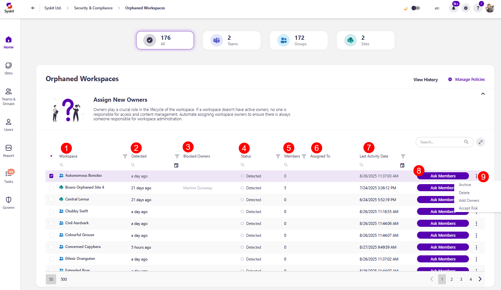
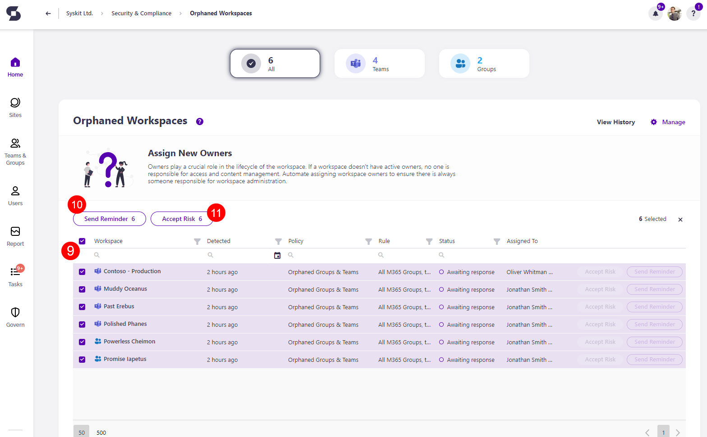
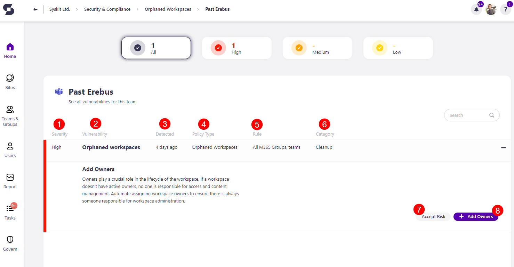

# Orphaned Workspaces

Syskit Point detects workspaces that don't have active owners, which helps you ensure there is always someone responsible for access and content management for your workspaces. 

When the task delegation option is enabled for the Orphaned Workspaces policy, Syskit Point creates tasks and sends emails to users as defined in the policy settings. To learn more, take a look at the [Orphaned Workspaces policy article](../../governance-and-automation/automated-workflows/orphaned-resources-admin.md). 

By default, task delegation is turned off for this policy, but the orphaned workspaces **are still detected** and visible on the Security and Compliance dashboard. **This means that Syskit Point detects a vulnerability in a workspace** based on the applied policy, but it does not create tasks or send any emails to workspace owners. 

The purpose of this is to assist Syskit Point admins by
bringing awareness of potential issues in their Microsoft 365 environment. 

On the Security & Compliance dashboard, click the **Orphaned Workspaces** button to see the report.

The Orphaned Workspaces screen opens, showing a list of all **workspaces that don't have active owners**.

Above the report, you can see the number of:
* All workspaces with a policy vulnerability
* Microsoft Teams with a policy vulnerability
* Microsoft Groups with a policy vulnerability
* SharePoint Sites with a policy vulnerability

The report itself provides information on:
* **Workspace (1)** name
* **Detected (2)** - when the policy vulnerability was detected
* **Blocked Owners (3)** - the names of workspace owners that have been blocked
* **Status (4)** - status of the policy vulnerability
  * If a vulnerability was detected, the status shows as *Detected*
  * If task delegation is enabled for the policy, it shows the task status, for example, *Awaiting response* from members
* **Members (5)** - the number of members in the workspace
* **Assigned to (6)** - who the policy vulnerability is assigned to for a resolution
* **Last Activity Date (7)** - the date and time of the last time there was an activity logged on the workspace

Additionally, you can complete the following actions for the policy vulnerability:
* **Ask Members (8)** - this action requests that the workspace members select new workspace owners
* **The Ellipsis (more options) Menu (9)** - clicking the 3 dots next to the Ask Members button provides the option to complete the following actions:
  * **Archive** - this action archives the workspaces
  * **Delete** - this action deletes the workspace
  * **Add Owners** - this action lets you manually add additional owners to the workspace to resolve the task yourself
  * **Accept Risk** - this action means you will close the policy vulnerability task without making any changes to the current state of the workspace

If the the task delegation is not enabled in policy settings, instead of sending a reminder you will have the option to **Ask Owners**. This will send emails and create tasks for users responsible for resolving the task.

By **selecting all (10)** or more than one workspace, you can perform the bulk action for **Archive (11)**, **Delete (12)**, **Add Owners (13)**, **Send reminder (14)**, and **Accept risk (15)**. 

To get more details on a specific workspace, **click the name of the workspace on the report**.
* This opens the screen that shows more details about the workspace

Here you can find the following information: 
* **Severity level (1)**
* **Vulnerability (2)**
* **Detected (3)**
* **Policy Type (4)**
* **Rule (5)**
* **Category (6)**

 You can also perform the actions to **Accept Risk (7)** and **Add Owners (8)**. 



**Please note:**
* **Nested group members are counted** when resolving a policy.
  * If the required number of members has not been added or removed, including those within nested groups, the Resolve button remains disabled until that condition is met.
* **Site Owners are determined by the SharePoint Owners group.**
  * Only users who are part of the SharePoint Owners group are considered Site Owners and can resolve tasks. **Site Admins cannot resolve tasks** and are not considered Site Owners.


