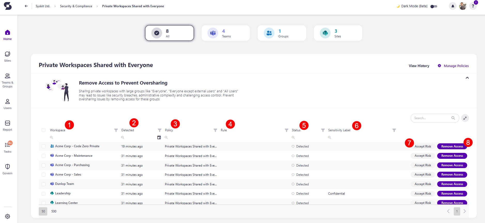

# Private Workspaces Shared with Everyone

Syskit Point detects private workspaces shared with everyone based on the settings defined in the tenant-wide [policy](../automated-workflows/private-workspaces-shared-with-everyone-admin.md). This helps you ensure your private workspaces are secure and only the people who should have access to the workspace have it. 

The Private Workspaces Shared with Everyone is **a tenant-wide policy, and it cannot have task delegation enabled**. That means no tasks are created to resolve this policy, and no emails are sent to collaborators.

The private workspaces shared with everyone **are still detected** as a part of the Security and Compliance checks feature. **This means that Syskit Point detects a vulnerability on a workspace** based on the applied policy, but it does not create tasks or send any emails to collaborators. 

The purpose of this is to assist Syskit Point admins by
bringing awareness of potential issues in their Microsoft 365 environment. 

Private Workspaces Shared with Everyone are private workspaces **shared with a large number of users** through Everyone / Everyone except external users / All Users. 

The policy can be applied to Microsoft Groups, Microsoft Teams, Sites, and OneDrive workspaces. 

A **vulnerability is detected** when:

 * **Access is given to dynamic security groups that are shared with a large number of people**: Everyone / Everyone except external users / All Users. 

 * **A public workspace is changed to private** and a large number of people still have access, or the workspace is still set to providing access to Everyone / Everyone except external users / All Users.

On the Security & Compliance dashboard, click the **Private workspaces shared with everyone** button to see the report.

The Private Workspaces Shared with Everyone screen opens, showing a list of all **private workspaces that have a large number of users** through Everyone / Everyone except external users / All Users.

The report provides information on:
  * **Workspace (1)** name
  * **Detected (2)** - when the policy vulnerability was detected
  * **Policy (3)** - the name of the policy
  * **Rule (4)** - the name of the Rule if one was created to automatically apply the policy
  * **Status (5)** - status of the policy vulnerability
  * **Sensitivity Label (6)** - shows the sensitivity label if assigned

Additionally, you can complete the following actions for the policy vulnerability:
  * **Accept Risk (7)** - clicking this closes the policy vulnerability without making any changes to the current state of the workspace 
    * You can select a time frame for how long the vulnerability should be ignored: 30 days, 90 days, 6 months, 1 year. 
  * **Remove Access (8)** - clicking this removes access to the selected workspace(s) for Everyone, Everyone except external users, and All Users

