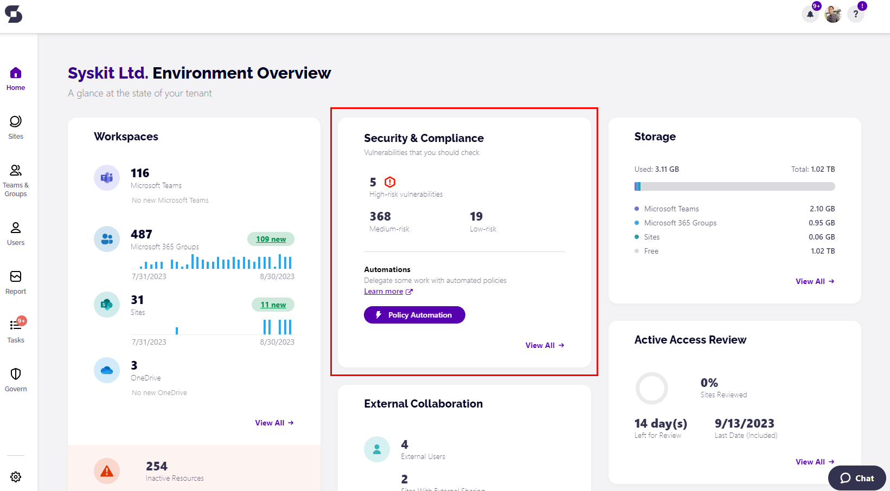
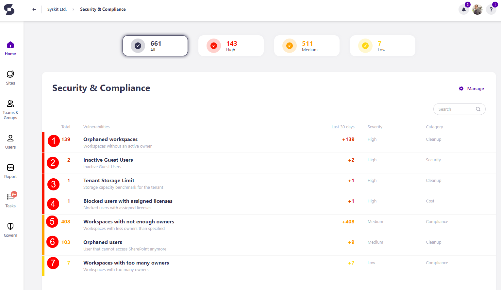

# Security and Compliance Checks

The **Security and Compliance Checks**, visible directly on your Syskit Point home screen, pinpoint the **most important vulnerabilities and misalignments** with Microsoft 365 best practices. These checks keep you aware and help you **react quickly to keep your environment secure and under control**.

Collecting all the important info about the security and compliance state of your environment is a time-consuming and repetitive administration task. **Syskit Point performs regular security and compliance checks** for you and **presents the results directly on your home screen**.


**Please note:** The Security and Compliance checks **email is sent to Syskit Point admins weekly**, on Wednesdays. 
  * If there are no vulnerabilities in your environment, there is no email sent. 
  * If Wednesday is less than 2 days from your installation date, the email will be sent next week. 



When you acquire SysKit Point, a **[default rule](../../governance-and-automation/automated-workflows/policy-automation.md#default-rule) will automatically apply default governance policies to your workspaces**. 
  * **The default policies are configured to detect vulnerabilities without sending any emails or creating any tasks**.
  * **All vulnerabilites detected by Syskit Point are displayed on the Security & Compliance Dashboard**
  * **Both the vulnerabilities detected by default policies, as well as the policies created by Syskit Point admins are displayed on the Security & Compliance Dashboard**

## Security & Compliance Dashboard
On the home Dashboard, you can click and drill down to a specific report to investigate further by **clicking the View All button**.

On your home screen, you can see the number of:
  * **High-risk** vulnerabilities
  * **Medium-risk** vulnerabilities
  * **Low-risk** vulnerabilities

You are also able to [set up Policy Automation](../../governance-and-automation/automated-workflows/policy-automation.md) if you haven't already by clicking the **Policy Automation button**. 

After clicking View All, the Security and Compliance checks dashboard will open, showing the following: 

* **Inactive Guest Users (1)** - shows the number of guest users that have been inactive for a certain amount of time and helps you optimize your environment and keep it safe.

* **Blocked users with assigned licenses (2)** - shows the number of users with one or more active licenses assigned that have been blocked, which helps you **detect and remove licenses** that are not being utilized.

* **Orphaned workspaces (3)** - shows the number of workspaces without an active owner. It helps you manage your Microsoft 365 workspace's health and helps **ensure there are no abandoned resources** and **workspaces without owners** in your tenant. 

* **Workspaces with not enough owners (4)** – shows the number of workspaces that don't have enough owners. You will be able to investigate further and assign additional owners if needed. Keep an eye on workspaces with only 1 owner because **if that one owner leaves, a workspace is left without an owner**. 

* **Orphaned users (5)** - shows the number of orphaned users and takes you to the Orphaned Users report, which helps **detect and remove blocked or deleted users** from your Microsoft 365 workspaces. 

* **Workspaces with too many owners (6)** – shows the number of workspaces with too many owners. If there are **too many owners, no one feels accountable for access and content management**. This helps you keep track of and remove extra owners. 



## Automated Governance

To keep all vulnerabilities **under control proactively and prevent possible issues**, explore and [**[set up governance policies](../../governance-and-automation/automated-workflows/set-up-policies.md) and [policy automation](../../governance-and-automation/automated-workflows/policy-automation.md)**] in Syskit Point.
 
## Navigate Security and Compliance Checks

Take a look at the following articles to learn how to settle your security and compliance checks: 

 * [**Inactive Guest Users**](../security-compliance-checks/inactive-guest-users.md)
 * [**Blocked users with assigned licenses**](../security-compliance-checks/blocked-users-assigned-license.md)
 * [**Orphaned workspaces** ](../security-compliance-checks/orphaned-workspaces.md)
 * [**Workspaces with not enough owners**](../security-compliance-checks/workspaces-not-enough-owners.md)
 * [**Orphaned users**](../security-compliance-checks/orphaned-users.md)
 * [**Workspaces with too many owners**](../security-compliance-checks/inactive-guest-users.md)


**Please note!**  
In case you have any security and compliance checks that need to be resolved, an **email is automatically sent each Wednesday** to Syskit Point admins. Click the **Resolve button** within the email to access the reports in Syskit Point directly and perform the needed actions.


