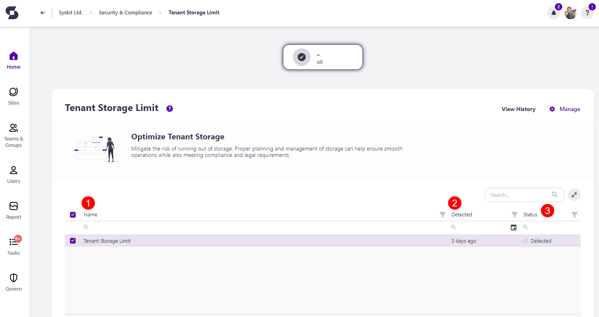

# Tenant Storage Limit

Syskit Point mitigates the risk of running out of storage based on the settings defined in the tenant-wide [policy](../automated-workflows/tenant-storage-admin.md). 

The purpose of the Tenant Storage Limit check is to **notify you when your storage percentage gets close to the limit you set**. This information can help you determine whether you should change the storage limit set for the policy, remove any redundant content to free up space or purchase additional storage from Microsoft.

The Tenant Storage policy is **a tenant-wide policy, and it can be automated**. When automation is enabled, Syskit Point creates tasks and sends emails to users as defined in the policy settings. To learn more, take a look at the [Tenant Storage Limit policy article](../../governance-and-automation/automated-workflows/tenant-storage-admin.md).

By default, the automation is turned off for this policy, but when the tenant storage limit is exceeded, Syskit Point **detects the policy vulnerability** and shows it on the Security and Compliance dashboard. **This means that Syskit Point detects a vulnerability on a workspace** based on the applied policy, but it does not create tasks or send any emails to workspace owners. 

The purpose of this is to assist Syskit Point admins by
bringing awareness of potential issues in their Microsoft 365 environment. 

On the Security & Compliance dashboard, click the **Tenant Storage Limit** button to see the report.

The Tenant Storage Limit screen opens, **showing the Tenant Storage Limit violation**.

The report provides information on:
  * **Name (1)** of the policy
  * **Detected (2)** - when the policy violation was detected
  * **Used Storage % (3)** - the percentage of storage that is used
  * **Used (4)** - the amount of storage that is used
  * **Total (5)** - the total amount of storage available
  * **Status (6)** - the status of the policy violation

There are two actions that can be completed for this violation:
 * **Accept Risk (7)**
   * Clicking Accept Risk opens a pop-up where you can **select the amount of days** you want Syskit Point to ignore this policy violation
   * Clicking the **Accept Risk button** finalizes your decision
 * **Add Storage (8)** 
   * Clicking Add Storage redirects you to the Microsoft 365 article that explains how to add more SharePoint storage to your tenant

Other than the actions available in the report, there are a few additional ways to resolve this violation:
  * **Increasing the storage limit percentage** that is set for the [Tenant Storage Limit policy](../automated-workflows/tenant-storage-admin.md)
  * **Removing unnecessary or redundant content** from your sites and cleaning up your tenant to free up storage

Completing any of the above actions resolves the Security & Compliance checks violation. 