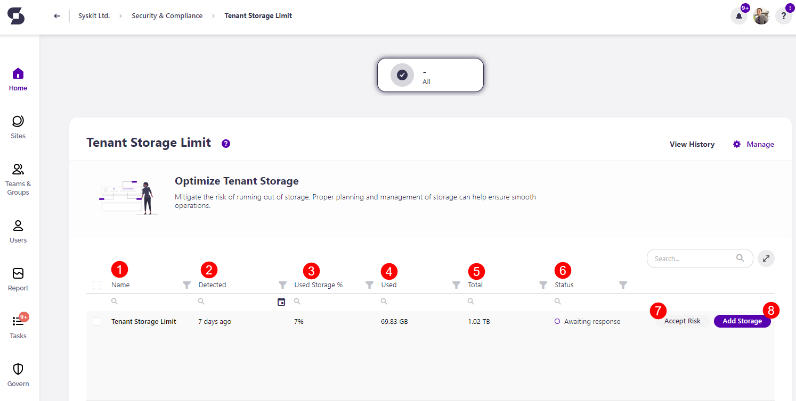

# Tenant Storage Limit

Syskit Point mitigates the risk of running out of storage based on the settings defined in the tenant-wide [policy](../automated-workflows/tenant-storage-admin.md). 

The purpose of the Tenant Storage Limit check is to **notify you when your storage percentage gets close to the limit you set**. This information can help you determine whether you should change the storage limit set for the policy, remove any redundant content to free up space or purchase additional storage from Microsoft.

The Tenant Storage policy is **a tenant-wide policy, and it cannot be automated**. That means that no tasks are created to resolve this policy violation, and no emails are sent to collaborators.

The tenant storage limits **are still detected** and shown on the Security and Compliance dashboard. **This means that Syskit Point detects a vulnerability on a workspace** based on the applied policy, but it does not create tasks or send any emails. 

The purpose of this is to assist Syskit Point admins by
bringing awareness of potential issues in their Microsoft 365 environment. 

On the Security & Compliance dashboard, click the **Tenant Storage Limit** button to see the report.

The Tenant Storage Limit screen opens, **showing the Tenant Storage Limit violation**.

The report provides information on:
  * **Name (1)** of the policy
  * **Detected (2)** - when the policy violation was detected
  * **Status (3)** - the status of the policy violation

While there are no actions you can take directly on the Syskit Point report, there are a few ways to resolve this violation:
  * **Increasing the storage limit percentage** that is set for the [Tenant Storage Limit policy](../automated-workflows/tenant-storage-admin.md)
  * **Removing unnecessary or redundant content** from your sites and cleaning up your tenant to free up storage
  * **Purchasing additional storage options** directly from Microsoft

Completing any of the above actions resolves the Security & Compliance checks violation. 