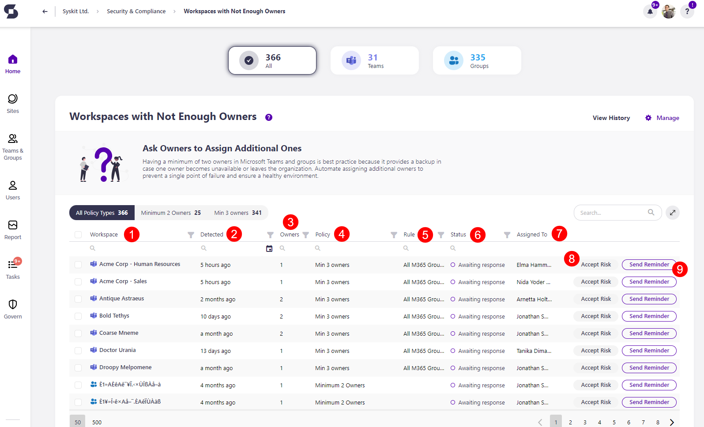
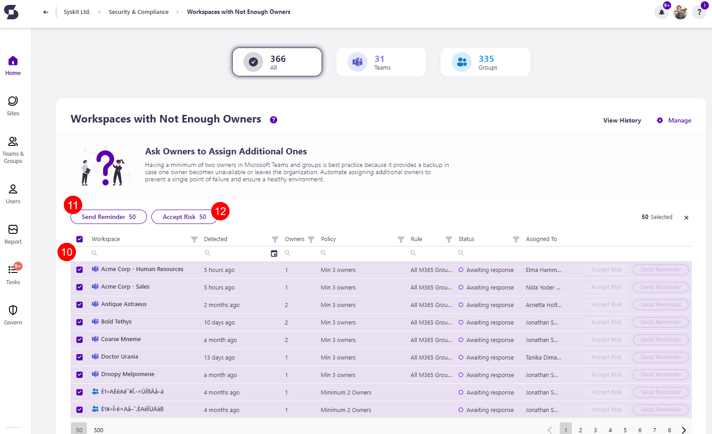

# Workspaces with Not Enough Owners


Security and Complaince checks for Workspaces with Not Enough Owners are available in the XXXX plan and above. 


On the Security & Compliance Checks section dashboard, click the **Workspaces with not enough owners** button to see the report.

The Workspaces with Not Enough Owners screen opens, showing a list of all **workspaces with not enough owners assigned** to them.

Above the report, you can see the number of:
 * All workspaces with a policy violation
 * Microsoft Teams with a policy violation
 * Microsoft Groups with a policy violation

The report itself provides information on:
  * **Workspace (1)** name
  * **Detected (2)** - when the policy violation was detected
  * **Owners (3)** - the number of owners the workspace has
  * **Policy (4)** - the policy assigned to the workspace
  * **Rule (5)** - for the policy applied
  * **Status (5)** - status of the policy violation
    * If a policy was detected, the status shows as *Detected*
    * If a policy was automated, it shows the status in the automation process, for example *Awaiting response*
  * **Assigned to (7)** - who the policy violation is assigned to for a resolution

Additionally, you can complete the following actions for the policy violation:
  * **Accept risk (8)** - this means you will close the policy violation task without making any changes to the current state of the workspace
  * **Send reminder (9)** - this sends a reminder to the person responsible for resolving this task

If the policy was detected instead of automated, instead of sending a reminder you will have the option to **Ask Owners**.

By **selecting all (10)** or more than one workspace, you can perform the bulk action for **Send reminder (11)** and **Accept risk (12)** or if the policy was detected, **Ask Owners**. 

To get more details on a specific workspace further, **click the name of the workspace on the report**.
  * This opens the screen that shows more details about the workspace

Here you can find the following information: 
 * **Severity level (1)**
 * **Vulnerability (2)**
 * **Detected (3)**
 * **Policy Type (4)**
 * **Rule (5)**
 * **Category (6)**

 You can also perform the actions to **Accept Risk (7)** and **Add Owners (8)**. 

