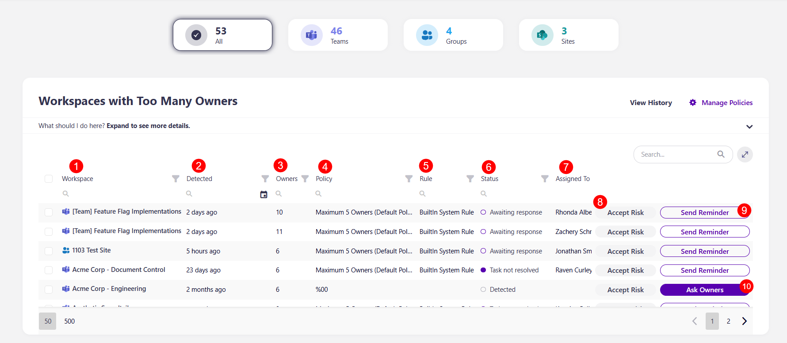
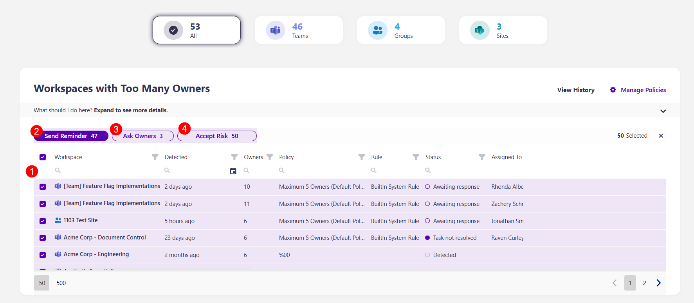
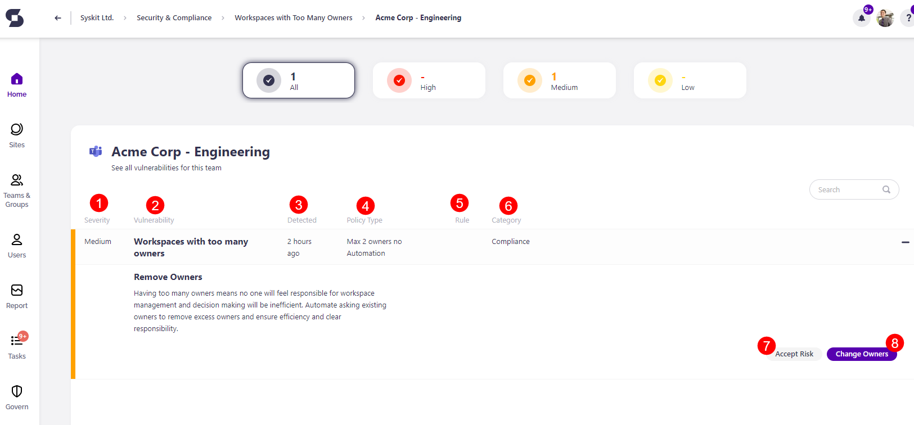

# Workspaces With Too Many Owners

Syskit Point detects workspaces with more than the maximum number of owners predefined in the policy settings, which can pose security concerns. 

When the task delegation option is enabled for the Maximum Number of Owners policy, Syskit Point creates tasks and sends emails to users as defined in the policy settings. To learn more, take a look at the [Maximum Number of Owners policy article](../../governance-and-automation/automated-workflows/maximum-number-of-owners-admin.md). 

By default, task delegation is turned off for this policy, but workspaces with too many owners **are still detected** and shown on the Security & Compliance Dashboard. **This means that Syskit Point detects a vulnerability on a workspace** based on the applied policy, but it does not create tasks or send any emails to workspace owners. 

The purpose of this is to assist Syskit Point admins by
bringing awareness of potential issues across their Microsoft 365 workspaces, including Microsoft Teams, Microsoft Groups, and SharePoint Sites. 

On the Security & Compliance dashboard, click the **Workspaces with too many owners** button to see the report.

The Workspaces with Not Enough Owners screen opens, showing a list of all **workspaces with too many owners assigned** to them.

Above the report, you can see the number of:
* All workspaces with a policy vulnerability
* Microsoft Teams with a policy vulnerability
* Microsoft Groups with a policy vulnerability
* SharePoint Sites with a policy vulnerability

The report itself provides information on:
* **Workspace (1)** name
* **Detected (2)** - when the policy vulnerability was detected
* **Owners (3)** - the number of owners the workspace has
* **Policy (4)** - the policy assigned to the workspace
* **Rule (5)** - for the policy applied
* **Status (5)** - status of the policy vulnerability
  * If a vulnerability was detected, the status shows as *Detected*
  * If task delegation is enabled for the policy, it shows the task status, for example, *Awaiting response* from owners
* **Assigned to (7)** - who the policy vulnerability is assigned to for a resolution

Additionally, you can complete the following actions for the policy vulnerability:
* **Accept risk (8)** - this means you will close the policy vulnerability task without making any changes to the current state of the workspace
* **Send reminder (9)** - this sends a reminder to the person responsible for resolving this task
* **Ask Owners (10)** - this action shows if the policy is not automated, meaning that no tasks were sent to owners; when clicked, emails will be sent to owners and tasks created for owners to resolve the vulnerability
  

By **selecting all (1)** or more than one workspace, you can perform the bulk action for **Ask Owners (2)**, **Send reminder (3)**, and **Accept risk (4)**. 

To get more details on a specific workspace, **click the name of the workspace on the report**.
* This opens the screen that shows more details about the workspace

Here you can find the following information: 
* **Severity level (1)**
* **Vulnerability (2)**
* **Detected (3)**
* **Policy Type (4)**
* **Rule (5)**
* **Category (6)**

 You can also perform the actions to **Accept Risk (7)** and **Change Owners (8)**. 

