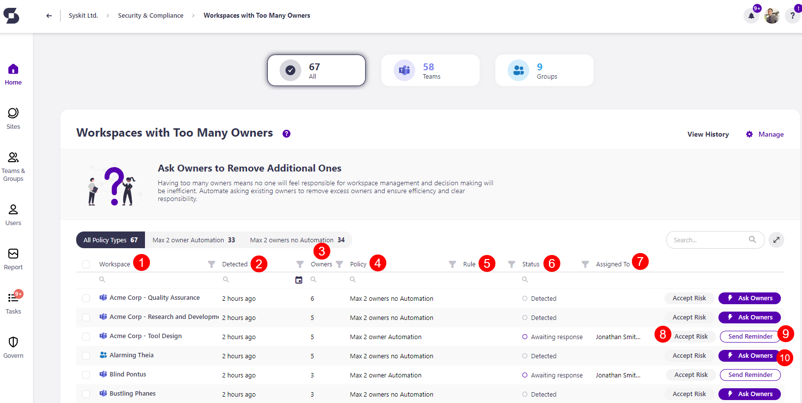
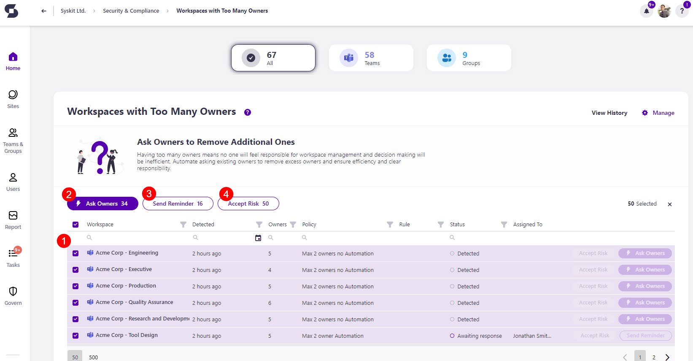

# Workspaces With Too Many Owners

Syskit Point detects workspaces with more than the maximum number of owners predefined by your organization's policies, which can pose security concerns. 

The Maximum Number of Owners policy can be automated, and when automation is enabled, Syskit Point creates tasks and sends emails to users as defined in the policy settings. To learn more, take a look at the [Maximum Number of Owners policy article](../../governance-and-automation/automated-workflows/maximum-number-of-owners-admin.md). 

When the **policy isn't automated**, Workspaces with Too Many Owners **is still detected** for the Security and Compliance checks. **This means that Syskit Point detects a vulnerability on a workspace** based on the applied policy, but it does not create tasks or send any emails to workspace owners. 

The purpose of this is to assist Syskit Point admins by
bringing awareness of potential issues in their Microsoft 365 environment. 

On the Security & Compliance Checks section dashboard, click the **Workspaces with too many owners** button to see the report.

The Workspaces with Not Enough Owners screen opens, showing a list of all **workspaces with too many owners assigned** to them.

Above the report, you can see the number of:
 * All workspaces with a policy violation
 * Microsoft Teams with a policy violation
 * Microsoft Groups with a policy violation

The report itself provides information on:
  * **Workspace (1)** name
  * **Detected (2)** - when the policy violation was detected
  * **Owners (3)** - the number of owners the workspace has
  * **Policy (4)** - the policy assigned to the workspace
  * **Rule (5)** - for the policy applied
  * **Status (5)** - status of the policy violation
    * If a policy was detected, the status shows as *Detected*
    * If a policy was automated, it shows the status in the automation process, for example *Awaiting response*
  * **Assigned to (7)** - who the policy violation is assigned to for a resolution

Additionally, you can complete the following actions for the policy violation:
  * **Accept risk (8)** - this means you will close the policy violation task without making any changes to the current state of the workspace
  * **Send reminder (9)** - this sends a reminder to the person responsible for resolving this task
  * **Ask Owners (10)** - this action shows if the policy wasn't automated but was detected
  

By **selecting all (1)** or more than one workspace, you can perform the bulk action for **Ask Owners (2)**, **Send reminder (3)** and **Accept risk (4)**. 

To get more details on a specific workspace further, **click the name of the workspace on the report**.
  * This opens the screen that shows more details about the workspace

Here you can find the following information: 
 * **Severity level (1)**
 * **Vulnerability (2)**
 * **Detected (3)**
 * **Policy Type (4)**
 * **Rule (5)**
 * **Category (6)**

 You can also perform the actions to **Accept Risk (7)** and **Change Owners (8)**. 

