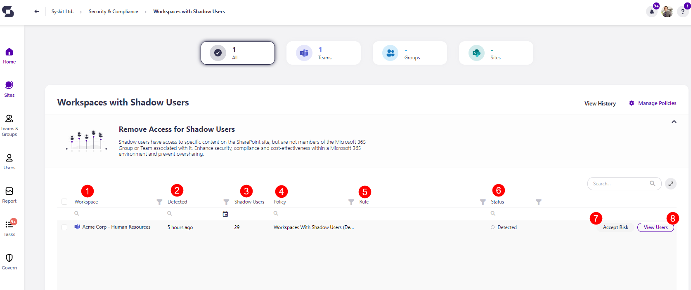
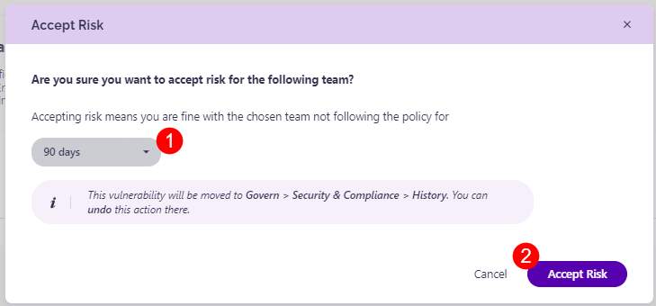
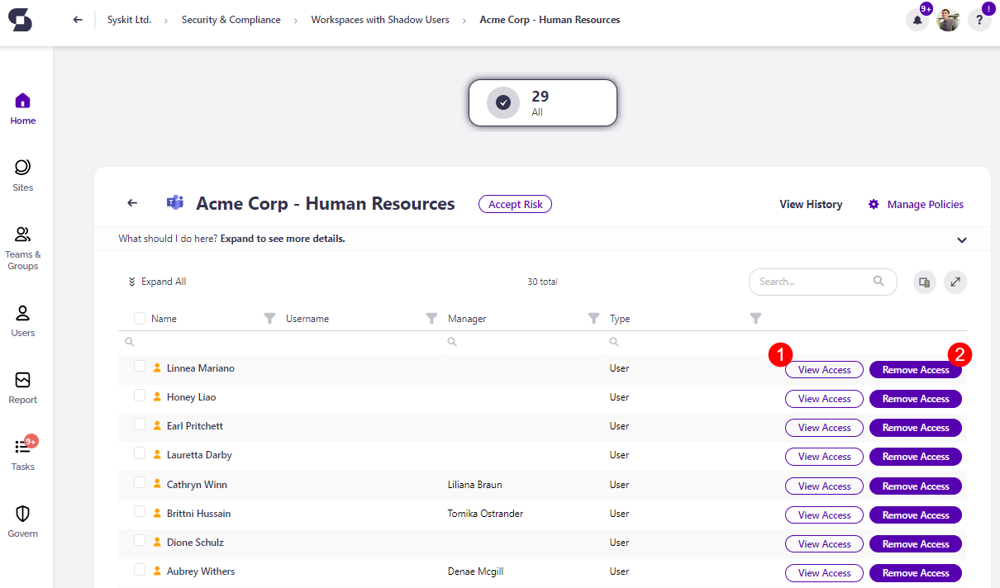
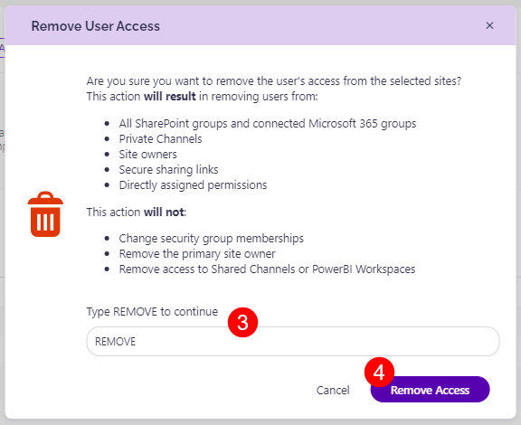

# Workspaces with Shadow Users

Syskit Point detects users who have access to specific content on the SharePoint site but are not members of the Microsoft 365 Group or Team associated with it, which could lead to security risks and cause oversharing.

The Workspaces with Shadow Users policy **cannot have task delegation enabled**. That means that no tasks are created to resolve this policy vulnerability, and no emails are sent to collaborators.

The shadow users **are still detected** and shown on the Security and Compliance dashboard. **This means that Syskit Point detects a vulnerability on a workspace** based on the applied policy, but it does not create tasks or send any emails to collaborators.

The purpose of this is to assist Syskit Point admins by bringing awareness of potential issues in their Microsoft 365 environment.

On the Security & Compliance dashboard, click the **Workspaces with Shadow Users** button to see the report.

The Workspaces with Shadow Users screen opens, showing a list of all \***workspaces that have content shared with users that are not part of the workspace**.

The report itself provides information on:

* **Workspace (1)** name of the workspace
* **Detected (2)** - when the policy vulnerability was detected
* **Shadow Users (3)** - the number of shadow users that have access to content from the workspace
* **Policy (4)** - the policy vulnerability that has been detected
* **Rule (5)** - the rule that has been assigned, if any
* **Status (6)** - the status of the policy vulnerability

You can complete the following actions for the policy vulnerability:

* **Accept Risk (7)** - this means you will close the policy vulnerability without making any changes to the current state of the workspace for the specified period
* **View Users (8)** - this generates the list of shadow users that have access to this workspace

Clicking the Accept Risk button opens the Accept Risk pop-up. To delay this violation, complete the following:

* **Select the number of days (1)** this policy vulnerability should be delayed for.   \* Once you accept the risk, this vulnerability is moved to the Govern > Security & Compliance > History section, and you can undo the action there.
* **Click the Accept Risk button (2)** to finalize your decision.

To view and manage the shadow users for this workspace, click the **View Users button** or the **name of the workspace**.

This opens the Remove Access for Shadow users screen, where you can:

* Click the **View Access button (1)** to see the access the user has in the workspace.   \* This opens the User Access report that shows a list of all workspaces where this user has access and shows the level of access they have per workspace.
* Click the **Remove Access button (2)**.   \* This opens the Remove User Access button   \* To remove access **type REMOVE (3)** in the designated space and **click the Remove Access button (4)** to finalize your choice.


**Please note** the following situations might occur:

* A Microsoft 365 Group named Marketing has access to documents in a Microsoft Team titled Sales; as a result, the Marketing group shows up as a shadow user on the Workspaces with Shadow Users report for the Sales team.
* John is a member of the Marketing Microsoft 365 Group. John shows up as a shadow user on the Sales team, even though he has no direct access to documents in the Sales team. This happens if the Marketing group that John is a part of has access to documents from the Sales team.
* Joanna is also a part of the Marketing group. However, Joanna is also an owner or member of the Sales team to which the Marketing group has access. Therefore, Joanna will not show as a shadow user for the team.
* When the Marketing group has its access removed from the Sales team, John no longer shows up as a shadow user.

