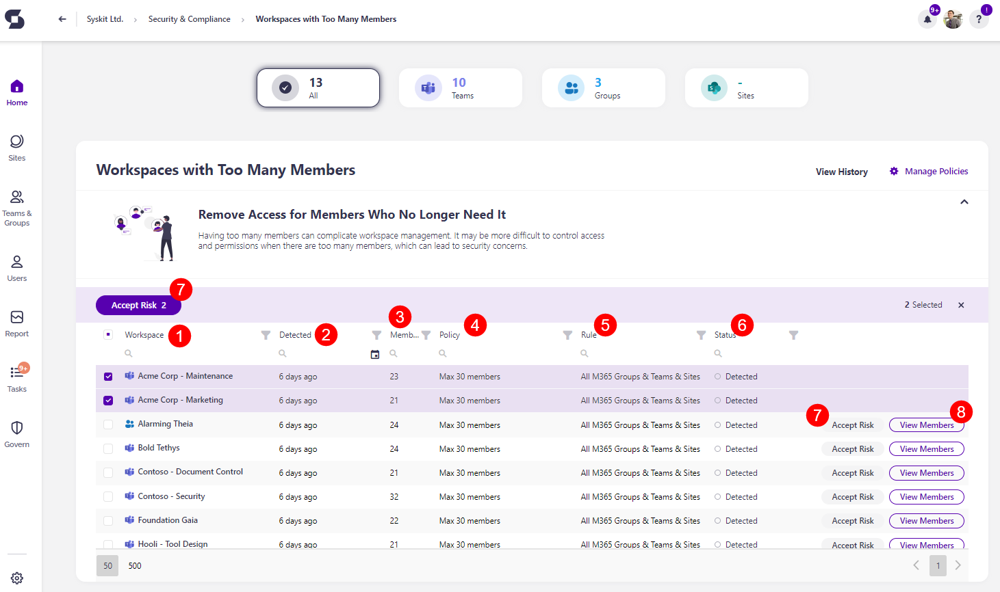

# Workspaces with Too Many Members

Syskit Point detects workspaces that have too many members, which makes it more difficult to control access and permissions for the workspace and could lead to security concerns. 

The Workspaces with Too Many Members policy **cannot have task delegation enabled**. That means no tasks are created to resolve this policy violation, and no emails are sent to collaborators.

The workspaces with too many members **are still detected** and shown on the Security and Compliance dashboard. **This means that Syskit Point detects a vulnerability on a workspace** based on the applied policy, but it does not create tasks or send any emails to collaborators. 

The purpose of this is to assist Syskit Point admins by
bringing awareness of potential issues in their Microsoft 365 environment. 

On the Security & Compliance dashboard, click the **Workspaces with Too Many Members** button to see the report.

The Orphaned Users screen opens, showing a list of all **workspaces that have too many members**, which means the workspace surpaces the member limit you set [for the policy](.././automated-workflows/workspaces-with-too-many-members-admin.md).

The report itself provides information on:
* **Workspace (1)** name of the workspace
* **Detected (2)** - when the policy violation was detected
* **Members (3)** - the number of members that are a part of the workspace
* **Policy (4)** - the policy violation that has been detected
* **Rule (5)** - the rule that has been assigned, if any
* **Status (6)** - the status of the policy violation

You can complete the following actions for the policy violation:
  * **Accept Risk (7)** - this means you will close the policy violation without making any changes to the current state of the workspace
  * **View Members (8)** - this opens the screen where you can view more details

Clicking the Accept Risk button opens the Accept Risk pop-up. To delay this violation, complete the following:

  * **Select the number of days (1)** this policy violation should be delayed for.
    * Once you accept the risk, this vulnerability is moved to the Govern > Security & Compliance > History section, and you can undo the action there. 
  * **Click the Accept Risk button (2)** to finalize your decision.

