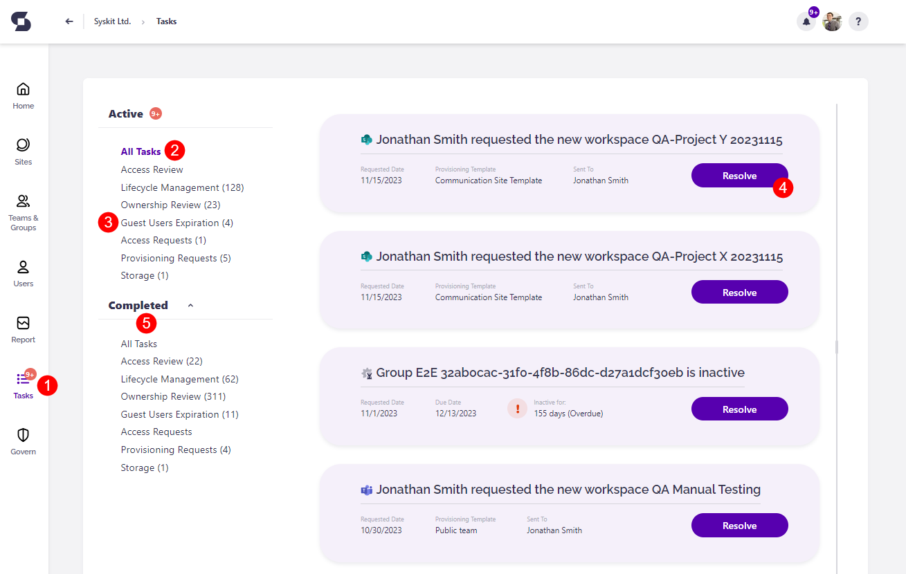

# Syskit Point Tasks

**Syskit Point empowers collaborative Microsoft 365 governance through different tasks** created and assigned to site owners and administrators.

In the latest version of Syskit Point, the following types of tasks are available:

* [**Access Review**](../point-collaborators/resolve-governance-tasks/access-review.md)
* [**Lifecycle Management**](../point-collaborators/resolve-governance-tasks/lifecycle-management.md)
* **Ownership Review**
    * [**Minimum Number of Owners**](../point-collaborators/resolve-governance-tasks/minimum-number-of-owners.md)
    * [**Maximum Number of Owners**](../point-collaborators/resolve-governance-tasks/maximum-number-of-owners.md)
    * [**Orphaned Workspaces**](../point-collaborators/resolve-governance-tasks/orphaned-resources.md)
* [**Guest Users Expiration**](../point-collaborators/resolve-governance-tasks/guest-users-expiration.md)
* [**Access Requests**](../governance-and-automation/access-requests/approval-process.md)
* [**Provisioning Requests**](../governance-and-automation/provisioning/approve-reject-requests.md)
* [**Tenant Storage Limit**](../point-collaborators/resolve-governance-tasks/tenant-storage-limit.md)

Click the appropriate link to learn more about how to resolve a specific type of task.


**Syskit Point Tasks** are available in the Governance plan and higher tiers. See the [pricing page](https://www.syskit.com/products/point/pricing/) for more details.


## Tasks

You can find all tasks assigned to you by **clicking the Tasks option (1)** available in the main menu.
Once clicked, the Tasks screen opens.
By default, **all active tasks are displayed \(2\)**. Here, you can:
* **display only a specific type of task** by using the **options in the left-hand navigation \(3\)**.
* **open a task** by using **the associated button \(4\)** on the right-hand side
* **view all completed tasks \(4\)**

