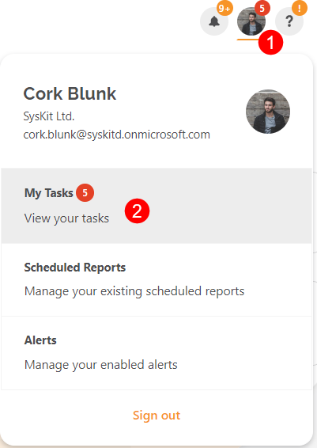
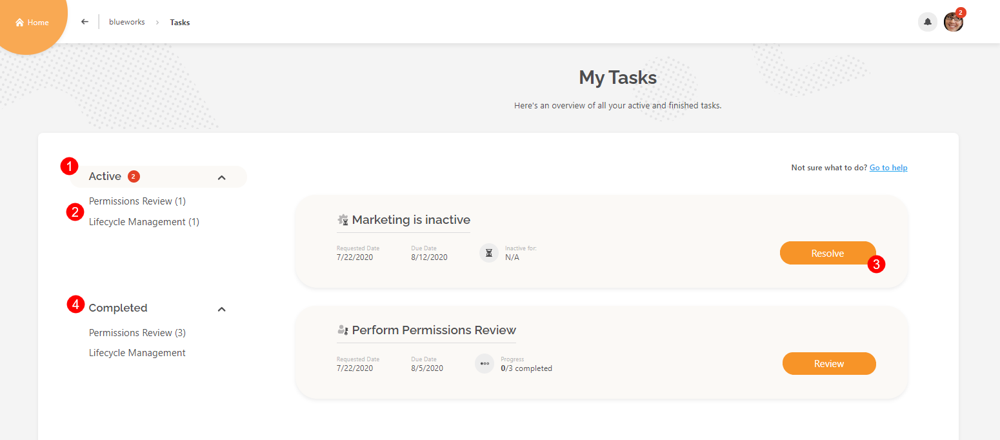

# Syskit Point Tasks

**Syskit Point empowers collaborative Microsoft 365 governance through different tasks** created and assigned to site owners and administrators.

In the latest version of Syskit Point the following types of tasks are available:

* [**Access Review**](permissions-review/)
* [**Lifecycle Management**](lifecycle-management/)

Click the appropriate link to learn more about how to resolve a specific type of task.


**Syskit Point Tasks** are available in the Governance plan and higher tiers. See the [pricing page](https://www.syskit.com/products/point/pricing/) for more details.


## My Tasks

You can find all tasks assigned to you by opening the My Tasks screen. To access the **My Tasks** screen:

* **Open the user profile menu \(1\)**
* **Click the My Tasks option \(2\)**

My Tasks screen opens.

By default, **all active tasks are displayed \(1\)**. Here, you can:

* **display only a specific type of task** by using the **options in the left-hand navigation \(2\)**.
* **open a task** by using **the associated button \(3\)** on the right-hand side
* **view all completed tasks \(4\)**

## Related Topics

* [Enable Automated Access Review](permissions-review/enable-permissions-review.md)
* [Manually Request Access Review](permissions-review/manually-request-permissions-review.md)
* [Monitor Access Review Tasks](permissions-review/monitor-permissions-review.md)
* [Perform Access Review](../point-collaborators/resolve-governance-tasks/access-review.md)
* [Enable Lifecycle Management Automation](lifecycle-management/enable-lifecycle-management.md)
* [Monitor Lifecycle Management Tasks](lifecycle-management/monitor-lifecycle-management.md)
* [Resolve Lifecycle Management Tasks](../point-collaborators/resolve-governance-tasks/lifecycle-management.md)

