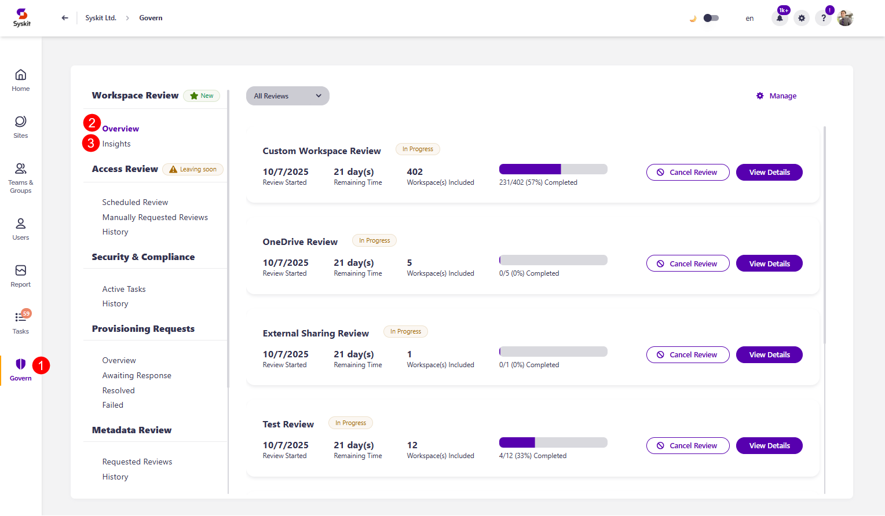
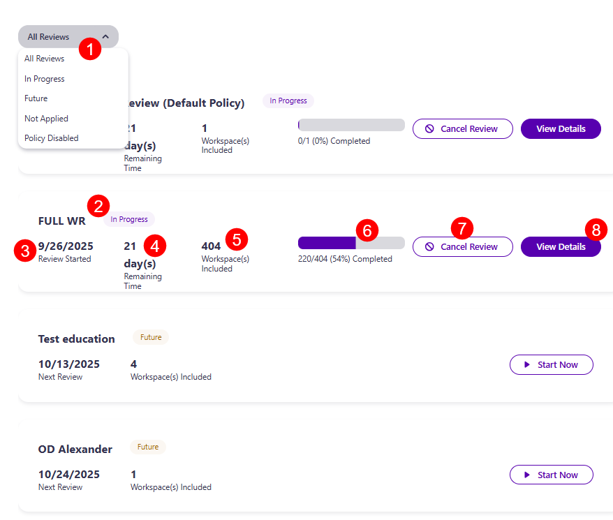
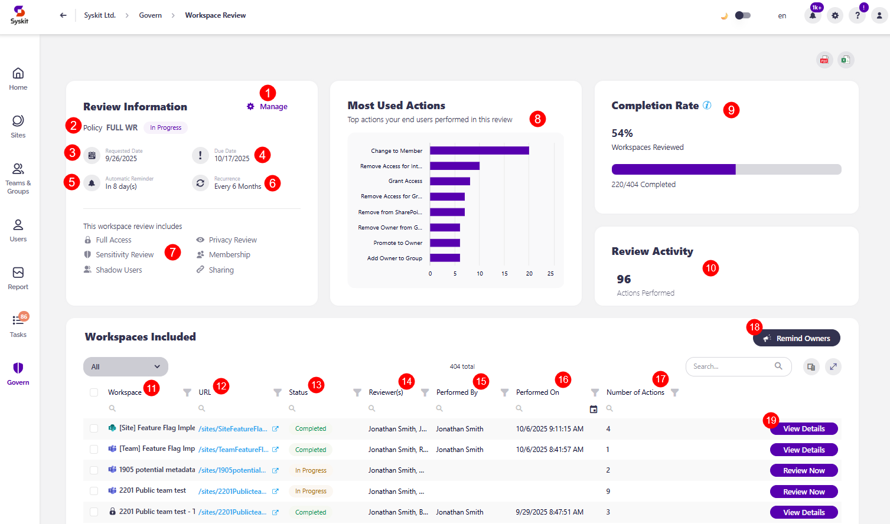
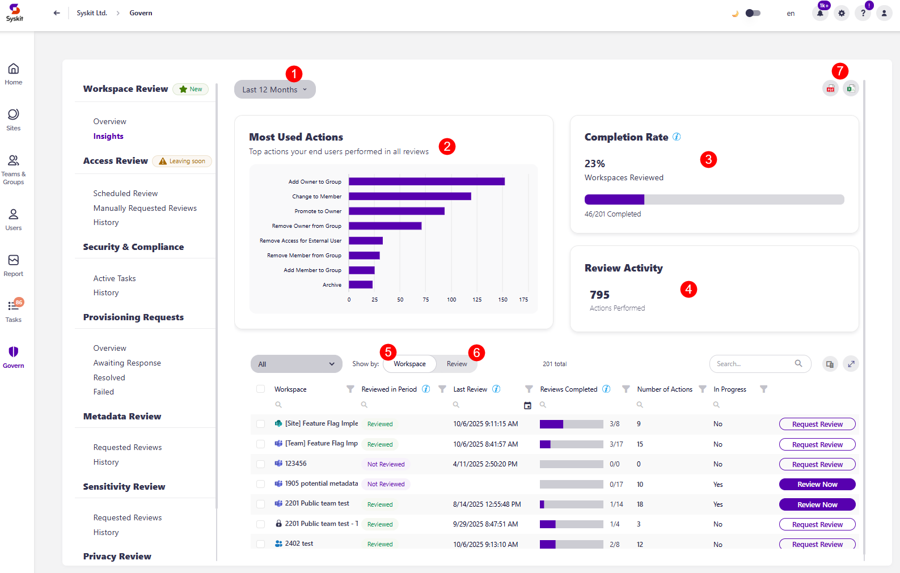
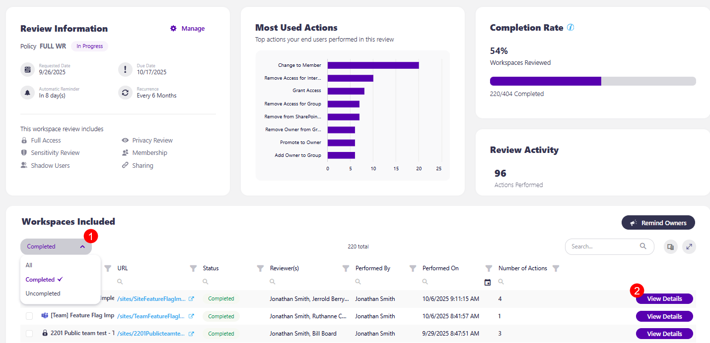
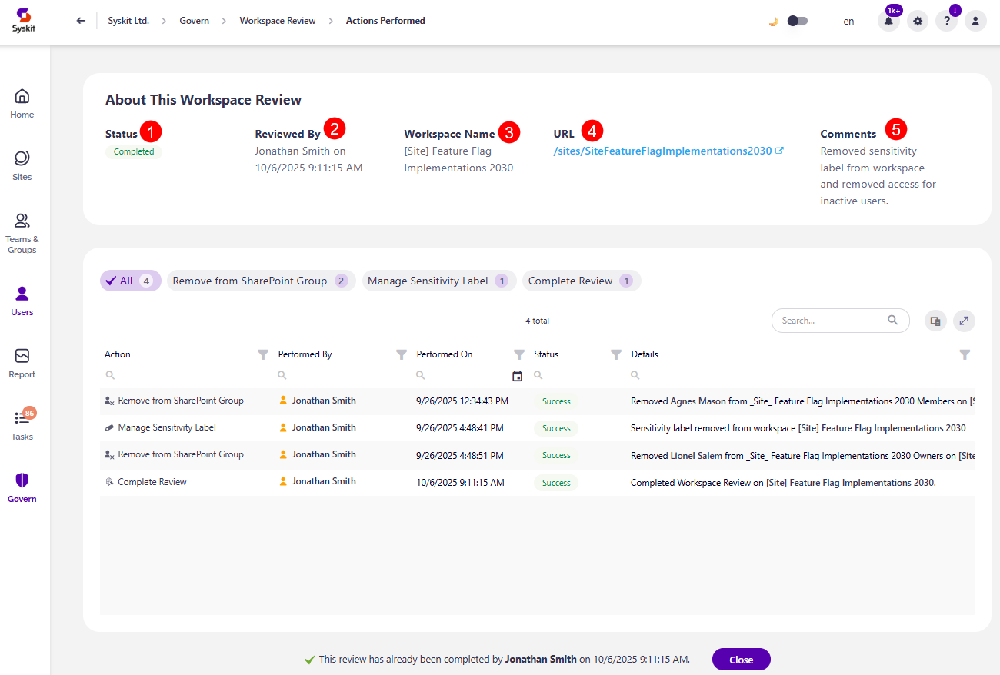
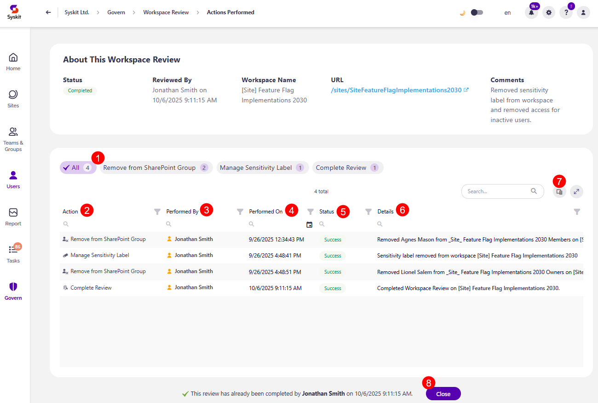
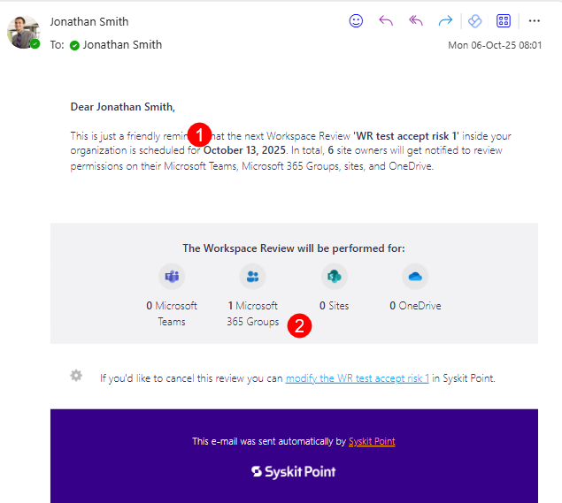

# Monitor Workspace Review in Syskit Point


**Please note!**\
To monitor workspace reviews, please make sure you have [enabled and configured at least one Workspace Review policy](setup-workspace-review.md).


The **Workspace Review policy** helps organizations **maintain and secure their Microsoft 365 environment by enabling regular, structured, and recommendation-driven review of the most essential workspace settings**. It provides automated tasks for workspace owners to review and resolve policy violations related to **access, privacy, and sensitivity**. 

Unlike Access Review, which focuses on reviewing users' access, the Workspace Review includes additional governance checks, such as: 

* **Inactive Workspaces** - reviewers can archive or delete workspaces that are no longer in use
* **Minimum Number of Owners** - reviewers can ensure that each workspace has enough active owners
* **Maximum Number of Owners** - reviewers can ensure that workspaces do not have too many owners
* **Privacy and Sensitivity Reviews** - reviewers can ensure that workspaces comply with organizational policies and are correctly labeled

Once you've [created your Workspace Review policies](setup-workspace-review.md), based on your selected settings, reviewers receive tasks to review and ensure the safety of their workspace regularly.  

The Workspace Review in Syskit Point can be viewed from two different roles:

* **Syskit Point Admin user**, as described in this article
* [Syskit Point Collaborator user](../../point-collaborators/resolve-governance-tasks/access-review.md)

When working with Workspace Review, Syskit Point Admin users can:

* **Define Workspace Review settings**
* **Decide which workspaces the policy applies to**
* **Monitor Workspace Review progress**

While Syskit Point Collaborators can **perform the Workspace Review on workspaces where they are the owner or admin**.

These two roles have **different reports and actions available** before and during the Workspace Review and receive different emails.

In this article, you can find out how **Syskit Point Admins** can monitor the progress of an active Access Review.

## Workspace Review - Governance

On the start date of the automated Workspace Review, **Workspace Review tasks are created in Syskit Point**, and **email requests are sent to reviewers**.

**Each reviewer gets one Workspace Review task**, and that task includes **all workspaces where the said user is an owner or admin**, based on the [how reviewers were defined for that Workspace Review policy](../../governance-and-automation/workspace-review/setup-workspace-review.md).

To **track the progress** of currently active Workspace Reviews, **request a Workspace Review** for workspaces **manually**, or **cancel an existing review**, Syskit Point Admins can **use the Governance screen**. 

To access the Governance screen, **click the Govern button (1)** on the left side of the screen.

On the Governance screen, the **Workspace Review** is divided into two sections:
* [Overview](#overview) (2)
* [Insights](#insights) (3)

### Overview

The Overview screen provides a quick look at the state of your Workspace Review.

* The **filter in the top left corner (1)** lets you select between the view you want applied, with the following options available:
  * **All Reviews** - shows all Workspace Review policies 
  * **In Progress** - shows reviews that are currently in progress 
  * **Future** - shows scheduled reviews that will start sometime in the future
  * **Not Applied** - shows policies that are configured, but are not applied to any workspace
  * **Policy Disabled** - shows Workspace Review policies that are disabled, which means tasks and emails won’t be sent

Each workspace review contains the following: 
* **Name (2)** of the review and the **current state** of the review (example, requested, in progress)
* **Date (3)** the review was started
* **Time left (4)** to complete the review 
* **Number of workspaces (5)** included in this workspace review 
* **Percentage of tasks (6)** complete and number of workspaces where the review was completed out of the number of workspaces where it was requested
* **Cancel Review button (7)** - clicking this opens the confirmation dialog, where you need to confirm the cancellation
  * If you cancel a Workspace Review, the following happens:
    * All workspace review tasks are automatically closed with the status 'Canceled'
    * No emails are sent to workspace owners 
    * The canceled review is visible under Govern > Insights > Show by Review
* **View Details (8)** - clicking this opens the review details screen for that workspace review policy

After clicking the **View Details button**, the Workspace Review details screen appears, where the following can be found:

* **Review Information** which includes:
  * The **Manage button (1)**, which you can use to edit the Workspace Review Policy
  * **Name (2)** of the review and the current status
  * **Date (3)** the review was requested
  * **Due date (4)** by which the review should be completed on
  * **Amount of days (5)** when an automatic reminder is sent
  * **Recurrence time (6)**, which shows how often the workspace review is repeated
  * **A list of what this workspace review includes (7)** out of the following options:
    * Full Access
    * Sensitivity Review
    * Shadow Users
    * Privacy Review
    * Membership
    * Sharing

* **Most Used Actions (8)**, which shows the top actions that end users performed in this review

* **Completion Rate (9)**, which shows the percentage of review completion as well as the number of workspaces the review was completed on out of the number of workspaces the review was requested on

* **Review Activity (10)**, which shows the number of actions taken during this workspace review

* **Workspaces Included**, which provides a list and overview of all workspaces included in the review, with the following columns available:

  * **Workspace (11)** - name of the workspace
  * **URL (12)** - URL for the workspace
  * **Status (13)** - the current status of the review for that workspace
  * **Reviewer(s) (14)** - list of reviewers responsible for that workspace
  * **Performed by (15)** - shows who the review was performed by
  * **Performed on (16)** - shows the date when the review was performed
  * **Number of Actions (17)** - the number of actions taken on the workspace as part of the workspace review
  * **Remind Owners action (18)** - in the top right corner, clicking this sends an email reminder to reviewers for the workspaces where the Workspace Review was not yet completed
  * **Review Now action (19)** - lets you complete the review on that workspace by yourself 

### Insights

The Insights screen provides more details on the state of your Workspace Review across a period of time.

* The **filter (1)** in the top left corner lets you **choose the time frame you want to generate the information for**, with the following options available:
  * **Last 3 Months**
  * **Last 6 Months**
  * **Last 12 Months**
  * **This Year**
  * **Custom**

* **The Most Used Actions (2)** shows the list of the most used actions for the workspace review, as well as graphs that indicate the number of times an action was performed 

* **Completion Rate (3)**, which shows the percentage of review completion as well as the number of workspaces the review was completed on out of the number of workspaces the review was requested on, for the duration you selected in the top filter

* **Review Activity (4)**, which shows the number of actions taken for the workspace review for the duration you selected in the top filter

There is also an **overview of workspaces** that the Workspace Review was applied to, which can be viewed in two ways:

* When **shown by Workspace (5)**, the following information is included: 
  * **Workspace** - name of the workspace
  * **Reviewed in Period** - shows whether the workspace was reviewed in the time frame you selected
  * **Last Review** - shows when the last review was performed on the workspace
  * **Reviews Completed** - the number of reviews in the selected time period, showing as N/M, with N being the number of completed reviews, and M the number of requested reviews
  * **Number of Actions** - the number of actions taken on the workspace as part of the workspace review
  * **In Progress** - whether a workspace review is currently active for the workspace
  * **Review Now action** - lets you complete the review on that workspace by yourself 
  * **Request Review action** - lets you immediately request a Workspace Review for that workspace

* When **shown by Review (6)**, the following information is included: 
  * **Policy Name** - the name of the Workspace Review policy that was applied
  * **Status** - the current status of the review for that workspace
  * **Requested Date** - the date the review was requested on 
  * **Completed Date** - the date the review was completed on
  * **Number of Actions** - the number of actions taken as part of the workspace review
  * **View Details button** - clicking this opens the review details screen for that workspace review policy, as was explained earlier in the [Overview section of the article](#overview)

The Insights screen can be **exported as PDF and XLSX files (7)**.

## Workspace Review - Completion Summary

When at least one workspace has its workspace review task completed, you can view the **Actions Performed** screen. Here's how you'll **get a summary of your workspace reviews per workspace**. 

On the **Govern > Workspace Review > Overview > View Details**, scroll to the Workspaces Included section and from the left side filter select **Completed (1)**. 

This lists the workspaces for which the review was completed, and by clicking the **View Details button (2)**, the Actions Performed screen opens for that workspace. 

On the **Actions Performed** screen, the following is available:

* **About This Workspace Review section** that contains information on:
  * **Status (1)** of the review 
  * **Reviewed By (1)** shows who reviewed the workspace and when
  * **Workspace Name (3)** shows the name of the workspace
  * **URL (4)** shows a clickable URL for the workspace
  * **Comments (5)** column shows any comments left by reviewers while resolving the workspace review task for the workspace

* **Actions Performed filter (1)**, which lists all the actions performed on the workspace, along with the number of times it was performed
  * **Clicking on an action filters the actions report below** to reflect only information for the action selected

* **Actions Performed report** with the following columns:
  * **Action (2)** shows what action was performed
  * **Performed By (3)** shows who performed the action
  * **Performed On (4)** shows when the action was performed
  * **Status (5)** shows the status of the action and whether it was performed successfully
  * **Details (6)** shows more details about the action performed

* The additional columns available from the **column chooser (7)** are:
  * **Scope**
  * **Execution End Time**
  * **Name**
  * **URL**
  * **Error**

* At the bottom, you can find information on who completed the review and when, along with a **Close button (8)**. 
  * Clicking on the Close button returns you to the Workspace Review Overview screen. 

## Admin Emails for Workspace Reviews

Syskit Point Admin users receive an email before the very start of the review as a reminder and at the end of the review with a quick summary of reviews completed. 

### Admin Reminder

Three workdays before the start of the automated Workspace Review, the Syskit Point Admin receives a reminder email with the most important information about the upcoming Workspace Review:

* **Start date (1)** of the upcoming Workspace Review
* **The number and type of workspaces (2)** - Microsoft Teams, Microsoft 365 Groups, sites, and OneDrive - which are included in the upcoming Workspace Review


**Please note!**\
To ensure that all sites have an owner responsible for the upcoming Workspace Review, set active users as site owners for all orphaned sites.


### Workspace Review Completion

Once the entire Workspace Review is completed or the time frame for the Workspace Review resolution has passed, you receive a **Workspace Review Completion email**. 

In this email, you can find out how many workspace review tasks were completed and how many workspaces were reviewed. 

The following information is provided:
* **Total number of workspaces** for which the Workspace Review was completed
* **Total number of workspaces** where Workspace Review was not completed
* **View Details** button 

Clicking the **View Details** button takes you to the [Overview](#overview) screen, where you can find more details on each workspace and the actions completed during the review. 

In addition to receiving an email, you can find the completed Workspace Review by clicking the **Govern** button on the left side of the screen. 