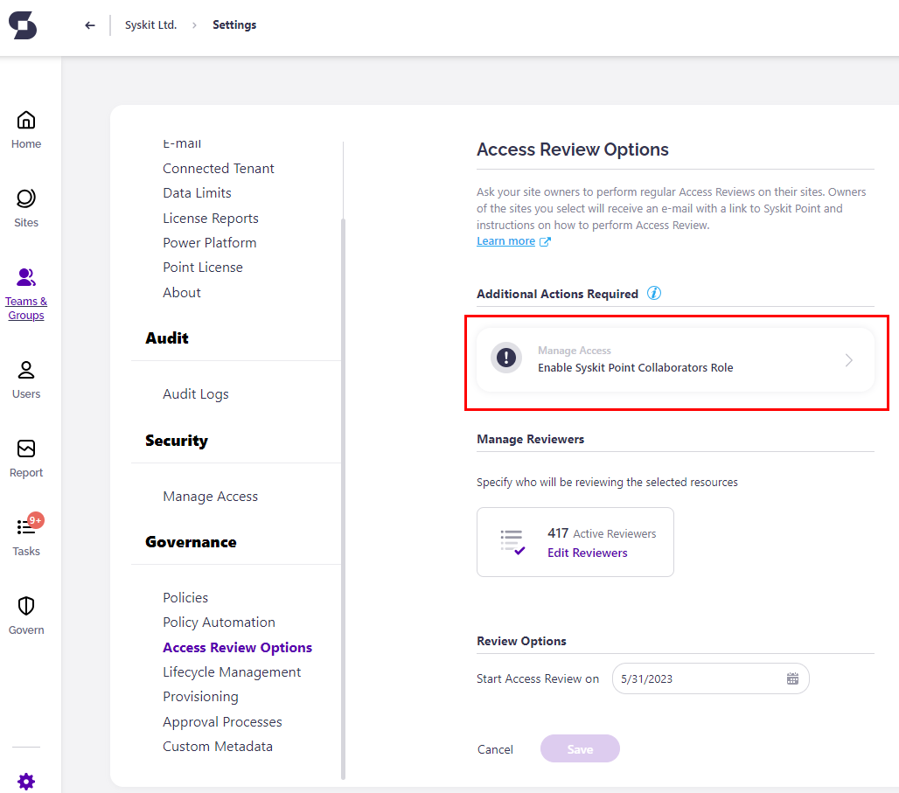

# Workspace Review

The Workspace Review policy helps you maintain control over your Microsoft 365 workspaces by regularly prompting workspace owners to confirm the importance, access, activity, and security of their workspaces. This policy includes a privacy and sensitivity review, broader governance policies, and introduces smarter, recommendation-driven tasks. 

Admins can define custom policies that trigger review cycles at regular intervals, ensuring each workspace is evaluated based on criteria like inactivity, sensitivity labels, ownership, or missing classification data.

The following steps:

* **Admins configure Workspace Review policies**
  * Set the schedule, define the review scope, and select which workspaces should be included based on filters like inactivity or sensitivity labels.
* **Workspace owners complete reviews**
  * When a review is due, owners receive a task in Syskit Point along with an email notification. Tasks include workspace details and suggested actions (e.g., archive, change owner, update label) to simplify decision-making.
* **Admins monitor review progress**
  * From the Workspace Review dashboard, admins can track which workspaces have been reviewed, see completed actions, and gain insights into the effectiveness of each review cycle.

## Configure Workspace Review Policies

With Workspace Review, you can ask site owners to perform regular Workspace Reviews on their workspaces. You can have more than one Workspace Review active with different Settings. 

To set up your Workspace Review, navigate to **Settings > Policies**. 

* Click Create New Policy
* Select Workspace Review from the list 
* Choose a template or build your own Workspace Review with the following options
  * Memberships - a tmplate to review only workspace members and owners
  * External Sharing - a template to review external users, guests, and shared content only
  * Full Review - a template to review all users and sharing type during one review 
  * Start From Scratch - configure a custom review policy to fit your team's needs. 

### Memberships

Selecting the Memberships template lets you do the following:
* **Define the policy name (1)**
* Choose whar to review:
  * Internal and External Access
  * External Access Only
* Select the Review date
* Choose the recurrance pattern - how often should the review repeat

* **Choose the severity level (2)**; this option is enabled by default
* **Enable Task Delegation (3)** by clicking the toggle next to it and selecting your task delegation preferences:
  * **Select between the 3 available processes (4)**:
     * **Ask Specific Users to Assign New Owners**; this is a **1-stage process**, where selected users - Syskit Point Administrators and/or custom recipients - **get a task to assign new owners**
     * **Ask Members to Suggest New Owners**; this is a **2-stage process**, where members can suggest new owners, and afterward, the selected users - Syskit Point Administrators and/or custom recipients - **get a task to resolve the task base on the suggestions from owners**; by default, this option is selected
     * **Automatically Assign New Owners**; if selected, Syskit Point **automatically assigns the last owner's manager as a new owner**
       * If the manager cannot be found, Syskit Point escalates the task to the user you defined when creating the policy
 * Click **Save (5)** once you are done with the policy configuration 

### External Sharing

### Full Review 

### Start From Scratch

Click the **Edit (1)** icon to view all defined options for the policy. 

The **Edit Policy** dialog opens where you can:
* **Define the policy name (1)**
* **Choose the severity level (2)**; this option is enabled by default
* **Enable Task Delegation (3)** by clicking the toggle next to it and selecting your task delegation preferences:
  * **Select between the 3 available processes (4)**:
     * **Ask Specific Users to Assign New Owners**; this is a **1-stage process**, where selected users - Syskit Point Administrators and/or custom recipients - **get a task to assign new owners**
     * **Ask Members to Suggest New Owners**; this is a **2-stage process**, where members can suggest new owners, and afterward, the selected users - Syskit Point Administrators and/or custom recipients - **get a task to resolve the task base on the suggestions from owners**; by default, this option is selected
     * **Automatically Assign New Owners**; if selected, Syskit Point **automatically assigns the last owner's manager as a new owner**
       * If the manager cannot be found, Syskit Point escalates the task to the user you defined when creating the policy
 * Click **Save (5)** once you are done with the policy configuration 



**Please note:** The Orphaned Workspaces policy vulnerability is detected when there are 0 active owners assigned to a workspace. 

If 1 owner is assigned to a workspace when resolving the Orphaned Workspaces vulnerability, Syskit Point will detect the [Minimum Number of Owners policy](../../point-collaborators/resolve-governance-tasks/minimum-number-of-owners.md) vulnerability, as the default requirement is to have at least 2 owners per workspace. 



To start with the configuration, open the **Settings** > **Governance** > **Access Review** screen. Initially, you may find the Access Review settings screen displaying the following warnings:

Clicking the tiles in the **Additional Actions Required** section redirects to the appropriate settings screen.

## Enable Syskit Point Collaborators


**Please note!** If a user, security group, or mail-enabled security group is added to the Governance-Excluded Users list, they do not receive any Access Review related tasks or task-related emails. [For more details on setting up Governance-Excluded Users, take a look at this article.](../../configuration/exclude-users-tasks.md)


## Next Steps

Once you are finished with the e-mail and Collaborators role configuration, continue to the [Create and Apply Access Review Policies](create-apply-access-review-policies.md) article.

For information on Syskit Point Collaborators completing Access Review tasks, take a look at the [Perform Access Review Tasks article](../../point-collaborators/resolve-governance-tasks/access-review.md).
