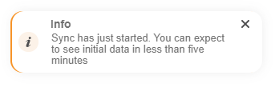
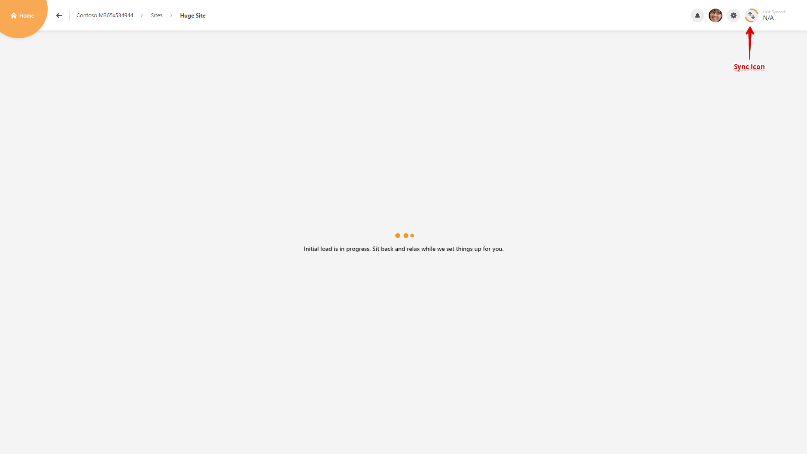

# Collect Office 365 Data

## First Run

After you install and configure SysKit Point, all data for SharePoint Online Sites, Microsoft Teams, Office 365 Groups, Office 365 tenant users and their OneDrive \(optional\) begins to load automatically. We call this process **Sync** since we sync Office 365 tenant data with data in the SysKit Point database.

When you log in to SysKit Point, you will get an appropriate notification telling you that Sync started.

If you navigate to the Sites screen and drill to Site details of a site for which the sync is not yet finished, a loading screen is displayed and you can notice the animated Sync icon in the top right corner, meaning that the Sync is in progress. 


**Hint!**  
While the initial load is in progress, if you drill to Site details of a not-yet-synced site, the site automatically gets a higher sync priority and will be synced as soon as possible.



**Please note!**  
Initial Sync can take considerably longer than 24 hours to complete, all depending on the size of your Office 365 environment.


## Sync 

The Sync button can be found positioned in the top right corner on most screens in SysKit Point. Depending on the screen you are currently seeing, running the Sync will trigger different sync actions. 

Here is an overview of screens and actions triggered by clicking the Sync button:

* **Sites screen** - Sync action triggers the Autodiscover process where all new Sites are discovered
* **Microsoft Teams & Groups screen** - Sync action triggers the Autodiscover process where all new Microsoft Teams and Office 365 groups are discovered
* **Users screen** - Sync action triggers data collection for all Users in Office 365 tenant
* **Site details screen** - Sync action triggers **data collection for the currently viewed site only**; if the site in question has a connected Office 365 Group, the Group data will also be collected
* **Group details screen** - Sync action triggers **data collection for the currently viewed Office 365 Group only**; if the group in question has a connected Site, the Site data will also be collected

## Sync Schedule

While the first Sync collects data for all SharePoint Online Sites, Microsoft Teams, Office 365 Groups, Office 365 tenant users and their OneDrive \(optional\), **all following Sync recurrences take changes into account, meaning that only SharePoint Online Sites and Office 365 Groups with discovered changes will be synced.** 


**Please note!**  
Since change detection is based on Office 365 audit log data, it can take up to 24 hours after a change event occurs for the corresponding audit log entry to be available for SysKit Point to process. 


**User Sync is by default run every 24 hours** and collects data for all Office 365 tenant users. Single user sync is not available at this point.


**Hint!**  
All changes in your Office 365 environment should be synced in no more than 24 hours.   
Should you require data to be synced immediately, you can start the Sync manually at any time by clicking the Sync button on the appropriate screen, be it for a Site, Office 365 Group or all users in your tenant.


\*\*\*\*

