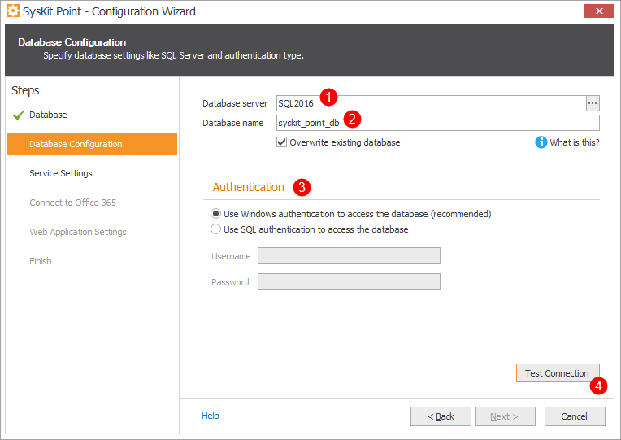
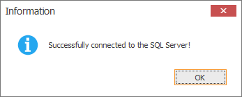
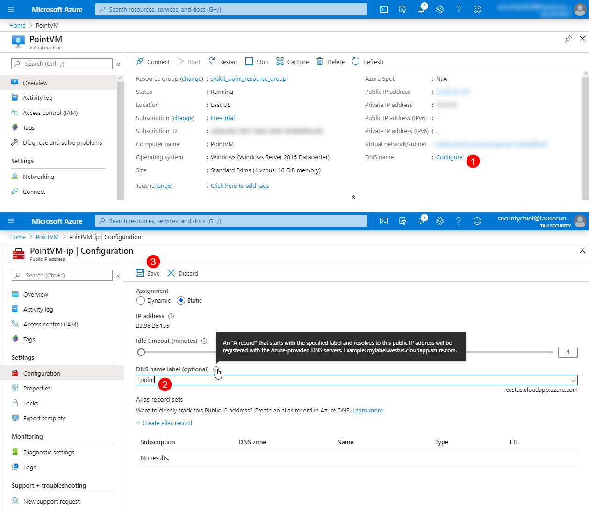
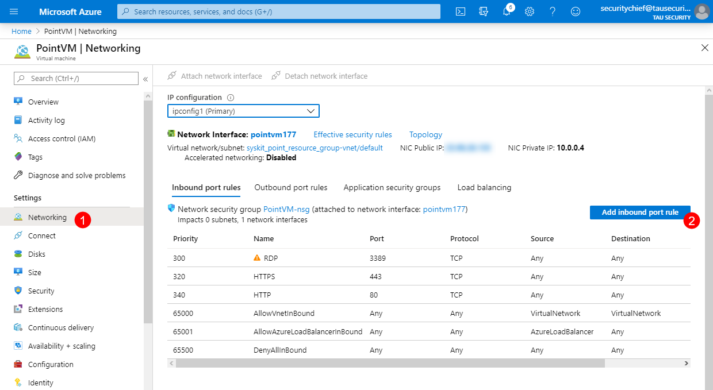
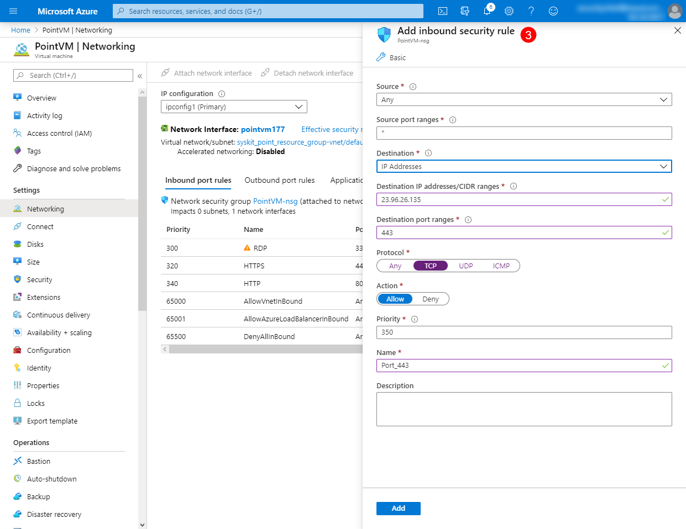

# Configure SysKit Point on Azure VM

You can use this guide when:

* **Configuring SysKit Point on Azure Virtual Machine**
* **Allowing access to SysKit Point web application**
* **Testing the access to SysKit Point web application**


Allowing access **enables site owners and business users to access SysKit Point**, which **empowers collaborative Office 365 governance**.



**Please note!**   
The web application is accessible on the Internet when you allow access to SysKit Point outside of Azure Virtual Machine. **To secure your data**, **SysKit Point uses modern authentication methods**, making sure that only the right users inside your Office 365 tenant can sign in, as defined in [SysKit Point security settings](../installation-and-configuration/enable-role-based-access.md).


## Prerequisites

Before you install and configure SysKit Point, make sure to secure the following Azure resources:

* **Azure Virtual Machine** and/or **SQL Server Virtual Machine where SysKit Point is going to be installed**; you can install SysKit Point on the SQL Server Virtual Machine if no additional Virtual Machine is available; 

  when creating Azure Resources, consider the [SysKit Point system requirements](../requirements/system-requirements.md)

* **Network Security Group assigned to the Azure Virtual Machine**
* **Public IP address \(static\)** 


**Please note!**   
Azure SQL Database is currently not supported.


In addition to Azure Resources, **the following is recommended when using SysKit Point in a production environment**:

* **Ownership of a public domain with the ability to manage DNS records**
* **SSL certificate from a publicly trusted certificate provider**

## Install and Configure SysKit Point


**Please note!**   
To install and configure SysKit Point, make sure to **enable RDP connection \(port 3389\)** that allows you to access your virtual machine. After the configuration, you can remove the inbound rule allowing RDP connection.


After you secure all needed Azure resources, proceed with the following steps:

* **Install SysKit Point**; find installation steps [here](../installation-and-configuration/install-syskit-point.md)
* **Configure SysKit Point**; all steps in the Configuration Wizard are described [here](../installation-and-configuration/configure-syskit-point.md)

**When configuring SysKit Point on Azure Virtual Machine**, in addition to the before-mentioned configuration article, here you can find more information needed in the:

* **Database Configuration step**
* **Web Application Settings step**

### Database Configuration Step

In this step you need to provide the following information required to connect to the SQL server:

* **Database server \(1\)**
* **Database name \(2\)**
* **Authentication \(3\)**; here you can choose between two options, depending on your infrastructure setup:
  * **Windows Authentication**
  * **SQL authentication**


**Please note!**   
If you have provisioned a **separate Azure Virtual Machine** for hosting SysKit Point, **make sure it is deployed to the same Virtual Network as SQL Server Virtual Machine** and **can establish a connection to the SQL Server** by following the [guidelines](https://docs.microsoft.com/en-us/azure/virtual-machines/windows/sql/virtual-machines-windows-sql-connect#connect-to-sql-server-within-a-virtual-network) from Microsoft.


Click the **Test Connection button \(4\)** to check if the provided information is valid. If everything is set up correctly, the following message shows:

**Click OK** to continue with the configuration.

### Web Application Settings Step

In the Web Application Settings, the following is defined:

* **URL of SysKit Point Web App \(1\)**
* **Port used \(2\)**
* **Certificate**; here you can choose from two options:
  * **SSL Certificate \(3\)**
  * **Self-signed certificate \(4\)**

**In a production environment**, **it is recommended to use**:

* **Custom Domain used in SysKit Point Web App URL**; for example, `https://point.mycustomdomain.com`
* **SSL certificate obtained from a publicly trusted SSL certificate provider**

When using such setup, make sure to:

* **Associate the SSL certificate with the custom domain used in the SysKit Point Web App URL**
* **Add a public DNS A record on your custom domain pointing to Point Virtual Machine's public IP address** 

**When configuring SysKit Point in a test environment**, you can use:

* **Azure default domain** `cloudapp.azure.com` **in SysKit Point Web App URL**; for example, `https://azurevmname.eastus.cloudapp.azure.com`
* **Self-signed certificate created by SysKit Point**


**Please note!**   
**Self-signed certificates are by default not publicly trusted**; therefore, your connection to Point application may be marked as not private in the browser when accessing SysKit Point URL.


**To use the Azure default domain**, you need to configure a DNS name in the Azure Portal. To do so:

* **Open** [Azure portal](https://portal.azure.com)
* **Navigate to your Azure Virtual Machine**
* **Click Configure \(1\)** next to the DNS name label on the Overview screen
* **Define the DNS name label \(2\)**
* **Save your changes \(3\)**

After the configuration is complete, you can continue with the next step - allowing access to SysKit Point.

## Allow Access to SysKit Point

To make SysKit Point accessible for other users outside the Azure Virtual Machine, you need to:

* **Allow inbound traffic on the Azure Virtual Machine** where SysKit Point is installed
* **Allow inbound traffic for the Network Security Group** associated with the Point Virtual Machine

### Azure Virtual Machine

To allow inbound traffic on the Azure Virtual Machine, follow these steps:

* **Sign in to Azure Virtual Machine**
* **Open Windows Firewall with Advanced Security on Local Computer**
* **Select Inbound Rules \(1\)**
* **Click New Rule action \(2\)**

New Inbound Rule Wizard opens that enables you to create an inbound rule for TCP protocol on port 443.

### Network Security Group

To allow inbound security rule for the Network Security Group associated with the Azure Virtual Machine, follow these steps:

* **Open** [Azure portal](https://portal.azure.com)
* **Navigate to your Azure Virtual Machine** 
* **Click Networking \(1\)** in the Settings section
* **Click Add inbound port rule button \(2\) to add a rule for TCP protocol with destination port 443 \(3\)**

After the inbound rule is created, you can continue and test access to the SysKit Point web application.

## Test Access to SysKit Point

You can test the connection to SysKit Point deployed on the Azure Virtual Machine now that the configuration is finished. To do so, use the following PowerShell cmdlet from any computer connected to the Internet: `Test-NetConnection -Port Point_port -ComputerName PointDNSName`

Here, the `-Port` parameter should be set to 443 and `-ComputerName` to the DNS name of the Point web application you specified as the URL in the SysKit Point Configuration Wizard. For example: `Test-NetConnection -Port 443 -ComputerName point.mycustomdomain.`

After all the steps are done, you can access the SysKit Point web application from anywhere on the Internet by opening the defined URL in your web browser. For example, `https://point.mycustomdomain.com`. If everything is set up correctly, the SysKit Point Sign in page opens.

