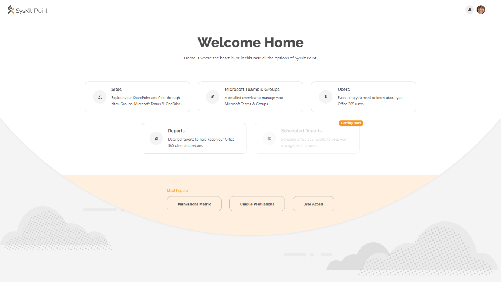
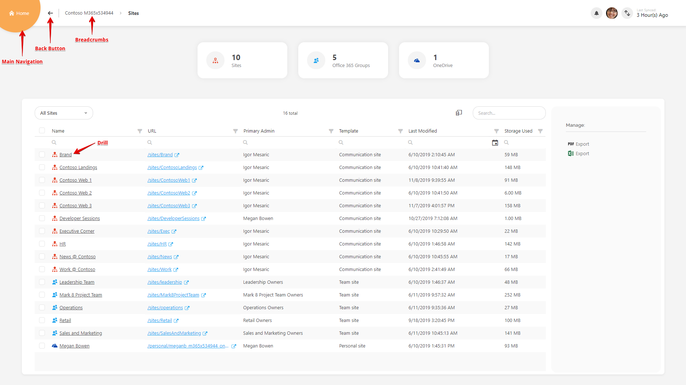
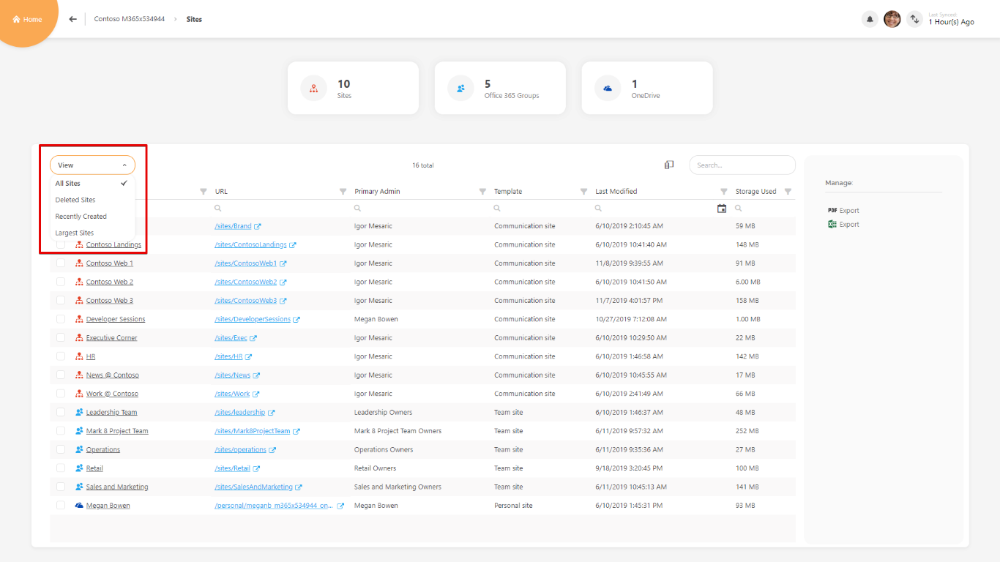
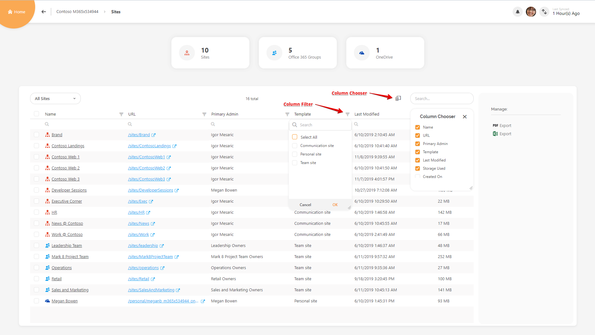
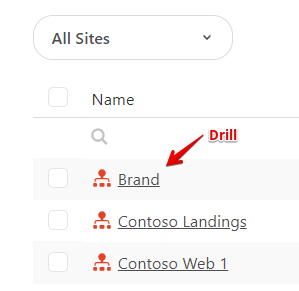
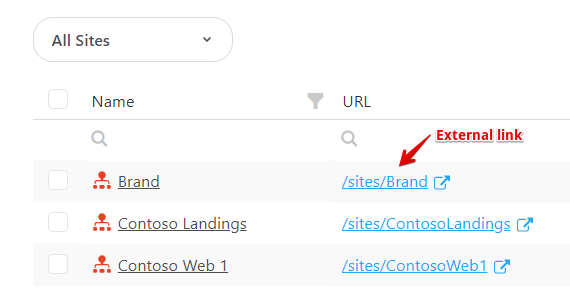
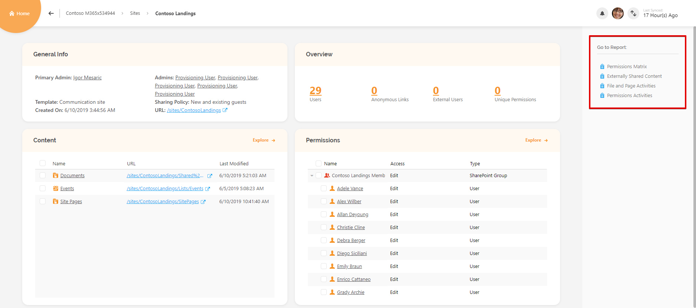
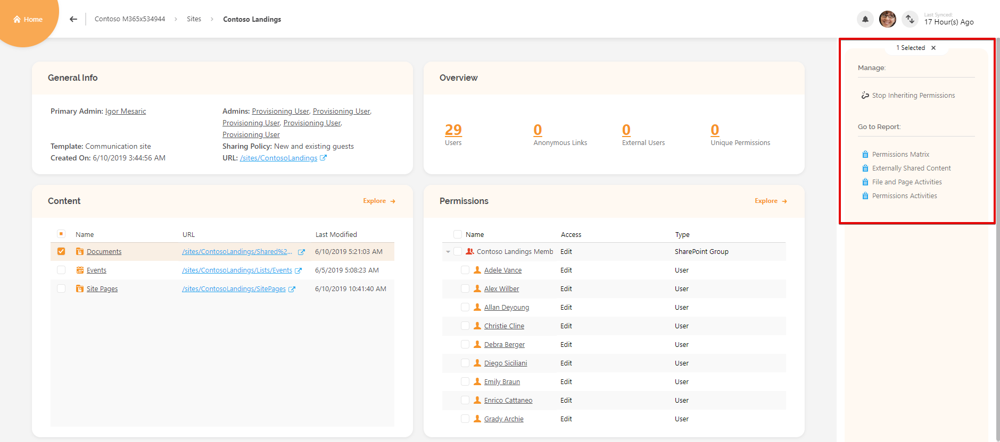

# SysKit Point Quick Start Guide

## Home Screen 

Place where everything in SysKit Point starts. You can see 4 major sections: 

* **Sites** – complete overview and inventory of all sites and ownerships. Full list of classic sites, sites connected to MS Teams and Office 365 groups, and OneDrive as well. 
* **Microsoft Teams & Office 365 Groups** – a complete overview of all Teams and Office 365 groups detected in your environment. 
* **Users** – explore all users and see more details about their memberships and permissions they hold across the sites. 
* **Reports** – create security and audit activities across your resources. 

To view specific section, click the appropriate tile.

## Navigation 

There are multiple ways of navigating through the application. 

* **Main Navigation** – click on the Home orange circle to access the main sections of the application. 
* **Breadcrumbs** – easily detect where you are currently located or move up the hierarchy/back to the parent. 
* **Drill** – clicking on the underlined objects takes you to a more detailed report about that resource. 
* **Back Button** – takes you to the previous screen, the one that you were at before jumping to a different report. 

## Built-in Views


Each overview screen comes with a set of predefined views to help you select the most important information for you. On the left-hand side of the report, simply click on the drop-down menu to select the views you are the most interested in.

## Custom Views

If you are not satisfied with the predefined views, please [let us know](https://feedback.syskit.com/).  
  
As an easy workaround, you can add additional columns on your own with the help of column chooser, or filter each column to get the desired results.

## Drill for Details 

The basic principle in the application is, whenever you wish to see more details about a specific resource, you simply click on its name to drill deeper. Resources, numbers, and details that can be drilled on will be marked with the underline. 

Everything is connected and we made it easy for you to navigate from specific site to the user details and vice versa. 

## External Links

Whenever possible, SysKit Point shows you an external link so you can, e.g. quickly open a site in SharePoint Online or send an email to Office 365 Group. External links are marked with an icon that suggests you will leave the current context, and to distinguish them from drill links mentioned above, they are colored blue.

## Contextual Actions & Reports 

On the right hand side of the screen you will find suggested actions and reports that are connected to the current selection \(site/user\) or report on your screen. 

There are two types of actions/reports: 

* **Global Actions/Reports** - these actions are always visible and will create report or perform action for the specific site/user you are currently located at.   **Example:** If you are exploring in details site called Research and Development, reports on the right hand site will contain information only about that site.

* **Contextual Actions/Reports** - when you select something in the screen, additional actions and reports may appear. If you choose to create a report/perform an action, they will impact currently selected object in one of the tiles. **Example:** If you select the Documents library in the Content tile, reports on the right hand side will be related to that selection only, meaning that they will present information about that selected folder, not the entire site you are currently exploring.

## **What Can a Site Owner See?** 

SysKit Point will present you with the inventory of your resources, meaning you will be able to see sites, Teams and Office 365 groups you are the owner/administrator of.  

Check the [following link](../installation-and-configuration/enable-role-based-access.md) for more details about **role based access configuration**. 

