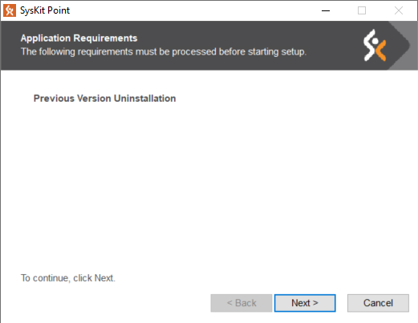

# Upgrade SysKit Point to a new version

Here at **SysKit**, we are regularly improving our applications with useful new features.                                                                                                         

We highly recommend having the latest version available installed to use its maximum potential. 

## 
Checking for version updates

Every user that holds **SysKit Point Admins role** and opens the application will **receive a popup message** at the bottom of the screen that a **new update is available**.


Link **Read What's New** will open a new tab in your browser at the [**Product Updates**](../product-updates/) ****section in SysKit Point documentation.

Clicking on **Download Latest Version** link will redirect you to [**my.syskit.com**](https://my.syskit.com) page if you have a valid license. From here, you can download the latest version available.

In case you are using a **trial version** of the application, a link **will redirect you** to the **SysKit Point web download page**.

If you **don't want to see** a popup **message** about the **new updates** anymore, close the message.


**Hint!                                                                                                                                                         About** section in the **Settings** screen contains **Check for updates** link inside Point version tile. When you click on it, it will show you if there are new versions available to download. **If you possess the latest version**, it will write an **Already up to date** message.


## 
Upgrading to a new version


After you downloaded the newest version of the application, follow these steps for a successful upgrade:

*  Unpack and run the setup file - **SysKitPointSetup.exe**.
* The wizard will require to uninstall the previous version of SysKit Point. 

* The following steps are classic installation steps available [here](../installation-and-configuration/install-syskit-point.md).
* After completing the installation, the **Configuration Wizard** will open by default.
*  In the **Database** step, select **Use existing database** option to preserve all your previous data. Click **Next** to proceed.
* In the **Database Configuration** step, click **Next**. A **warning message** will appear about the necessary upgrade for the database. For data protection, **consider backing up the database**. Click **Yes** and continue to the next step.

* Enter your **service account** and validate it. Click **Next**.
* In **Connect to Office 365** step, you can see that your **tenant is already connected** with the application. Proceed to the next step.
* In **Web Application Settings** step, click on the **Next** button. 
* In the **Finish** step, wait until all the checks are done and click on the **Finish** button to open the application automatically in your browser.


You can always Visit [**What's New**](https://www.syskit.com/products/point/whats-new/) page at our official site to get more in-depth information about how we improved the application.

