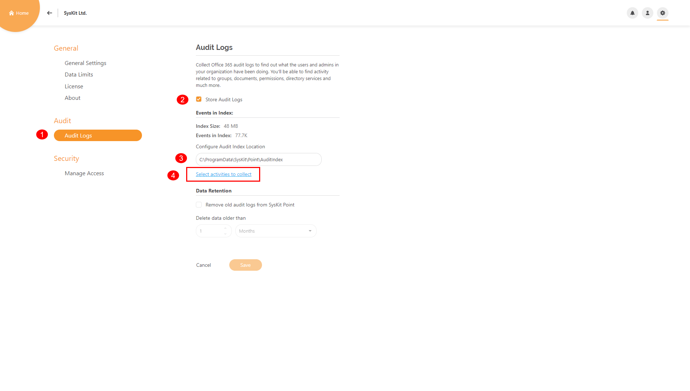

# Customize Audit Logs Collection

Audit logs can provide you with **insights into all activities** related to user and administration activities in your Office 365 environment.‌ 

When configuring **SysKit Point** in **Configuration Wizard**, you have the **option to turn the storage of Audit Logs on/off**. The setting is available on the screen shown below, which appears after you enter the Office 365 Global admin credentials on the Configuration Wizard's **Connect to Office 365** step. By default, the **Store audit logs** option is enabled, meaning that SysKit Point will process and store the audit logs to your local disk, by default in the **C:\ProgramData\SysKit\Point\AuditIndex** folder.


**Please note!**  
Regardless of your selection to store or not to store them, audit logs are **regularly** **processed by SysKit Point** to track changes and activity in your Office 365 environment. Storing audit logs gives you the possibility to access audit data for longer periods than available in Office 365.


Audit log settings can also be configured after the initial configuration of **SysKit Point**. To do so, open the **Settings** screen, and navigate to the **Audit** &gt; **Audit Logs** page. Here, you can turn the storage of Audit Logs on or off, as well as configure the **Audit Index storage location**. The information about **Index** **Size** and the **number** **of** **events** in the Audit Index is provided here too.

Audit logs activities that are being collected can be found by clicking the **Select activities to collect** link.

In the new window there will be categories of all activities:

* Sharing and access request activities
* Application administration activities
* User administration activities
* Directory administration activities
* Azure AD group administration activities
* Role administration activities
* Site permissions activities
* Site administration activities
* Microsoft Teams activities
* File and page activities
* Synchronization activities
* Folder activities
* Data governance
* SharePoint list events
* User activities.

You can adjust which activities are going to be collected by clicking the checkbox next to categories.

If you need only specific activities to be collected within one category, just mark those activities and click **OK** and then **Save** button in **Audit Logs** screen.

The last option in the Audit Logs screen is **Data Retention**.

By default, this option is turned off.

When enabled, you can set a time frame in the number of days, weeks, or months for the application to delete older Audit Logs folders than the specified date.

