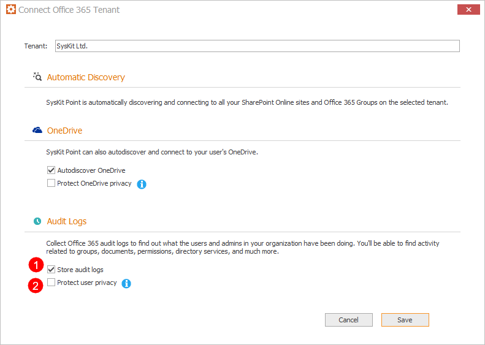

# Customize Audit Logs Collection

Audit logs can provide you with **insights into all activities** related to the user and administration activities in your Office 365 environment.‌

Users that are assigned **SysKit Point Admin role** can configure activities that are going to be collected in these locations:

* SysKit Point Configuration Wizard
* Audit Logs section in Settings

## SysKit Point Configuration Wizard

When configuring **SysKit Point**, on the **Connect to Office 365** step, you have the following audit options on disposal:
* **Store audit logs (1)**
* **Protect user privacy (2)**

### Store Audit Logs Option

By default, the **Store audit logs** option is enabled, meaning that SysKit Point will process and store the audit logs to your local disk, by default in the **C:\ProgramData\SysKit\Point\AuditIndex** folder.


**Please note!**  
Regardless of your selection to store them or not, audit logs are **regularly processed by SysKit Point** to track changes and activity in your Office 365 environment. Storing audit logs gives you the possibility to access audit data for more extended periods than available in Office 365.


### Protect User Privacy Option

Turning this option on results in the following:
* **User activity data**, such as file and permissions changes, **will be hidden and protected from Administrator supervision** 
  * **User Activity report will be hidden from SysKit Point user interface**
  * **Access to the File and Page Activities report will be hidden**
  * **Summary data in the Analytics & Usage tile will remain visible, but cannot be drilled to access data for a specific user**
* **User activity** data will, however, be collected and stored


**Please note!**                                                                                                                                             
User activity data continues to be collected and stored, to be readily available if needed, in case of a security incident.


The following rules apply regarding the User Privacy option:
* **By default, this option is turned off**
* **Option can be defined for each tenant connected with SysKit Point independently**
* **Changing the option is only possible through the SysKit Point Configuration Wizard**


**Please note!**                                                                                                                                             
The **Protect user privacy** option is disabled automatically if the **Store audit logs option** is turned off.


## Audit Logs section in Settings

Audit log settings can also be configured after the initial configuration of **SysKit Point**. To do so, open the **Settings** screen, and navigate to the **Audit** &gt; **Audit Logs** page. Here, you can turn the storage of Audit Logs on or off, as well as configure the **Audit Index storage location**. The information about **Index** **Size** and the **number** **of** **events** in the Audit Index is provided here too.

Audit logs activities that are being collected can be found by clicking the **Select activities to collect** link.

In the new window, all categories and activities are shown:

* Sharing and access request activities
* Application administration activities
* Exchange admin activities
* Exchange mailbox activities
* User administration activities
* Directory administration activities
* Azure AD group administration activities
* Role administration activities
* Site permissions activities
* Site administration activities
* Microsoft Teams activities
* File and page activities
* Synchronization activities
* Folder activities
* Data governance
* SharePoint list events
* User activities.

You can **adjust which activities are going to be collected by clicking the checkbox** next to categories. If you need only specific activities to be collected within one category, mark those activities and click **OK**. Save your changes by clicking the **Save** button on the **Audit Logs** screen.

The last section available on the Audit Logs screen to configure is the **Data Retention** section. **By default, this option is turned off.** **When enabled, SysKit Point will delete audit logs older than specified.**

### Exchange Logs

SysKit Point doesn't collect exchange logs by default - they have to be selected among audit activities, as shown in the picture above.

After you select exchange activities, wait around 15-20 minutes until Syskit Point collects the data.

You can now go to Reports Center and open **Exchange Logs report** that will show exchange logs in your environment.

In the **Options screen**, you can choose which period and which specific activities you want to generate in the report.

Also, you can search for logs for a specific user mailbox if you need to.

