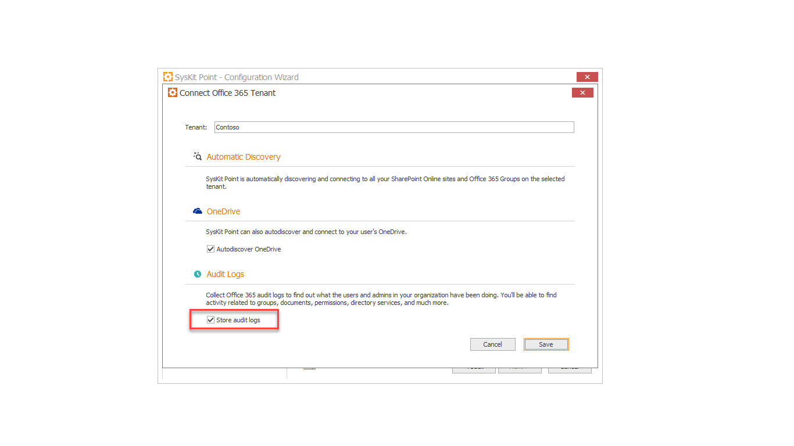
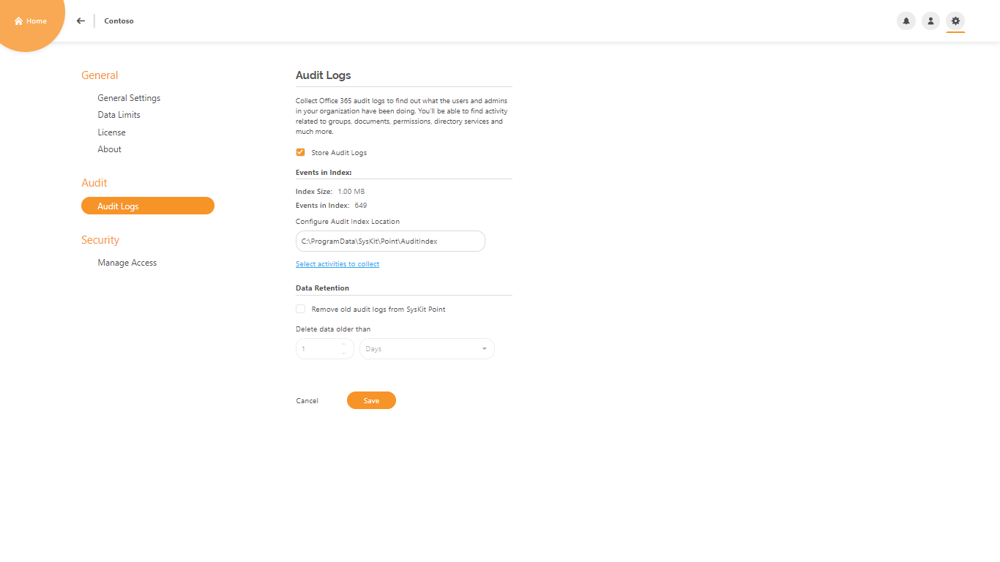
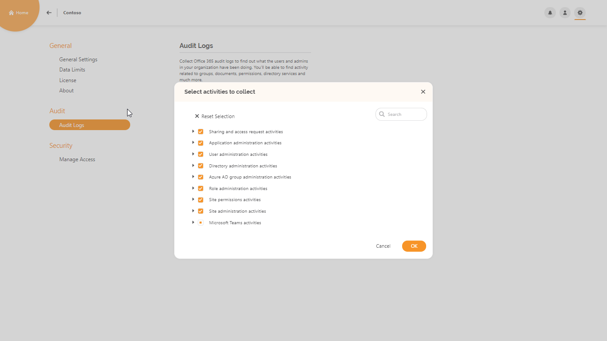

# Customize Audit Logs Collection

Audit Logs, within the **SysKit Point**, are directly connected with the **Microsoft Office 365 Security & Compliance Center** and their Audit Logs.

Logs can provide you insights into all activities related to users and administration activities in your Office 365 organization.

You have the option to turn storage of Audit Logs on or off while you are configuring **SysKit Point** in **Configuration Wizard**.

You can do this action while entering your tenant with the Office 365 Global admin account.

After you successfully entered your credentials, a new window will open.

Here you can mark or unmark checkbox for storing Audit Logs, depending on whether you need it or not. 


Regardless of your selection to store or not to store **Audit Logs** locally onto your disc, they are still regularly **processed by Microsoft Admin Center**.


Audit Logs are by default marked for collection.

If you choose to collect Audit Logs, they will be stored onto your local disk storage with default path like **C:\ProgramData\SysKit\Point\AuditIndex**.

In the **SysKit Point** application, you can open **Settings** and under section **Audit** -&gt; **Audit Logs**, manage some options.

Here, you can also turn on or off Audit Logs storage or configure **Audit Index storage location**.

The information about **Index** **Size** and the **number** **of** **events** in the belonging index is provided here too.

Audit Logs collected activities can be found if you click on the blue link **Select activities to collect**.

In the new window there will be categories of all activities: 

* Sharing and access request activities
* Application administration activities
* User administration activities
* Directory administration activities
* Azure AD group administration activities
* Role administration activities
* Site permissions activities
* Site administration activities
* Microsoft Teams activities
* File and page activities
* Synchronization activities
* Folder activities
* Data governance
* SharePoint list events
* User activities.

You can adjust which activities are going to be collected when clicking the checkbox next to categories.

If you need only specific activities to be collected within one category, just mark those activities and click **OK** and then **Save** button in **Audit Logs** screen.

The last option in the Audit Logs screen is **Data Retention**.

By default, this option is turned off.

When enabled, you can set a timeframe in the number of days, weeks, or months for the application to delete older Audit Logs folders than the specified date.

