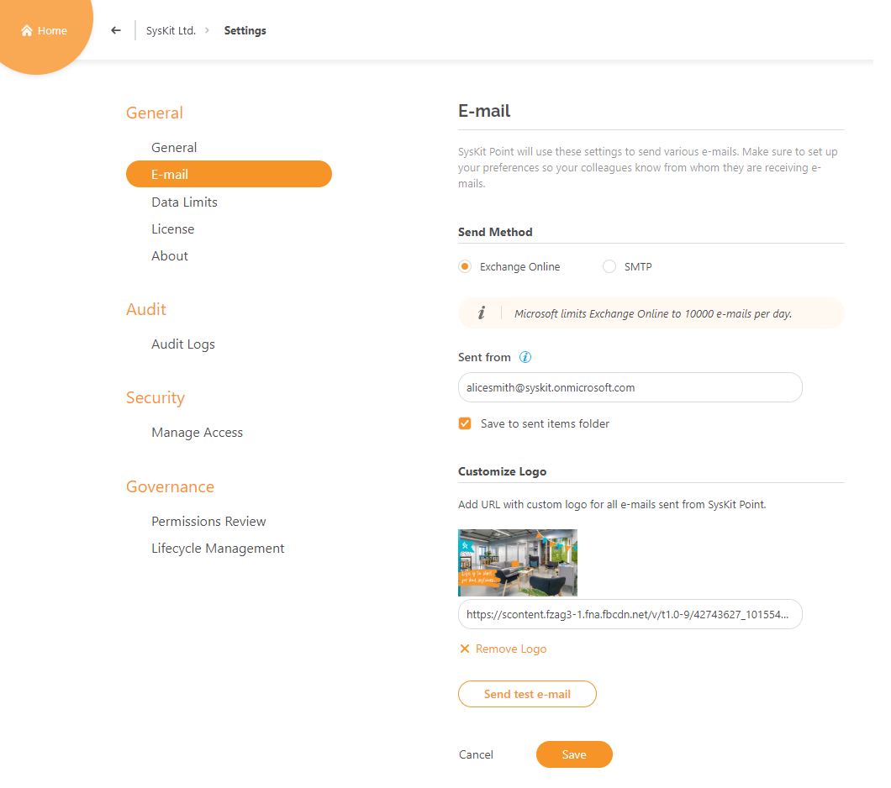
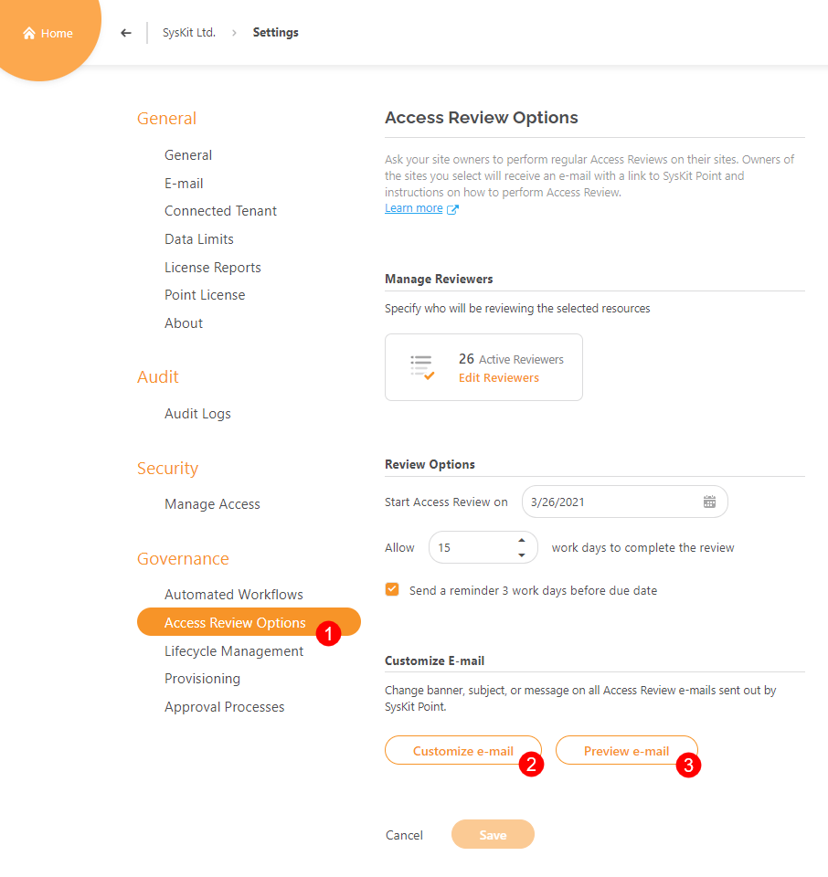
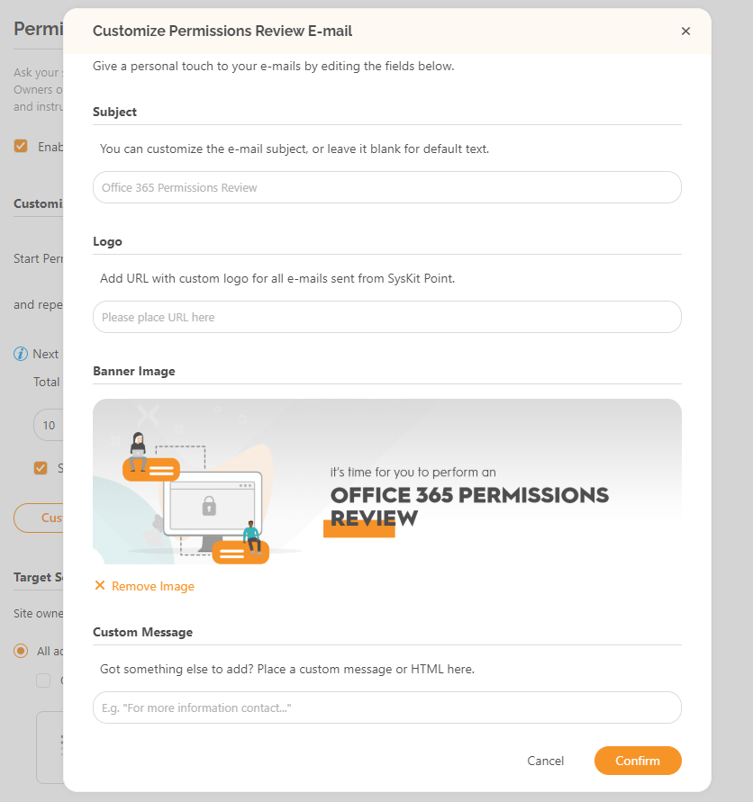
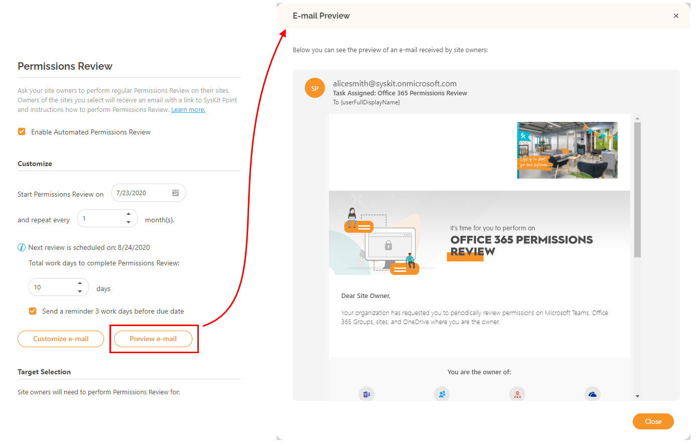
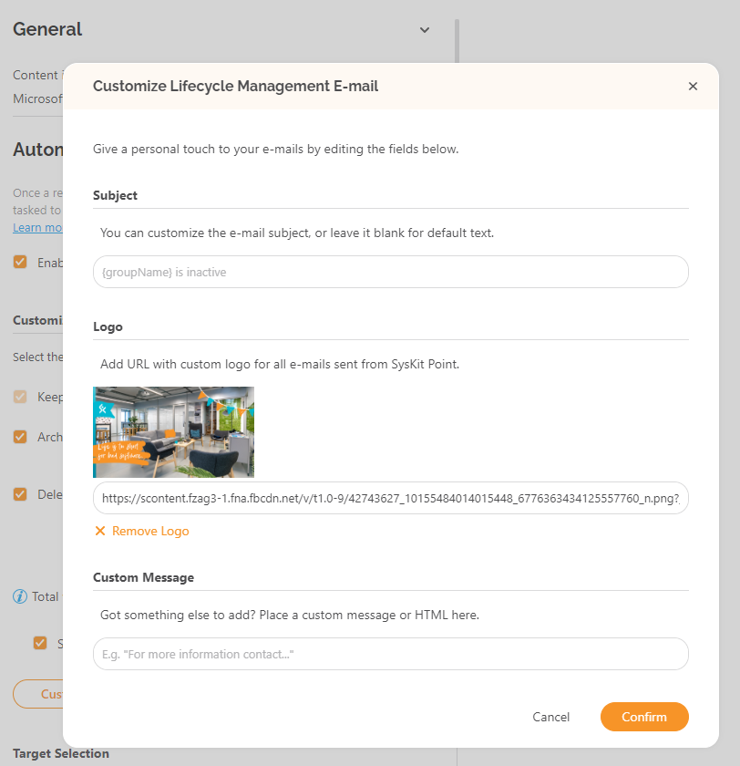

# Customize E-mails

SysKit Point **allows you to edit e-mails** that will be **sent to site owners** as a part of **Permissions Review and Lifecycle Management Automation**.

You can customize the following aspects of e-mails:

* **subject**
* **logo**
* **additional message in the body of the e-mail**

These changes can be performed in three locations within SysKit Point Settings:

* **General Settings &gt; E-mail section** 
* **Governance Settings &gt; Permissions Review** 
* **Governance Settings &gt; Lifecycle Management**


**Please note!** E-mail customization is only available as a part of the [**Enterprise subscription plan**](https://www.syskit.com/products/point/pricing/).


## E-mail Settings

In E-mail settings, you can define a global logo that will be used in all e-mails sent by SysKit Point. To define the logo:

* **Enter a URL of your logo** located in the **content distribution network** \(**CDN**\)
* **Click Save** to apply changes


**Hint!**   
**Modifying the logo** in SysKit Point **is a global action**, which means that **editing from any location in the settings** \(E-mail section, Permissions Review, or Lifecycle Management\) **will affect all E-mails**.


In the picture below, the defined logo is shown.

To remove the logo, click the **Remove Logo** action and save your changes.

## Permissions Review Settings


**Hint!**  
Customizing the Permissions review e-mail is possible only if the Automated Permissions Review feature is enabled. For more information on that topic, visit the [following article](https://github.com/SysKitTeam/docs-point/tree/760d1915a5eae5f73e1897f8d65be591aec401f9/installation-and-configuration/enable-permissions-review/README.md).


To customize the Permissions Review e-mail:

* **Open the Permissions Review tab** in the Governance section of settings 
* **Click the Customize e-mail button** to open the editing screen

Here, you will see the following sections that can be edited:

* **Subject**
* **Logo**
* **Banner image**
* **Custom message**

The custom message can contain **plain text** or **HTML**. A **link has to be defined in the HTML form** `&lt;a href="URL"&gt;LinkDisplayText&lt;/a&gt;`, where `URL` represent a web address to a web resource, and the `LinkDisplayText` is an arbitrary text that will be displayed in the e-mail and, when clicked, lead to the defined URL.

When done with editing, click the **Confirm button** to save your changes. You can immediately see the e-mail changes by clicking the **Preview e-mail button**.

## Lifecycle Management Settings

Similar to the Permissions Review e-mail customization, there is an option to customize Lifecycle Management e-mails.

To customize the Permissions Review e-mail:

* **Open the Lifecycle Management tab** in the Governance section of settings 
* **Click the Customize e-mail button** to open the editing screen

Similar to the Permissions Review e-mail, you can edit the following sections:

* **Subject**
* **Logo**
* **Custom Message**

All the rules apply as for the Permissions Review e-mail customization.

You can access the e-mail preview by clicking the **Preview e-mail button**.

