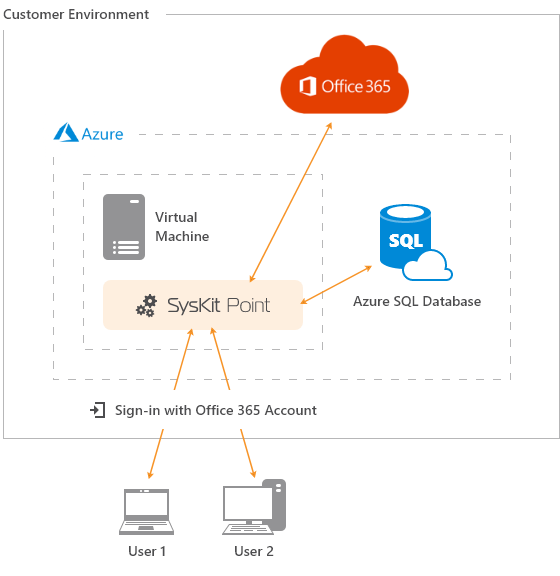

# Deploy SysKit Point On-Premises

To successfully deploy SysKit Point on-premises, follow these steps:

1. **Ensure that all** [**prerequisites**](prerequisites/) **are met**:

   • [**SysKit Point Server**](prerequisites/syskit-point-server.md)

   • [**SysKit Point SQL Database**](prerequisites/syskit-point-database.md)

2. [**Install SysKit Point**](install-syskit-point-on-premises.md) **on a dedicated server**
3. [**Configure SysKit Point**](configure-syskit-point-on-premises.md)   

Provided steps result in the on-premises setup shown in the picture below.

If you run into any issues when preparing your environment or configuring SysKit Point, please [contact us](https://www.syskit.com/contact-us/).

## Related Topics

* [Deploy SysKit Point On-Premises](../deploy-to-azure/)

