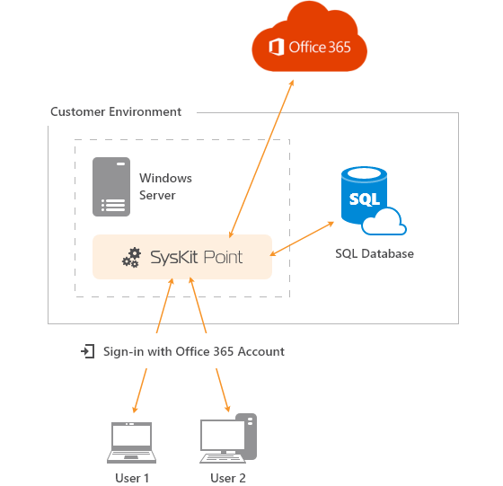

# Deploy SysKit Point On-Premises

To successfully deploy SysKit Point in a On-Premises environment, the following resources are needed:

* **Virtual Machine**
* **SQL Server Database**

Find the complete installation guide at the following [**link**](overview.md).

Provided steps result in the on-premises setup shown in the picture below.

If you run into any issues when preparing your environment or configuring SysKit Point, please [contact us](https://www.syskit.com/contact-us/).

## Related Topics

* [Deploy SysKit Point to Cloud](../deploy-to-azure/)

