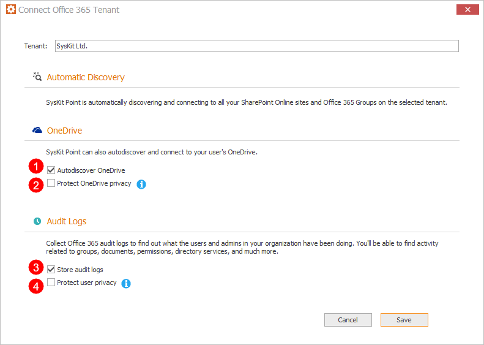

# Configure SysKit Point On-Premises

Once the installation is completed, by default, **SysKit Point - Configuration Wizard** starts automatically. Alternatively, you can start it manually at any time by running it from the installation folder. The default location is: **C:\ProgramFiles\SysKit\Point\Host\Configuration.exe**.

## Prerequisites

In the Configuration Wizard, you will need to provide the following information:

* **MS SQL Server and SQL Server database**
* **Local service account**
* **Office 365 Global admin account**
* **SSL Certificate** \(we can provide you with a self-signed one, but for production, we recommend you use full SSL certificate\).


For a detailed overview of the **SysKit Point requirements**, [navigate to the Prerequisites section](prerequisites/).


## Configuration Steps

### Database

First, you need to choose between the following two options:

* **Create a new database** – use this when configuring SysKit Point for the first time, and if the account running the Configuration Wizard has proper privileges on the MS SQL server to create new SQL Server databases. 
* **Use existing database** – if you have your SQL Server database pre-created by your SQL administrator, or if you already configured SysKit Point and are just upgrading to a newer version of SysKit Point, or modifying settings. 

### Database Configuration

Provide MS SQL Server and database names.


**How to enter the MS SQL Server name?**

* if you are using the default instance type “servername”, or “FQDN” 
* if you are using a named instance type “servername\instancename”, or “FQDN\instancenameˇ  
* if your MS SQL Server is on a non-standard port \(different from 1433\), type “servername,port” or “servername\instance,port”. \(FQDN formats are also supported\) 


Choose the type of authentication to this MS SQL Server and SQL Server database:

* **Windows Authentication** \(recommended\)  
* **SQL Authentication** 

To make sure that you will be able to use this MS SQL Server and SQL Server database, click the **Test Connection** button.  
If everything is configured properly, an Info window appears with the message:

**`Successfully connected to the SQL Server`**

Click **OK** to close the Info window, and **Next &gt;** to continue to the next step.


Check the supported MS SQL Server versions and requirements [here](prerequisites/syskit-point-database.md).


### Service Settings

Provide local service account that will be used for running the automatic actions performed by SysKit Point, such as:

* **Office 365 autodiscovery and data crawling** 
* **Writing the collected data to a specified SQL Server database**  
* **Writing down collected Audit data to the Index location** 

Supported service account formats:

* `machine_name\username`
* `.\username`

After you've entered the credentials click the **Validate Account** button. If the account has all [proper privileges](prerequisites/syskit-point-server.md#service-account), a Success window appears with the message:

`This account can be used to run SysKit Point!`

Click **OK** to close the Success window, and **Next &gt;** to continue to the next step.

### Connect to Office 365

Click the **Connect to your tenant** link to connect SysKit Point to your Office 365 tenant. **You need to provide the Office 365 global admin account.** This account will be used for collecting all the data from your environment and for the continuous autodiscovery of new resources.


**Please note!**  
Office 365 Global Admin credentials are only needed when configuring SysKit Point for the first time.


**Please note that this can be any global admin account**; it doesn’t have to be the account you will use in the future to log in to the application.


**SysKit Point** uses modern authentication methods and **does not store any passwords or accounts** you present here.


When you first connect to your tenant, SysKit Point will request permissions needed to collect data from your Office 365 environment.

To continue, check the **Consent on behalf of your organization** **option \(1\)**, and click the **Accept** **button \(2\)**. A new window opens where you can choose which information would you like to collect when it comes to your Office 365 environment:

* **Automatic Discovery** – by default, SysKit Point continuously monitors your Office 365 environment and shows you the latest data. SharePoint Online sites and Office 365 Groups data will always be monitored. This setting cannot be modified.
* **Autodiscover OneDrive \(1\)** - by default, SysKit Point will collect information and report on user OneDrive activity, content, and sharing. To stop collecting OneDrive data, uncheck this option.
* **Protect OneDrive privacy \(2\)** - When enabled, SysKit Point will only show general information about user's OneDrive, such as used storage. SysKit Point Admins won't be able to access OneDrive content and personal data. By default, this option is disabled.
* **Store audit logs \(3\)** - SysKit Point will also collect all audit logs to monitor internal and external user activities and changes and Store them to the hard drive. To stop storing audit logs, uncheck this option.
* **Protect user privacy \(4\)** - When enabled, user activity data will be hidden from SysKit Point and protected from Administrator supervision. By default, this option is disabled.


You can change these options anytime by running **SysKit Point Configuration**.



**Please note!**  
For SysKit Point to collect, process, and save audit logs, the auditing has to be enabled in your tenant. [Navigate here to find out how to turn on auditing.](../../faq/turn-on-auditing.md)



**Why do I need to provide a global admin account?**  
You can find answers in the [following article](../../requirements/permission-requirements.md#office-365).


### Web Application Settings

The default URL for the web interface of SysKit Point is set to `https://fully-qualified-domain-name` and port to `443`. You can customize these values as you wish at any point in time, but make sure to also configure your DNS for the customized URL to correctly resolve the target address.

Use this URL to log in to the SysKit Point web interface by using the [supported browsers](../../requirements/system-requirements.md#supported-browsers).

#### SSL Certificates

**If you decide to configure SysKit Point web-app be reachable from the public internet**, **the following is recommended**:

* **Use a Custom Domain mapped to SysKit Point Web App**; for example, `https://point.mycustomdomain.com`
* **Use an SSL certificate obtained from a publicly trusted SSL certificate provider**

When using such setup, make sure to:

* **Associate the SSL certificate with the FQDN used in the SysKit Point Web App URL**
* **Add a public DNS A record on your custom domain pointing to SysKit Point server's public IP address** 

**When configuring SysKit Point to be used inside your company or in a test environment**, you can use:

* **FQDN of the Windows Server as SysKit Point Web App URL**; for example, `https://pointserver.contoso.com`
* **Internally-signed certificate or Self-signed certificate created by SysKit Point**

Choose the certificate type to ensure a secure connection between SysKit Point machine and web interface in the browser:

* **Import SSL certificate** – recommended for the production usage and it needs to be created by the end-user/customer
* **Use self-signed certificate** – this is a certificate provided automatically by SysKit Point, and will work for testing purposes. Since this certificate is not signed by a certification authority, you will receive security warnings when you try to open the web application in the browser from other machines \(other than the one where SysKit Point is installed\). 


Learn how to [configure the SSL certificate by using your internal CA here.](../../common-tasks/configure-ssl-certificate.md)



**When configuring**, SysKit Point will, by default, automatically set up the **Web App URL** and the **Self-signed certificate** so there is no additional configuration needed on your side.



**Please note!**  
**Self-signed certificates are by default not publicly trusted**; therefore, your connection to Point application may be marked as not private in the browser when accessing SysKit Point URL.


### Finish

The last step shows the status of all operations that are done before you can access SysKit Point. If the configuration was successful, all steps are marked with green checkmarks, and SysKit Point URL is shown.

Click the **Finish** button to open SysKit Point in the default browser, and you are ready to go.

To get started with SysKit Point, [read the Quick Start Guide article.](../../how-to/syskit-point-quick-start-guide.md)

## Related Topics

* [SysKit Point Server](prerequisites/syskit-point-server.md)
* [SysKit Point SQL Server Database](prerequisites/syskit-point-database.md)
* [Install SysKit Point On-Premises](install-syskit-point-on-premises.md)

If you have additional questions or concerns, please [contact us](https://www.syskit.com/contact-us/).

