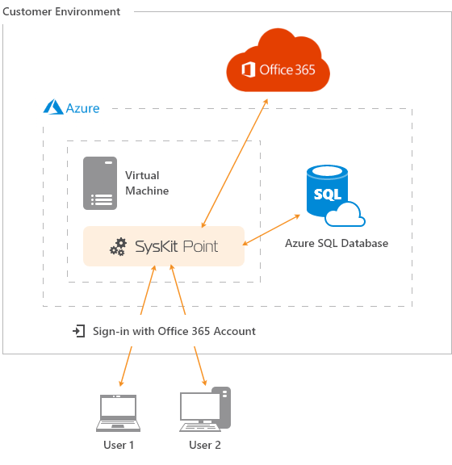

# Deploy SysKit Point to Cloud

To successfully deploy SysKit Point in the Azure cloud environment, the following resources are needed:

* **Azure Virtual Machine**
* **Azure SQL Database**

Find the complete installation guide at the following [**link**](overview.md).

Provided configuration results in the Cloud environment setup shown in the picture below.

If you run into any issues when preparing your environment or configuring SysKit Point, please [contact us](https://www.syskit.com/contact-us/).

## Related Topics

* [Deploy SysKit Point On-Premises](../deploy-on-premises/)

