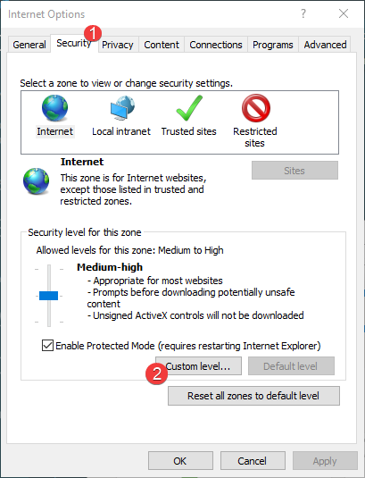
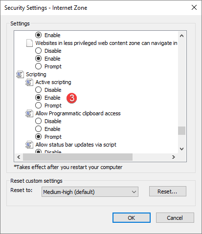

# Additional Azure Virtual Machine Configuration

After the Virtual Machine has been created by your **Azure team** some **additional configuration steps are needed before you install SysKit Point** to that machine. Connect to the virtual machine using a **RDP connection** and perform the following steps:

* **Prepare a Service Account** - a **Windows account** to run the **SysKit Point Windows service**
* **Configure Windows Firewall** - needed to allow access to the SysKit Point web application
* **Configure Internet Options** - required to **enable login to Office 365** from the **Point Configuration Wizard**
* **Install a Compatible Browser** - needed **after** the Point setup to access the **Point web application**

## Service Account

A Service account is a **Windows Account** used to run the **SysKit Point Windows service**. This Windows service will **host the Point web application**.

We recommend you use one of the following options for the service account:

* Create a dedicated domain account: `Domain\PointServiceAccount`
* Create a local computer account: `Virtual_Machine_Name\PointServiceAccount`
* Use your own account \(the same one you use for RDP connection\): `Domain\Username`
  * Please note each time your **password expires, the SysKit Point Windows service will stop** until you update it in the **SysKit Point Configuration Wizard**

The **only privileges** this Service account needs to have is the **Local Administrator** role on the Azure Virtual Machine.
Please note:
* This account is **not used** to authenticate against Office 365 and does **not need** any Office 365 roles. 
* This account is **not used** to authenticate against the Azure SQL Database and does **not need** any permissions on the SQL Server (if using SQL authentication per our recommendations).

## Configure Windows Firewall

To be able to use the SysKit Point web application from **outside the local virtual machine** you need to be able to reach the page where the Point web application is hosted.

To allow inbound traffic on the Azure Virtual Machine, follow these steps:

* **Use RDP connection to connect to Azure Virtual Machine**
* **Open Windows Firewall with Advanced Security**
* **Select Inbound Rules \(1\)**
* **Click New Rule action \(2\)**
* A new **Inbound Rule Wizard** opens that enables you to create an inbound rule for **TCP protocol** on **port 443**.

## Configure Internet Explorer Settings

SysKit Point uses **modern authentication** to enable **single sign-on** with your **Office 365 account** to the Point web application. **During the SysKit Point configuration** process, a **Global administrator** will be asked to **log in** and **provide consent**. For this login experience, Point uses an integrated version of the **Internet Explorer** browser. **Additional configuration of Internet Explorer is needed** in order to be able to sign in to [**Office.com**](https://www.office.com/).

**Enable access to Microsoft pages**

Server versions of Windows \(Internet Explorer\) use enhanced security settings and, in order to be able to use single sign-on authentication, it is necessary to enable access to the [**Microsoft login page**](https://login.microsoft.com).

We recommend configuring IE settings the following way:

* Open **Internet Explorer**
* Select **Tools** -&gt; **Internet Options** -&gt; **Security tab**
* Select the **Trusted sites** icon -&gt; **Sites** button
* Add the following Microsoft addresses to the trusted sites list:

  [\*.microsoft.com](additional-vm-configuration.md), [\*.live.com](additional-vm-configuration.md), [\*.microsoftonline.com](additional-vm-configuration.md) 

**Enable JavaScript**

Microsoft’s login window uses JavaScript to render its content. For it to work it is necessary to enable scripting in the Internet Explorer settings. To enable it, follow these steps:

* Open **Internet Explorer**
* Select **Tools** -&gt; **Internet Options** -&gt; **Security tab**
* Click the **Custom Level...** button
* Scroll down and change the **Active Scripting setting** -&gt; select the **Enable** option
* **Confirm** the change
* Close **Internet Options**

## Install a Compatible Browser

We are always trying to give our users the best security and visual experience while using our application and in order to provide that we are **not compatible with Internet Explorer** and you should **install a compatible browser** to be able to use SysKit Point. After configuration, SysKit Point users will be able to access the SysKit Point interface from any [supported internet browser](../../requirements/system-requirements.md#supported-browsers) through the specified web application URL.

## Output

When you finish the above steps, you will need the following information for the next steps in the installation process:

* A **Service account** to run the SysKit Point Windows service

## Related Topics

* [Overview - Install SysKit Point on an Azure Virtual Machine](overview.md) 
* [Hardware and Software Requirements](hardware-software-requirements.md)
* [Create Azure Virtual Machine](create-azure-vm.md)
* [Install SysKit Point on an Azure VM](install-syskit-point-on-azure-vm.md) 

If you have additional questions or concerns, please [contact us](https://www.syskit.com/contact-us/).

