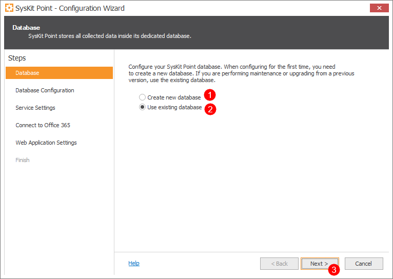
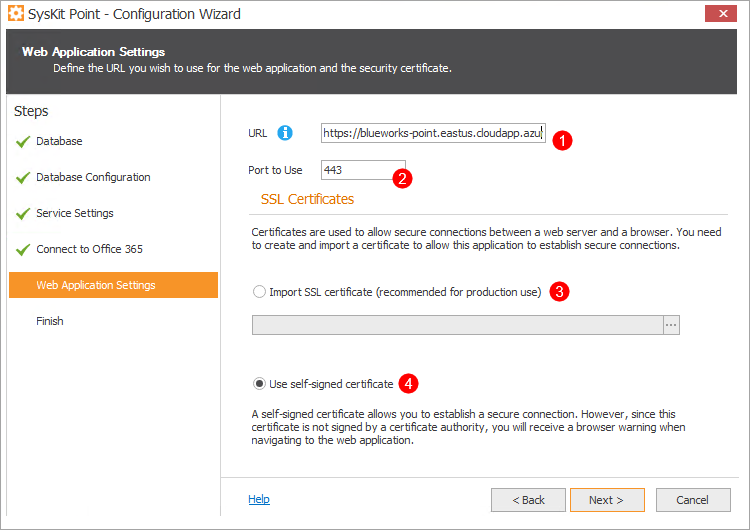
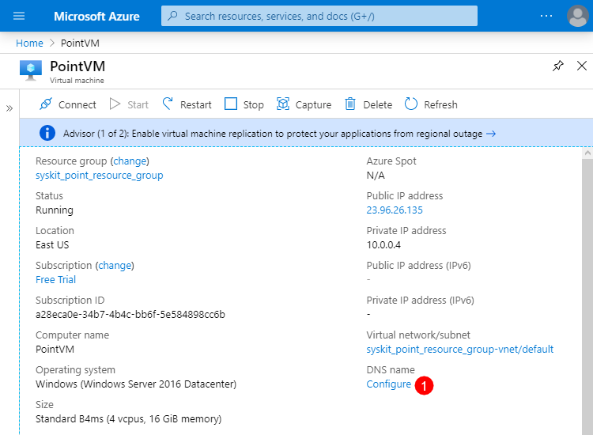
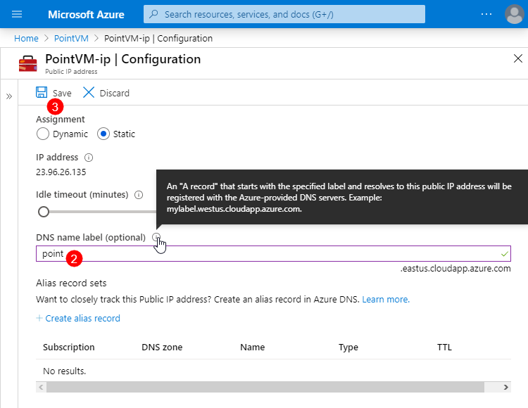
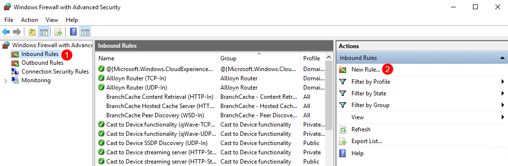
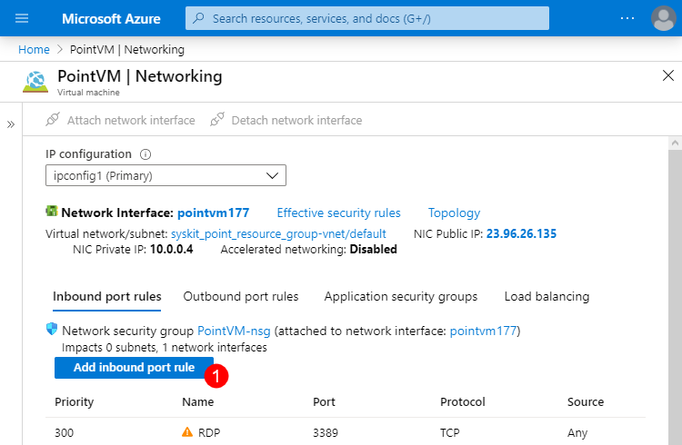
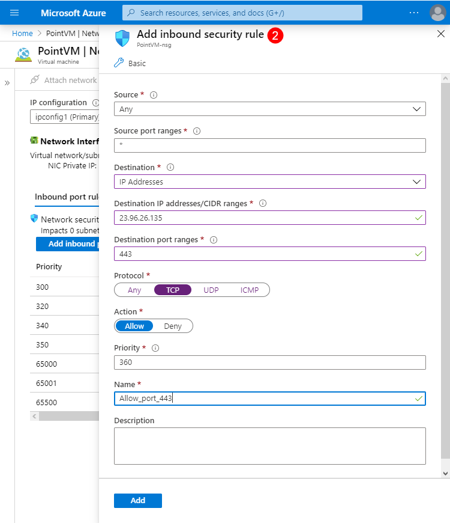

# Configure SysKit Point on Azure Virtual Machine

You can use this guide when:

* **Configuring SysKit Point on Azure Virtual Machine**
* **Allowing access to SysKit Point web application**
* **Testing the access to SysKit Point web application**


Allowing access **enables site owners and business users to access SysKit Point**, which **empowers collaborative Office 365 governance**.



**Please note!**  
The web application is accessible on the Internet when you allow access to SysKit Point outside of Azure Virtual Machine. **To secure your data**, **SysKit Point uses modern authentication methods**, making sure that only the right users inside your Office 365 tenant can sign in, as defined in [SysKit Point security settings](../installation-and-configuration/enable-role-based-access.md).


After configuration, SysKit Point users will be able to access the SysKit Point interface from any [supported internet browser](../../requirements/system-requirements.md#supported-browsers) through the specified app URL.

## Prerequisites

In addition to [Azure Resources](azure-resource-requirements.md), **the following is recommended when using SysKit Point in a production environment**:

* **Ownership of a public domain with the ability to manage DNS records**
* **SSL certificate from a publicly trusted certificate provider**

## Configure SysKit Point

After you [install SysKit Point on Azure Virtual Machine](install-syskit-point-on-azure-vm), **SysKit Point Configuration Wizard** starts.
Below, each step of the Configuration Wizard is described in greater detail.

### Database Step

Here, you can choose between two options:
* **Create new database \(1\)**
* **Use existing database \(2\)**

In case the Azure SQL Administrator prepared a Dedicated Azure SQL database for SysKit Point, choose the **Use existing database \(2\)**.

Click **Next\(3\)** to proceed.

### Database Configuration Step

On the Database Configuration step you will be required to enter the:

* **Database server**\(1\)
* **Database name**\(2\)

Select the option **Use SQL authentication**\(3\) to access the database and use the **data and credentials** provided by **Azure SQL Administrator**.

Click **Test Connection**\(4\) to see if **SysKit Point** can connect to the entered Azure SQL database.

If the connection is successful, click **Next** to proceed.


**Please note!**  
If you have provisioned **separate Azure Virtual Machines** for Azure SQL database and SysKit Point installation, **make sure that they are deployed to the same Virtual Network** and the SysKit Point server **can establish a connection to the SQL Server** by following the [guidelines](https://docs.microsoft.com/en-us/azure/virtual-machines/windows/sql/virtual-machines-windows-sql-connect#connect-to-sql-server-within-a-virtual-network) from Microsoft.


### Service Settings Step

Here you must provide a [Service account](permission-requirements.md#service-account) provided by the Azure administrator. 
The Service account will be used for running the automatic actions performed by SysKit Point, such as:

* **Office 365 auto discovery and data crawl** 
* **Writing the collected data to a specified SQL database**  
* **Writing down collected Audit data to the Index location** 

Supported service account formats are as follows:

* `machine_name\username`
* `.\username`

After you've entered the credentials click the **Validate Account** button. If the account has all [proper privileges](permission-requirements.md#service-account), a Success window appears with the message:

`This account can be used to run SysKit Point!`

Click **OK** to close the Success window, and **Next &gt;** to continue to the next step.

### Connect to Office 365 Step

Click the **Connect to your tenant** link to connect SysKit Point to your Office 365 tenant. **You need to provide the Office 365 global admin account.** This account will be used for collecting all the data from your environment and for the continuous auto discovery of new resources.

**Please note that this can be any global admin account**; it doesn’t have to be the account you will use in the future to log in to the application.


**SysKit Point** uses modern authentication methods and **does not store any passwords or accounts** that you present here.


When you first connect to your tenant, SysKit Point will request permissions needed to collect data from your Office 365 environment.

To continue, check the **Consent on behalf of your organization** **option \(1\)**, and click the **Accept** **button \(2\)**. A new window opens where you can choose which information would you like to collect when it comes to your Office 365 environment:

* **Automatic Discovery** – by default, SysKit Point continuously monitors your Office 365 environment and shows you the latest data. SharePoint Online sites and Office 365 Groups data will always be monitored. This setting cannot be modified.
* **OneDrive** - by default, SysKit Point will collect information and report on user OneDrive activity, content and sharing. To stop collecting OneDrive data, uncheck this option.
* **Audit Logs** - SysKit Point will also collect all audit logs to monitor internal and external user activities and changes and Store them to the hard drive. To stop storing audit logs, uncheck this option. 

You can change these options anytime by navigating to **Settings** in SysKit Point.


**Please note!**  
For SysKit Point to be able to collect, process, and save audit logs, the auditing has to be enabled in your tenant. [Navigate here to find out how to turn on auditing.](../../faq/turn-on-auditing.md)



**Why do I need to provide a global admin account?**  
You can find answers in the [following article](permission-requirements.md).


### Web Application Settings Step

In the Web Application Settings, the following is defined:

* **URL of SysKit Point Web App \(1\)**
* **Port used \(2\)**
* **Certificate**; here you can choose from two options:
  * **SSL Certificate \(3\)**
  * **Self-signed certificate \(4\)**

**In a production environment**, **it is recommended to use**:

* **Custom Domain used in SysKit Point Web App URL**; for example, `https://point.mycustomdomain.com`
* **SSL certificate obtained from a publicly trusted SSL certificate provider**

When using such setup, make sure to:

* **Associate the SSL certificate with the custom domain used in the SysKit Point Web App URL**
* **Add a public DNS A record on your custom domain pointing to Point Virtual Machine's public IP address** 

**When configuring SysKit Point in a test environment**, you can use:

* **Azure default domain** `cloudapp.azure.com` **in SysKit Point Web App URL**; for example, `https://azurevmname.eastus.cloudapp.azure.com`
* **Self-signed certificate created by SysKit Point**


**Please note!**  
**Self-signed certificates are by default not publicly trusted**; therefore, your connection to Point application may be marked as not private in the browser when accessing SysKit Point URL.


**To use the Azure default domain**, you need to configure a DNS name in the Azure Portal. To do so:

* **Open** [Azure portal](https://portal.azure.com)
* **Navigate to your Azure Virtual Machine**
* **Click Configure \(1\)** next to the DNS name label on the Overview screen
* **Define the DNS name label \(2\)**
* **Save your changes \(3\)**

### Finish Step

When the configuration is completed, if everything was configured correctly the screen will look like this.

After the configuration is complete, you can continue with the next step - allowing access to SysKit Point.

## Allow Access to SysKit Point

To make SysKit Point accessible for other users outside the Azure Virtual Machine, you need to:

* **Allow inbound traffic on the Azure Virtual Machine** where SysKit Point is installed
* **Allow inbound traffic for the Network Security Group** associated with the Point Virtual Machine

### Azure Virtual Machine

To allow inbound traffic on the Azure Virtual Machine, follow these steps:

* **Sign in to Azure Virtual Machine**
* **Open Windows Firewall with Advanced Security on Local Computer**
* **Select Inbound Rules \(1\)**
* **Click New Rule action \(2\)**

New Inbound Rule Wizard opens that enables you to create an inbound rule for TCP protocol on port 443.

### Network Security Group

To allow inbound security rule for the Network Security Group associated with the Azure Virtual Machine, follow these steps:

* **Open** [Azure portal](https://portal.azure.com)
* **Navigate to your Azure Virtual Machine** 
* **Click Networking** in the Settings section
* **Click Add inbound port rule button \(1\) to add a rule for TCP protocol with destination port 443 \(2\)**

After the inbound rule is created, you can continue and test access to the SysKit Point web application.

## Test Access to SysKit Point

You can test the connection to SysKit Point deployed on the Azure Virtual Machine now that the configuration is finished. To do so, use the following PowerShell cmdlet from any computer connected to the Internet: `Test-NetConnection -Port Point_port -ComputerName PointDNSName`

Here, the `-Port` parameter should be set to 443 and `-ComputerName` to the DNS name of the Point web application you specified as the URL in the SysKit Point Configuration Wizard. For example: `Test-NetConnection -Port 443 -ComputerName point.mycustomdomain.`

After all the steps are done, you can access the SysKit Point web application from anywhere on the Internet by opening the defined URL in your web browser. For example, `https://point.mycustomdomain.com`. If everything is set up correctly, the SysKit Point Sign in page opens.

## Related Topics

* [Azure Resource Requirements](azure-resource-requirements.md)
* [Permission Requirements](permission-requirements.md)
* [Install SysKit Point on Azure VM](install-syskit-point-on-azure-vm.md) 

If you have additional questions or concerns, please [contact us](https://www.syskit.com/contact-us/). 