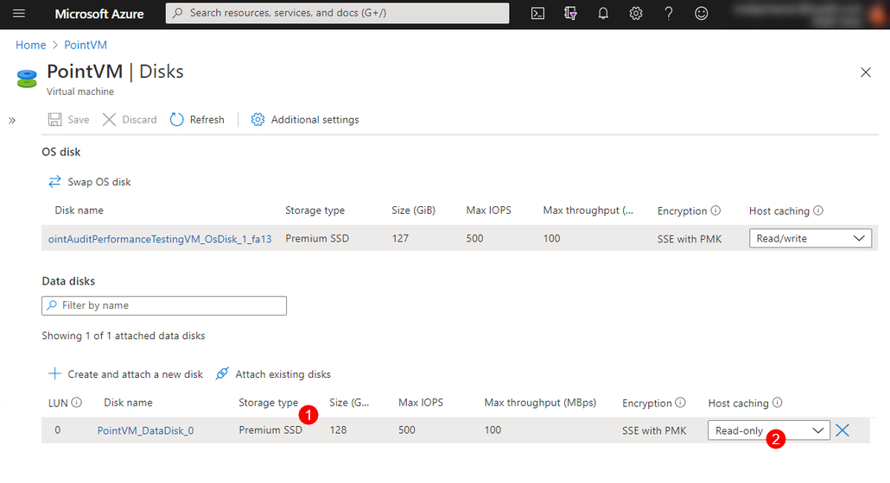

# Create Azure Virtual Machine

Here are the instructions for your **Azure team** to create and configure a **dedicated Azure Virtual Machine** in the [Azure portal](https://portal.azure.com) which will host SysKit Point.

## Prepare for Installation & Configuration

First you have to create a new **Virtual Machine** in the [Azure portal](https://portal.azure.com). During creation, you need to select an appropriate **Windows Server** image and set the **size** according to our [minimum hardware requirements](hardware-software-requirements.md#azure-virtual-machine-requirements).

After you create an Azure Virtual Machine, ensure the following configuration is set:

* A [**Network Security Group**](create-azure-vm.md#network-security-group) **is assigned** to the Azure Virtual Machine
  * **RDP connection \(port 3389\)** that allows access to the Azure Virtual Machine is enabled
  * **HTTPS connection \(TCP port 443\)** that allows access to Point web application is enabled
* A [**DNS name**](create-azure-vm.md#configure-a-dns-name) is set for the Azure Virtual Machine
  * A **Public IP address \(static\)** is set for the Azure Virtual Machine
* A **Premium \(SSD\)** [**Disk is attached**](create-azure-vm.md#attach-premium-ssd-data-disk) to the Azure Virtual Machine


**Please note!**

* **For increased security after the SysKit Point configuration is completed, the inbound rule allowing RDP connections can be removed.**


### Network Security Group

To **allow inbound traffic** for the **Network Security Group** associated with the Azure Virtual Machine, follow these steps:

* Open the [Azure portal](https://portal.azure.com)
* Navigate to your **Azure Virtual Machine** 
* **Click Networking** in the Settings section
* To enable **RDP connection**, click **Add inbound port rule button \(1\)** to add a rule for the **TCP protocol** with destination **port 3389 \(2\)** or **edit an existing rule** if it exists
* To enable **HTTPS connection**, click **Add inbound port rule button \(1\)** to add a rule for the **TCP protocol** with destination **port 443 \(2\)**

### Configure a DNS Name

You need to **configure a DNS name** in the Azure Portal which will be used for **RDP connection** or as a **hostname for the Point web application**. To do so:

* Open the [Azure portal](https://portal.azure.com)
* Navigate to your **Azure Virtual Machine**
* **Click Configure \(1\)** next to the **DNS name** label on the **Overview** screen
* **Set** the **IP Assignment** to **Static** 
* **Define** the **DNS name label \(2\)**
* **Save** your changes \(3\)


* The Public IP address defined here is needed when [allowing access to Azure SQL database](create-azure-sql-database.md#allowing-access-to-azure-sql-database), so make sure to have it at hand.


### Attach Premium \(SSD\) Data Disk

* While creating your Azure VM data disk, please make sure that you calculate your storage requirements based on the number of users on your tenants multiplied by the number of months you want to keep audit logs. You can find more details on the [minimum hardware requirements page](hardware-software-requirements.md#azure-virtual-machine-requirements).
* When attaching a data disk to your VM, make sure that you select **Premium \(SSD\) \(1\)** disk type.
* After the disk is attached, to achieve the best performance, switch your data disk `Host caching` to [**Read Only \(2\)**](https://docs.microsoft.com/en-us/azure/virtual-machines/premium-storage-performance#disk-caching)

## Output

When your **Azure team** finishes the above steps, they need to provide you with the following information for the next steps in the installation process:

* A **RDP connection file** so you can connect to the new Azure Virtual Machine 
* A **User account** with **Local Administrator rights** on the Azure Virtual Machine used for RDP connection and the SysKit Point installation
* A **Static IP address value** needed to [allow access to Azure SQL database](create-azure-sql-database.md#allowing-access-to-azure-sql-database) and a custom DNS setup if you decide to configure it
* The **DNS name** of the Azure Virtual Machine 
  * This will be in the format `{DNSNameLabel}.{DataCenter}.cloudapp.azure.com` as visible during the [**Configure a DNS Name**](create-azure-vm.md#configure-a-dns-name) step
  * Example `point.eastus.cloudapp.azure.com`

## Related Topics

* [Overview - Install SysKit Point on Azure Virtual Machine](overview.md) 
* [Hardware and Software Requirements](hardware-software-requirements.md)
* [Additional Azure Virtual Machine Configuration](additional-vm-configuration.md)
* [Create Azure SQL Database](create-azure-sql-database.md)

If you have additional questions or concerns, please [contact us](https://www.syskit.com/contact-us/).

