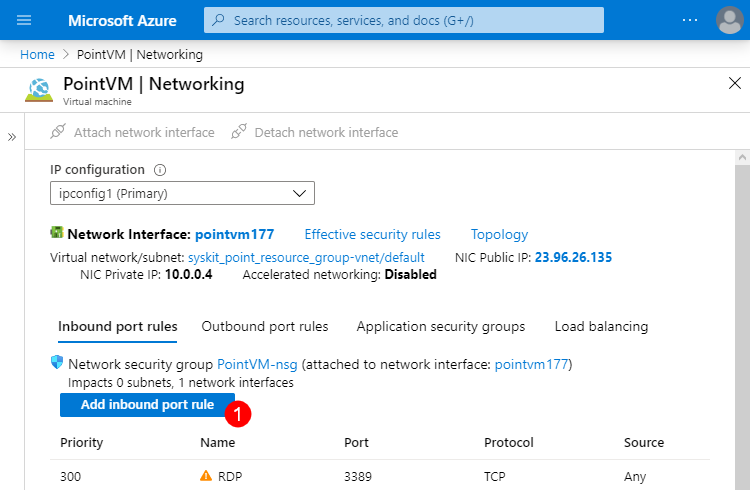
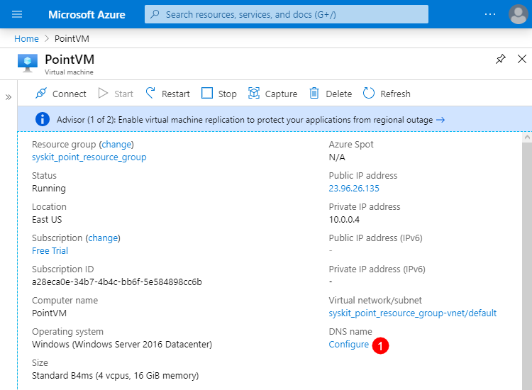

# Create Azure Virtual Machine

Here are the instructions for your **Azure team** to create and configure a **dedicated Azure Virtual Machine** in the [Azure portal](https://portal.azure.com) which will host SysKit Point.

## Prepare for Installation & Configuration

First you have to create a new **Virtual Machine** in the [Azure portal](https://portal.azure.com). During creation you need to select an appropriate **Windows Server** image and set the **Size** according to our [minimum hardware requirements](hardware-software-requirements.md#azure-virtual-machine-requirements).

After you create an Azure Virtual Machine, ensure the following configuration is set:

* **Network Security Group is assigned** to the Azure Virtual Machine
  * **RDP connection \(port 3389\)** that allows access to the Azure Virtual Machine is enabled
  * **HTTPS connection \(TCP port 443\)** that allows access to Point web application is enabled
* **Configure a DNS name** is set for the Azure Virtual Machine
  * **Public IP address \(static\)** is set for the Azure Virtual Machine


**Please note!**

* **For increased security after the SysKit Point configuration is completed, the inbound rule allowing RDP connections can be removed.**


### Network Security Group

To **allow inbound security rule** for the **Network Security Group** associated with the Azure Virtual Machine, follow these steps:

* Open [Azure portal](https://portal.azure.com)
* Navigate to your **Azure Virtual Machine** 
* **Click Networking** in the Settings section
* To enabled **RDP connection** click **Add inbound port rule button \(1\)** to add a rule for **TCP protocol** with destination **port 3389 \(2\)** or **edit an existing rule** if it exists
* To enabled **HTTPS connection** click **Add inbound port rule button \(1\)** to add a rule for **TCP protocol** with destination **port 443 \(2\)**

### Configure a DNS Name

You need to **configure a DNS name** in the Azure Portal which will be used for **RDP connection** or as a **hostname for the Point web application**. To do so:

* Open [Azure portal](https://portal.azure.com)
* Navigate to your **Azure Virtual Machine**
* **Click Configure \(1\)** next to the **DNS name** label on the **Overview** screen
* **Set** the **IP Assignment** to **Static** 
* **Define** the **DNS name label \(2\)**
* **Save** your changes \(3\)


* The Public IP address defined here is needed when [allowing access to Azure SQL database](create-azure-sql-database.md#allowing-access-to-azure-sql-database), so make sure to have it at hand.


## Output

When your **Azure team** finishes the above steps, they need to provide you with the following information for the next steps in the installation process:

* **RDP connection file** so you can connect to the new Azure Virtual Machine 
* **User account** with **Local Administrator rights** on the Azure Virtual Machine used for RDP connection and the SysKit Point installation
* **Static IP address value** need to [allow access to Azure SQL database](create-azure-sql-database.md#allowing-access-to-azure-sql-database) and custom DNS setup if you decide to configure it
* **DNS name** for the Azure Virtual Machine 
  * This will be in the format {DNSNameLabel}.{DataCenter}.cloudapp.azure.com as visible during the step **Configure a DNS Name**
  * Example `point.eastus.cloudapp.azure.com`

## Related Topics

* [Install SysKit Point on Azure Virtual Machine](overview.md) 
* [Hardware and Software Requirements](hardware-software-requirements.md)
* [Additional Azure Virtual Machine Configuration](additional-vm-configuration.md)
* [Create Azure SQL Database](create-azure-sql-database.md)

If you have additional questions or concerns, please [contact us](https://www.syskit.com/contact-us/).

