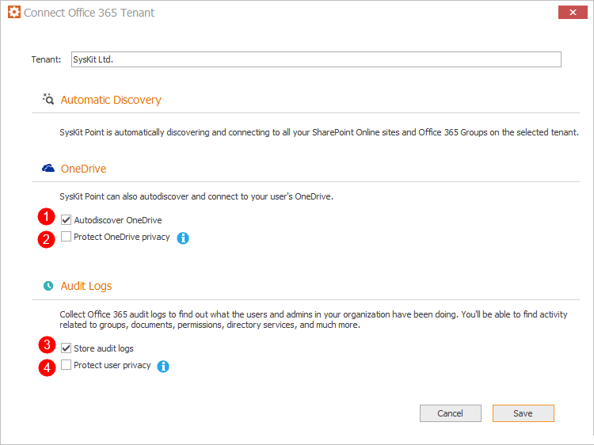

# Install SysKit Point on an Azure Virtual Machine

## Install & Configure SysKit Point on Azure Virtual Machine

Before you can install and configure **SysKit Point** on your Azure Virtual Machine make sure you prepared the following information described in the [**installation guide**](overview.md):

* [**Azure SQL database information**](create-azure-sql-database.md#output): **Azure SQL server**, **Azure SQL database name** and **SQL account** with db owner permissions 
* [**URL for Point web application and a valid SSL certificate**](ssl-certificate.md#output)
* [**Service account**](additional-vm-configuration.md#service-account): windows account to run the SysKit Point windows service
* **Global Administrator** is ready to provide [**application consent**](./../../requirements/permission-requirements#global-administrator)

## Install SysKit Point


**Please note!**  
To install SysKit Point, make sure that the **RDP connection \(TCP port 3389\)** that allows you to access your virtual machine is enabled. After the configuration, the inbound rule allowing RDP connections can be removed.


1. **Connect to the Azure Virtual Machine** using RDP connection
2. [Download the SysKit Point setup file](https://my.syskit.com/).
3. **Unpack and run the setup file** - **SysKitPointSetup.exe**. The wizard will guide you through the installation steps.
4. Read and accept the license agreement - [EULA](https://www.syskit.com/eula/) - click **Next >** to proceed.
5. By default, the installation folder is set to **C:\Program Files\SysKit\Point**. You can modify it by clicking the **Change** button. Once selected, click **Next >** to proceed. 
6. By default, the **Run Configuration Wizard now** option is selected. **SysKit Point Configuration Wizard** will, therefore, automatically start when you click the **Finish** button. Alternatively, you can always start the Configuration Wizard manually by running it from the installation folder. The default location is: **C:\ProgramFiles\SysKit\Point\Host\Configuration.exe**.

## Configure SysKit Point

By default, after SysKit Point is installed the **SysKit Point Configuration Wizard** starts automatically. Alternatively, you can start it manually at any time by running it from the installation folder. The default location is: **C:\ProgramFiles\SysKit\Point\Host\Configuration.exe**.

Below, each step of the Configuration Wizard is described in greater detail.

### Database Step

Here, you can choose between two options:

* **Create new database \(1\)**
* **Use existing database \(2\)**

In case a dedicated Azure SQL database is prepared for SysKit Point, choose the **Use existing database \(2\)** option.

Click **Next\(3\)** to proceed.

### Database Configuration Step

On the Database Configuration step you will be required to enter the:

* **Database server \(1\)**
* **Database name \(2\)**

Select the option **Use SQL authentication**\(3\) to access the database and use the **data and credentials** defined when creating an Azure SQL database.

Click **Test Connection**\(4\) to see if **SysKit Point** can connect to the entered Azure SQL database.

If the connection is successful, a Success window appears with the message:

`Successfully connected to the database!`

Click **OK** to close the Success window, and **Next >** to continue to the next step.

### Service Settings Step

Here you must provide a [Service account](additional-vm-configuration.md#service-account) that will be used for running SysKit Point windows service.

Supported service account formats are as follows:

* `machine_name\username`
* `.\username`
* `domain\username`

After you've entered the credentials click the **Validate Account** button. If the account has all [proper privileges](additional-vm-configuration.md#service-account), a Success window appears with the message:

`This account can be used to run SysKit Point!`

Click **OK** to close the Success window, and **Next >** to continue to the next step.

### Connect to Office 365

Click the **Connect to your tenant** link to connect SysKit Point to your Office 365 tenant. **You need to provide a Office 365 Global Admin account.** This account will be **used only for the initial setup** and Point **does not store any passwords** you enter here.

When you first connect to your tenant, SysKit Point will request permissions needed to collect data from your Office 365 environment.

To continue, check the **Consent on behalf of your organization** **option \(1\)**, and click the **Accept** **button \(2\)**. A new window opens where you can choose which information would you like to collect when it comes to your Office 365 environment:

* **Automatic Discovery** – by default, SysKit Point continuously monitors your Office 365 environment and shows you the latest data. SharePoint Online sites and Office 365 Groups data will always be monitored. This setting cannot be modified.
* **Autodiscover OneDrive \(1\)** - by default, SysKit Point will collect information and report on the users' OneDrive activity, content, and sharing. To stop collecting OneDrive data, uncheck this option.
* **Protect OneDrive privacy \(2\)** - When enabled, SysKit Point will only show general information about user's OneDrive, such as used storage. SysKit Point Admins won't be able to access any OneDrive content and personal data. By default, this option is disabled.
* **Store audit logs \(3\)** - SysKit Point will also collect all audit logs to monitor internal and external user activities and changes and store them to the hard drive. To stop storing audit logs, uncheck this option.
* **Protect user privacy \(4\)** - When enabled, user activity data will be hidden from SysKit Point and protected from Administrator supervision. By default, this option is disabled.


You can change these options anytime by running the **SysKit Point Configuration Wizard** again.



**Please note!**  
For SysKit Point to collect, process, and save audit logs, auditing has to be enabled in your tenant. [Navigate here to find out how to turn on auditing.](../../faq/turn-on-auditing.md)



**Why do I need to provide a global admin account?**  
You can find answers in the [following article](../../requirements/permission-requirements.md#office-365).


### Web Application Settings Step

In the Web Application Settings, the following options are defined:

* **URL of SysKit Point Web App \(1\)**
* **Port to use \(2\)**
* **Certificate**; here you can choose from two options:
  * **SSL Certificate \(3\)**
  * **Self-signed certificate \(4\)**

### Finish Step

When the configuration is completed, if everything was configured correctly the screen will look like this:

### Related Topics

* [Overview - Install SysKit Point on Azure Virtual Machine](overview.md) 
* [Hardware and Software Requirements](hardware-software-requirements.md)
* [Create Azure Virtual Machine](create-azure-vm.md)
* [Create Azure SQL Database](create-azure-sql-database.md)

If you have additional questions or concerns, please [contact us](https://www.syskit.com/contact-us/).

