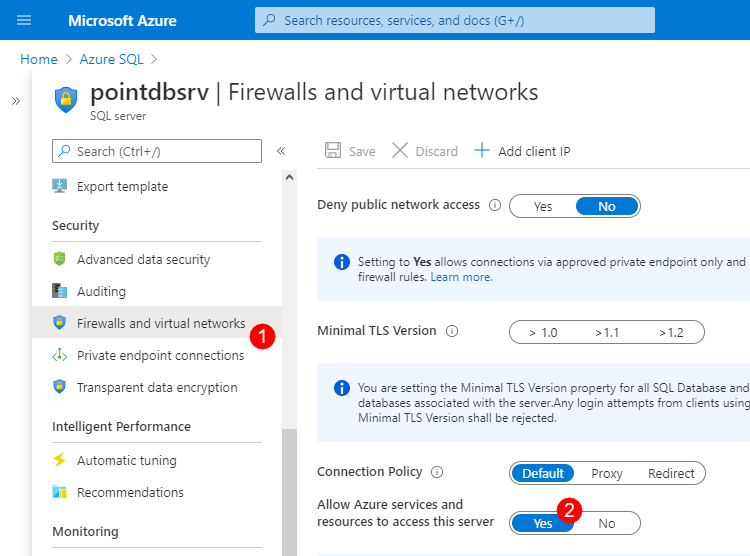

SysKit Point requires an **Azure SQL database** for storing data collected from Office 365. In this article, you can find recommendations to follow when creating this resource.

## Resource Requirements per Subscription Plan

Based on the size of your Office 365 environment, SysKit Point comes with three different subscription plans:
* **Professional**
* **Team**
* **Enterprise**


To learn more about available SysKit Point subscription plans and included features, continue to the [Pricing page.](https://www.syskit.com/products/point/pricing/)  


Below, you can find Azure SQL Database requirements based on your SysKit Point subscription plan and your environment's size.

### Professional Subscription

Recommended for Office 365 environments with up to 1000 users and sites.

| Server/Resource | Service tier | DTU | CPU | Included storage (GB) |
| :--- | :--- | :--- | :--- | :--- | 
| Azure SQL Database | S1 | 20 | non intensive (<1 vCore) | 250 (HDD-based) | 

### Team Subscription

Recommended for Office 365 environments with up to 10000 users and sites.

| Server/Resource | Service tier | DTU | CPU | Included storage (GB) |
| :--- | :--- | :--- | :--- | :--- | 
| Azure SQL Database | S2 | 50 | non intensive (<1 vCore) | 250 (HDD-based) | 

### Enterprise Subscription

Recommended for Office 365 environments with more than 10000 users and sites.

| Server/Resource | Service tier | DTU | vCore (CPU) | Included storage (GB) |
| :--- | :--- | :--- | :--- | :--- | 
| Azure SQL Database | S3 | 100 | intensive | 250 (SSD-based) | 

## Prepare for Installation & Configuration

### Creating the Database

When creating the database ensure the following:
* **resource requirements are met**
* **a dedicated Azure SQL database is created for SysKit Point.**
* the **Allow Azure services to access server** option is enabled


By enabling the **Allow Azure services to access server** option, you are also enabling SysKit Point to connect to the Azure SQL database.


To enable the **Allow Azure services to access server** option, follow these steps:
* **Open** [Azure portal](https://portal.azure.com)
* **Navigate to your Azure SQL server**
* **Click** the **Firewalls and virtual networks (1)** option in the **Security** section
* **Set** the **Allow Azure services and resources to access this server (2)** setting to **Yes**


**Please note!**  
If you have provisioned **separate Azure Virtual Machines** for Azure SQL Server and SysKit Point installation, **make sure that they are deployed to the same Virtual Network** and the SysKit Point server **can establish a connection to the SQL Server** by following the [guidelines](https://docs.microsoft.com/en-us/azure/virtual-machines/windows/sql/virtual-machines-windows-sql-connect#connect-to-sql-server-within-a-virtual-network) from Microsoft.


### Credentials 

For SysKit Point configuration, prepare the following information:

* **Database server**
* **Database name**
* **Server admin login**
* **Server admin password**

## Related Topics

* [Create Azure Virtual Machine](create-azure-vm.md)
* [Install SysKit Point on Azure VM](../install-syskit-point-on-azure-vm.md) 
* [Configure SysKit Point on Azure VM](../configure-syskit-point-on-azure-vm.md)
* [Allow Access to SysKit Point Web-App](../allow-access-to-syskit-point-web-app.md)

If you have additional questions or concerns, please [contact us](https://www.syskit.com/contact-us/).