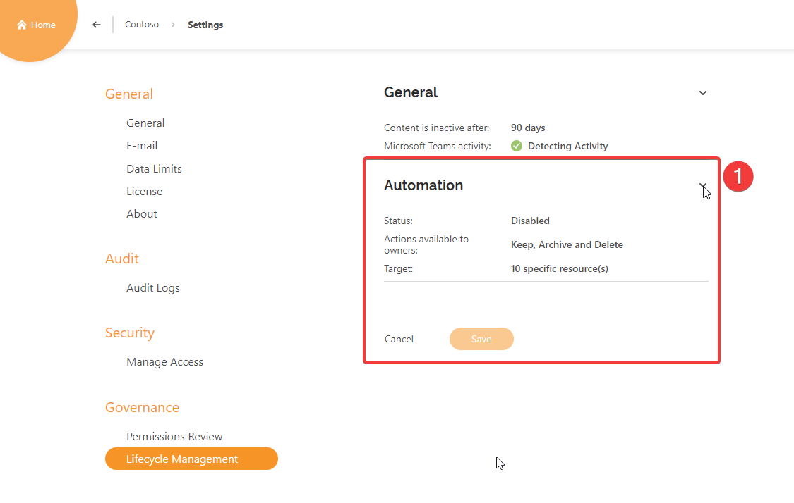
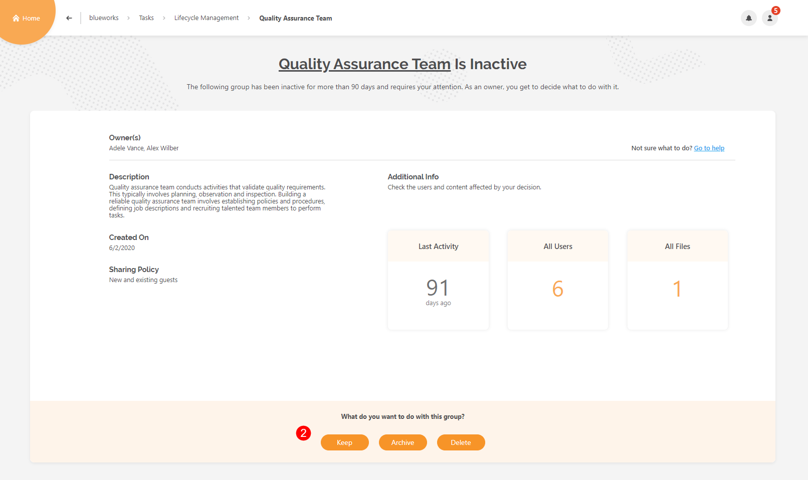
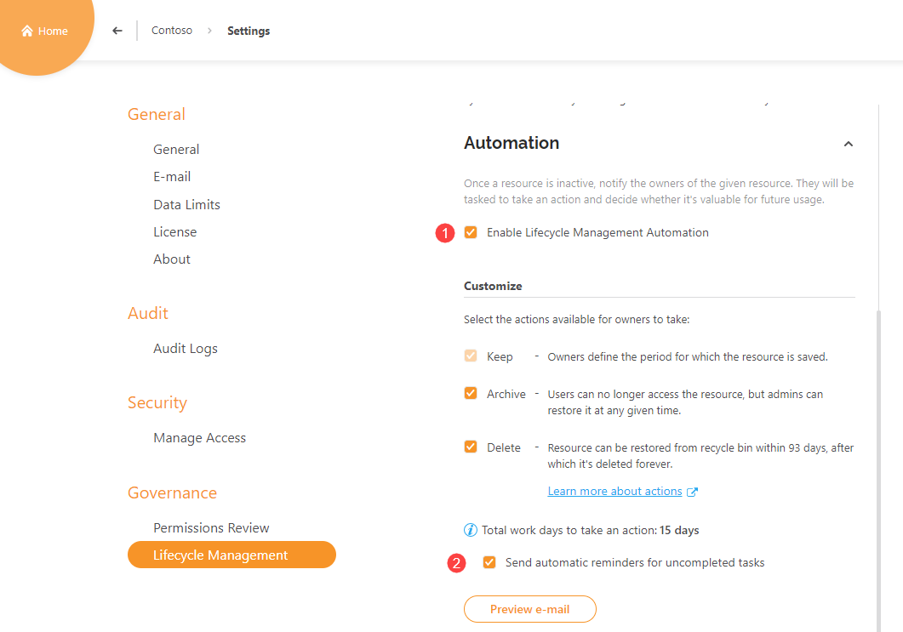
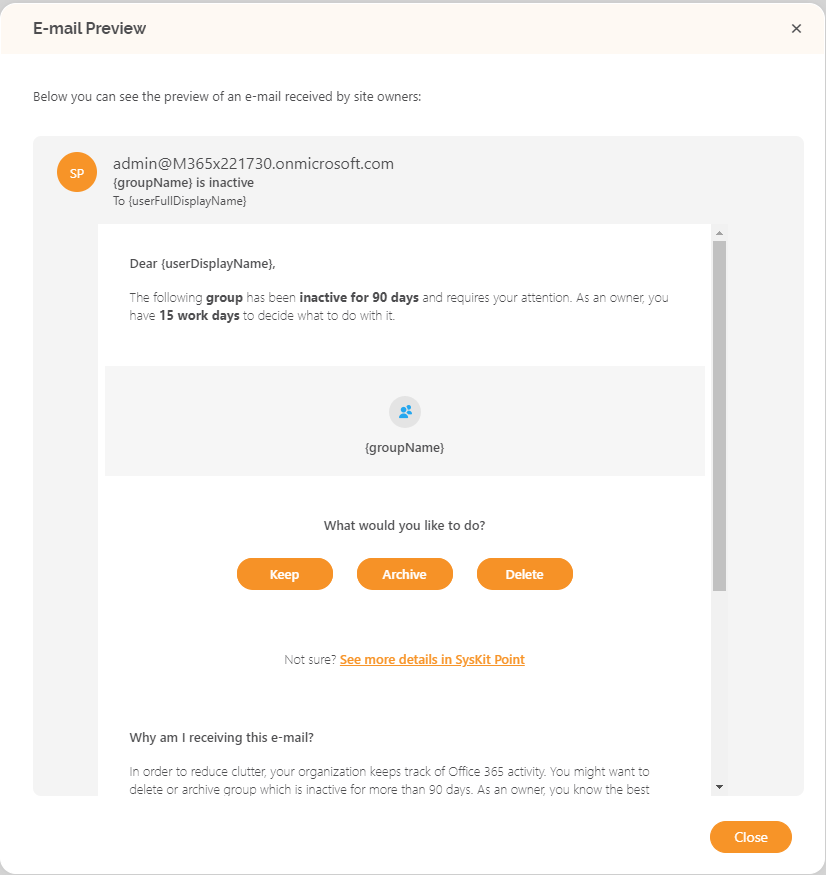
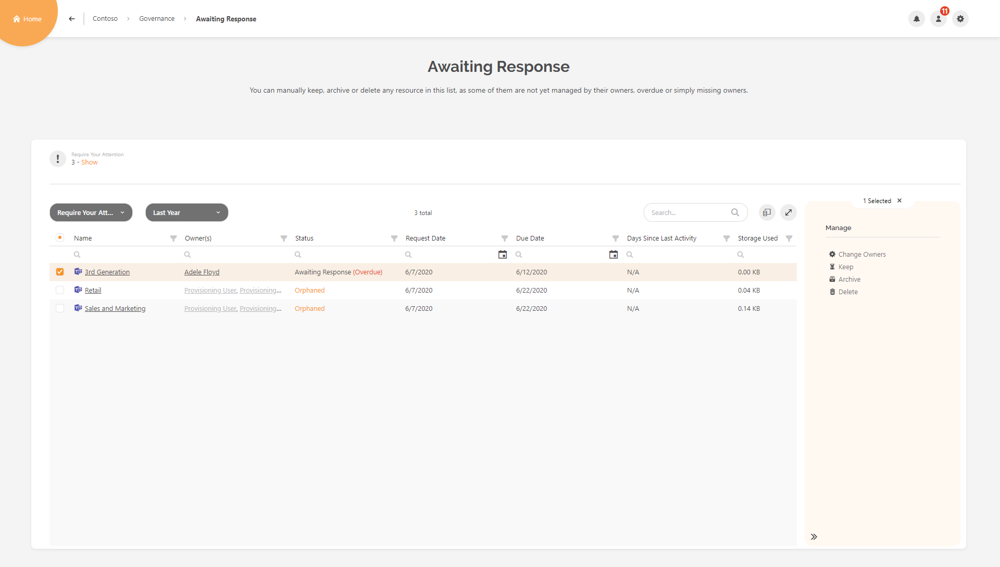
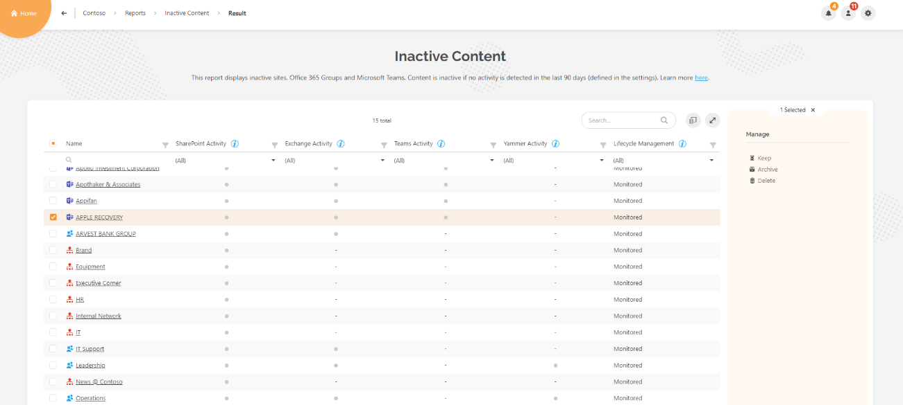
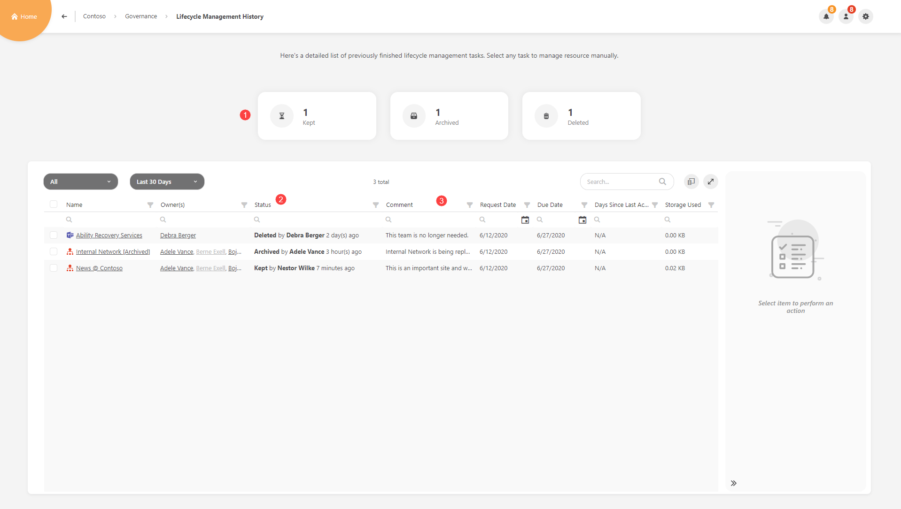

# Enable Lifecycle Management Automation


**Before you continue**, check if the Lifecycle Management Automation feature is included in your [subscription plan](https://www.syskit.com/products/point/pricing/).


To Use the advantages of **Lifecycle Management Automation** in **SysKit Point**, you need to:

* **Set up e-mail settings**
* **Enable SysKit Point Collaborators role**
* **Configure Lifecycle Management Automation in settings**


**Please note!**                                                                                                                                                Only users assigned to the **SysKit Point Admin** role can access and configure Settings in SysKit Point.


## Enable Lifecycle Management

To start with the configuration, open the **Settings** &gt; **Governance** &gt; **Lifecycle Management** screen. Initially, you will see two **accordions** named; **General** and **Automation**. To expand the **Lifecycle Management Automation** settings, click on Automation accordion \(1\).

If you haven't enabled the **E-mail** or **SysKit Point Collaborators** role yet, the screen will look like this.


**Hint** – if you don't know how to enable those settings visit [Set Up E-Mail](https://docs.syskit.com/point/installation-and-configuration/enable-permissions-review#set-up-e-mail) and Enable [SysKit Point Collaborators](https://docs.syskit.com/point/installation-and-configuration/enable-permissions-review#enable-syskit-point-collaborators) articles on SysKit Docs page.


## Customize Lifecycle Management Automation

When you have enabled required options, click on **Enable Lifecycle Management Automation** \(1\). After that, more options becomes available.

You can select between three available actions for your **Site Owners** to take :

* **Keep**
* **Archive**
* **Delete**


**Please note** – Action **Keep** cannot be disabled, also minimum of **two** actions is needed for this feature to be functional.


If you wish to receive an **automatic reminder** for uncompleted tasks, select said checkbox \(2\).

If you want to become familiar with the look of the lifecycle management e-mail that will be sent to site owners, click the **Preview e-mail button**.

## Lifecycle Management Targeting

In the **Target Selection** section, you can **define which sites to include in the Lifecycle Management**.

By default, the **All Microsoft Teams, Office 365 Groups and sites \(1\)** option is selected. Additionally, you can:

* **remove any of the initially selected resources** by clicking the **resource filter \(2\)**
* **preview selected sites based on your configuration by clicking the Preview tile \(3\)**; first, you need to save your changes to enable the Preview tile


**Please note** that if you haven't got the approval from **Microsoft** for detecting activity of **Microsoft Teams**, those resources **will not be monitored** with **Lifecycle Management Automation**.


Once your changes are saved, you can click the **Preview tile**, which opens the **Lifecycle Management - Preview** report showing detailed information about resources that will be included in the lifecycle management automation. On the report, you can:

* **click the tiles \(1\)** to show only a certain site type; the tiles show the number of sites included in the lifecycle management automation, grouped by type
* **click the Show link \(2\) that activates the** Orphaned Sites view \(3\)
* **view all site owners that will receive a lifecycle management e-mail**; for each Microsoft Team, Office 365 Group, site included in the lifecycle management automation.
* **change admins** by **selecting a row \(4\)** and clicking the **Change Admins action \(5\)** available in the side panel

Choose the **Specific items \(1\)** option if you want to manually select specific sites to be included in the lifecycle management automation. You can also select the checkbox if you wish to Auto-select new resources.

When done with the selection, save your changes.

Now that everything is defined, the lifecycle management will start automatically. To learn all about the lifecycle management in SysKit Point, visit the [following article](https://app.gitbook.com/@syskit/s/point-staging/common-tasks/monitor-lifecycle-management).

