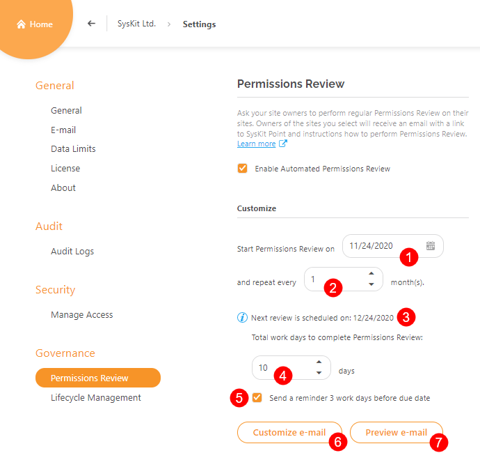
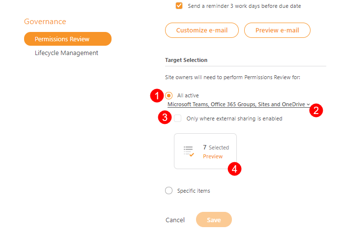

# Prerequisites


**Before you continue**, check if the Automated Permissions Review feature is included in your [subscription plan](https://www.syskit.com/products/point/pricing/).


To use the advantages of Automated Permissions Review in SysKit Point, you need to:

* **set up e-mail settings**
* **enable SysKit Point Collaborators role**
* **configure Automated Permissions Review with the help of Permissions Review Setup wizard**


**Please note!**  
Only users assigned to the **SysKit Point Admin** role can access and configure Settings in SysKit Point.


To start with the configuration, open the **Settings** &gt; **Governance** &gt; **Permissions Review** screen. Initially, you may find the Permissions Review settings screen displaying the following warnings:

Clicking the tiles in the **Additional Actions Required** section redirects to the appropriate settings screen.

## **Set Up E-Mail**

As a part of the automated permissions review process, e-mails are sent to SysKit Point Admin and SysKit Point Collaborator users. For SysKit Point to be able to send e-mails, you need to configure the sending method. Two options are available:

* **Exchange Online** 
* **SMTP** - Simple Mail Transfer Protocol


**Please Note!**  
E-mail address set up in this section will appear in the **Sent from** field of all e-mails sent from SysKit Point.


### Exchange Online Settings


**Please Note!**  
Exchange Online has a sending limit of 10000 e-mails per day.


The Exchange Online method enables you to use an existing Exchange account in your Microsoft 365 tenant to send e-mails from SysKit Point. Here, you can:

* **enter a valid e-mail address in the Sent from field \(1\)**
* **choose whether to save e-mails sent by SysKit Point to the Sent items folder \(2\)**; by default, this option is turned on, meaning that all e-mails sent from SysKit Point will be stored in the **Sent** mailbox folder of the entered Exchange account
* **Send a test e-mail \(3\)** to check if the entered e-mail address is working properly

After you click the **Send test e-mail** button, the **Sent test e-mail** dialog opens. Here, **enter the e-mail address to which you want to send** the test e-mail. After a moment, you should receive an e-mail like the one pictured below.

Click the **Save** button to store your e-mail settings.

### SMTP Settings

Select the **SMTP method** if you are using an **SMTP** server in your environment. Here, you can enter the SMTP properties:

* **Outgoing Server**
* **Port**
* **Sent from** e-mail
* **Username** and **Password**; in case the **Require Authentication** option is enabled

  You can also choose whether to **Use Encrypted Connection \(SSL\)**.

You can check if the entered data is correct by **sending a test e-mail**.

Click the **Save** button once you confirm that the test e-mail was received.

## **Enable SysKit Point Collaborators**

To enable site owners to perform the permissions review on their sites, you need to enable them to access SysKit Point. To do so, navigate to the **Settings** &gt; **Security** &gt; **Manage Access** screen, and **click the toggle to enable the SysKit Point Collaborators role**. When the role is enabled, site owners can access SysKit Point, where they can manage their sites and review permissions.

For more information about role-based access in SysKit Point, go to the [following article](enable-role-based-access.md).

# **Automated Permissions Review Setup**

After you have successfully set up e-mail and enabled the SysKit Point Collaborators role, you can enable the Automated Permissions Review by clicking the **Enable Automated Permissions Review (1)** button on the **Governance** &gt; **Permissions Review** screen. The **Permissions Review Setup wizard** opens, guiding you through the Automated Permissions Review configuration.

The Permissions Review Wizard consists of several steps with reports and actions that enable Permissions Review customization. Let's examine each step in more detail.

## **Overview**
The **Overview step** provides basic information on how the Permissions Review Setup works.
Here, you can see that the Permissions Review Setup will ask you to:
* **Create or customize Permissions Review Policies (1)**
* **Apply policies to Microsoft Teams**, **Microsoft 365 Groups**, **OneDrive**, and **sites (2)**
* **Manage who will get the Permissions Review task (3)**
Additionally, you can find information about:
* **Permissions Review policies (4)**
* **Reviewers (5)**
To continue to the next step, click the **Start button (6)**.
You can find the **Close Setup link (7)** on all steps in the Permissions Review Setup wizard, enabling you to leave the setup at any time. 

## **Set Up Policies**
**Permissions Review policies enable you to define different review options**, such as review frequency and scope, and later **apply them to different Microsoft Teams**, **Microsoft 365 Groups**, **OneDrive** and **sites**.
By default, SysKit Point offers a precreated policy - **All users and shared files (1)**.
When a policy is selected, the following actions are available in the **side panel**:
* **Edit Policy (2)**
* **Enable Policies (3)**
* **Disable Policies (4)**
* **Delete Policies (5)** 

Let's edit the existing predefined policy. After clicking the **Edit Policy link (2)**, the **Editing Policy** dialog opens.
The following review policy settings can be defined here:
* **Policy Name (1)**
* **Memberships to review (2)** - you can choose between two options:
  * **All**
  * **Guests Only**
* **Content to review (3)** - you can choose between two options:
  * **All** 
  * **External Only**
* **Recurrence (4)** - set how often the review should be performed
* **Content level to be reviewed (5)** - you can choose between the following options:
  * **subsites**
  * **document libraries & lists**
  * **folders**
  * **files & folders**

Depending on your selection of what should be reviewed, the **descriptions (6)** on the right side of the dialog will change.
Click **Save (7)** when you are done editing the policy. 

You can also **create a new review policy by clicking the Create Policy action (1)** in the right side panel. The **New Permissions Review Policy dialog (2)** opens, giving you the possibility to define review policy options as described when edititng.

To continue to the next step, click the **Next** button
## **Apply Policies**

On the **Apply Policies step**, you can apply created policies to your **Microsoft Teams**, **Microsoft 365 Groups**, **OneDrive**, and **sites**.
To do so:
* **select (1)** one or multiple resources; you can easily filter them by applied policies with the help of **top tiles (2)**
* **click the Apply Policy action (3)**

The **Apply Permissions Review Policy** dialog opens where you can:
* **choose one of your review policies (3)**
* **confirm your selection by clicking the Save button (4)**

Once you're done assigning policies to **Microsoft Teams**, **Microsoft 365 Groups**, **OneDrive**, and **sites**, click the **Next** button to continue to the next step.

## **Manage Reviewers**

## **Review Options**

## **Summary**

### **Customize Permissions Review**

In the **Customize section** of the permissions review, you can do the following:

* **define the start date** for the first **Automated Permissions Review** by clicking the **calendar icon \(1\)** and choosing the desired date
* **define the recurrence period \(2\)** for the permissions review
* **view the start date for the next permissions review \(3\)**; save your changes to recalculate and refresh values if needed
* **define the permissions review duration \(4\)**; permissions review has a defined duration of **10 workdays**
* **choose whether to send an e-mail reminder \(5\)** to all site owners included in the permissions review three workdays before the due date; you can turn off this option at any time during the permissions review
* **customize the permissions review e-mail \(6\)** - learn more about e-mail customization [here](customize-emails.md)
* **preview the permissions review e-mail \(7\)**


**Please Note!**  
All dates in the permissions review, including start and due date, are calculated to fall on a workday. That way, SysKit Point ensures that no e-mails are sent during non-working hours.



**Hint!**  
SysKit Point Admins can manually send an e-mail reminder to site owners once a day, any time during the permissions review, by choosing the **Remind Owners** action on the **Governance** &gt; **Permissions Review details** screen.


If you want to become familiar with the look of the permissions review e-mail that will be sent to site owners, click the **Preview e-mail button**. Since each site owner will have different sites and site types to review, the **e-mail preview dialog shows placeholders** marked with parenthesis **{ }**.

### **Permissions Review Targeting**

In the **Target Selection** section, you can **define which sites to include in the permissions review**. By default, the **All active Microsoft Teams, Microsoft 365 Groups and sites \(1\)** option is selected. Additionally, you can:

* **include OneDrive or remove any of the initially selected resources** by clicking the **resource filter \(2\)**
* **choose to include only resources where external sharing is enabled \(3\)**
* **preview selected sites based on your configuration by clicking the Preview tile \(4\)**; first, you need to save your changes to enable the Preview tile

To learn more about **active and inactive content**, visit [this article](../common-tasks/inactive-content.md).


**Hint!**  
You can find resources with the enabled external sharing setting on the Sites overview screen. In the Sharing Settings column, they will have one of the following values: **Anyone**, **New and existing guests**, or **Existing guests only**.


Once your changes are saved, you can click the **Preview tile**, which opens the **Permissions Review - Preview** report showing detailed information about resources that will be included in the permissions review. On the report, you can:

* **click the tiles \(1\)** to show only a certain site type; the tiles show the number of sites included in the permission review, grouped by type
* **view Permissions review information**, such as due date, number of e-mail recipients, and the number of orphaned sites \(sites that have no owners or have owners that are blocked or deleted\) 
* **click the Show link \(2\) that activates the** Orphaned Sites view \(3\)
* **view all site owners that will receive a permissions review e-mail**; for each Microsoft Team, Microsoft 365 Group, site, and OneDrive included in the permissions review 
* **change owners** by **selecting a row \(4\)** and clicking the **Change owners action \(5\)** available in the side panel

Choose the **Specific items \(1\)** option if you want to manually select specific sites to be included in the permissions review.

Save the changes to proceed with the selection. Click the **Select Now \(2\)** link. The **Specific Permissions Review** screen opens. Here, you can select sites that you want to include in the permissions review.


**Please note!**  
Only selected sites will be included in future permissions reviews. If a new site is created, you need to add it manually to the selection on the Specific Permissions Review screen.


When done with the selection, save your changes. The **Preview tile** becomes available and, once clicked, shows the **Permissions Review - Preview** report described above.

Now that everything is defined, the permissions review will start automatically. To learn all about the automated permissions review in SysKit Point, visit the [following article](../common-tasks/permissions-review.md).

