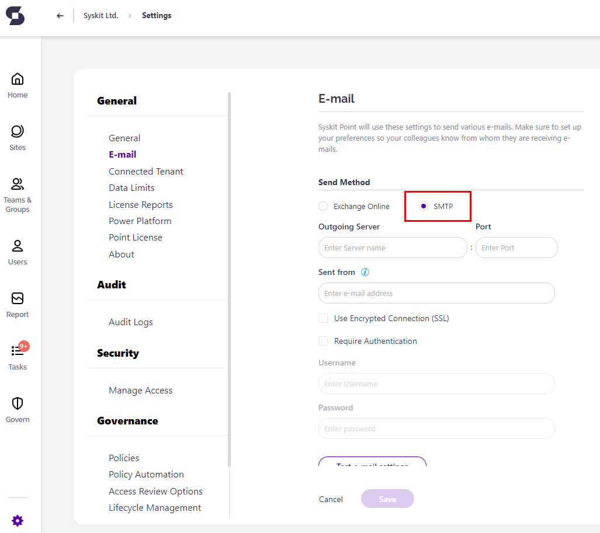

# Enable Automated Permissions Review

## Prerequisites


**Before you continue**, check if the Automated Permissions Review feature is included in your [subscription plan](https://www.syskit.com/products/point/pricing/).


To use the advantages of Automated Permissions Review in SysKit Point, you need to:

* **set up e-mail settings**
* **enable SysKit Point Collaborators role**
* **configure Automated Permissions Review with the help of Permissions Review Setup wizard**


**Please note!**  
Only users assigned to the **SysKit Point Admin** role can access and configure Settings in SysKit Point.


To start with the configuration, open the **Settings** &gt; **Governance** &gt; **Permissions Review** screen. Initially, you may find the Permissions Review settings screen displaying the following warnings:

Clicking the tiles in the **Additional Actions Required** section redirects to the appropriate settings screen.

### **Set Up E-Mail**

As a part of the Automated Permissions Review process, e-mails are sent to SysKit Point Admin and SysKit Point Collaborator users. For SysKit Point to be able to send e-mails, you need to configure the sending method. Two options are available:

* **Exchange Online** 
* **SMTP** - Simple Mail Transfer Protocol


**Please Note!**  
E-mail address set up in this section will appear in the **Sent from** field in all e-mails sent from SysKit Point.


#### Exchange Online Settings


**Please Note!**  
Exchange Online has a sending limit of 10000 e-mails per day.


The Exchange Online method enables you to use an existing Exchange account in your Microsoft 365 tenant to send e-mails from SysKit Point. Here, you can:

* **enter a valid e-mail address in the Sent from field \(1\)**
* **choose whether to save e-mails sent by SysKit Point to the Sent items folder \(2\)**; by default, this option is turned on, meaning that all e-mails sent from SysKit Point will be stored in the **Sent** mailbox folder of the entered Exchange account
* **Send a test e-mail \(3\)** to check if the entered e-mail address is working properly

After you click the **Send test e-mail** button, the **Sent test e-mail** dialog opens. Here, **enter the e-mail address to which you want to send** the test e-mail. After a moment, you should receive an e-mail like the one pictured below.

Click the **Save** button to store your e-mail settings.

#### SMTP Settings

Select the **SMTP method** if you are using an **SMTP** server in your environment. Here, you can enter the SMTP properties:

* **Outgoing Server**
* **Port**
* **Sent from** e-mail
* **Username** and **Password**; in case the **Require Authentication** option is enabled

  You can also choose whether to **Use Encrypted Connection \(SSL\)**.

You can check if the entered data is correct by **sending a test e-mail**.

Click the **Save** button once you confirm that the test e-mail was received.

### **Enable SysKit Point Collaborators**

To enable site owners to perform the permissions review on their sites, you need to enable them to access SysKit Point. To do so, navigate to the **Settings** &gt; **Security** &gt; **Manage Access** screen, and **click the toggle to enable the SysKit Point Collaborators role**. When the role is enabled, site owners can access SysKit Point to manage their sites and review permissions.

For more information about role-based access in SysKit Point, go to the [following article](enable-role-based-access.md).

## **Automated Permissions Review Setup**

After you have successfully set up e-mail and enabled the SysKit Point Collaborators role, you can enable the Automated Permissions Review by clicking the **Enable Automated Permissions Review \(1\)** button available on the **Governance** &gt; **Permissions Review** screen. The **Permissions Review Setup wizard** opens, guiding you through the Automated Permissions Review configuration.

The Permissions Review Wizard consists of several steps with reports and actions that enable Permissions Review customization. Let's examine each step in more detail.

### **Overview**

The **Overview step** provides essential information on how the Permissions Review Setup works. Here, you can see that the Permissions Review Setup will ask you to:

* **Create or customize Permissions Review Policies \(1\)**
* **Apply policies to Microsoft Teams**, **Microsoft 365 Groups**, **OneDrive**, and **sites \(2\)**
* **Manage who will get the Permissions Review task \(3\)**

  Additionally, you can find information about:

* **Permissions Review policies \(4\)**
* **Reviewers \(5\)**

  To continue to the next step, click the **Start button \(6\)**.

  You can find the **Close Setup link \(7\)** on all steps in the Permissions Review Setup wizard, enabling you to leave the setup at any time.

### **Set Up Policies**

**Permissions Review policies enable you to define different review options**, such as review frequency and scope, and later **apply them to various Microsoft Teams**, **Microsoft 365 Groups**, **OneDrive**, and **sites**. By default, SysKit Point offers a predefined policy - **All users and shared files \(1\)**. When a policy is selected, the following actions are available in the **side panel**:

* **Edit Policy \(2\)**
* **Enable Policies \(3\)**
* **Disable Policies \(4\)**
* **Delete Policies \(5\)** 

Let's edit the existing predefined policy. After clicking the **Edit Policy link \(2\)**, the **Editing Policy** dialog opens. The following review policy settings can be defined here:

* **Policy Name \(1\)**
* **Memberships to review \(2\)** - you can choose between two options:
  * **All**
  * **Guests Only**
* **Content to review \(3\)** - you can choose between two options:
  * **All** 
  * **External Only**
* **Recurrence \(4\)** - set how often the review should be performed
* **Content level to be reviewed \(5\)** - you can choose between the following options:
  * **subsites**
  * **document libraries & lists**
  * **folders**
  * **files & folders**

Depending on your selection of what should be reviewed, the **descriptions \(6\)** on the right side of the dialog will change. Click **Save \(7\)** when you are done editing the policy.

You can also **create a new review policy by clicking the Create Policy action \(1\)** in the right-side panel. The **New Permissions Review Policy dialog \(2\)** opens, giving you the possibility to define review policy options as described when editing.

To continue to the next step, click the **Next** button.

### **Apply Policies**

On the **Apply Policies step**, you can apply created policies to your **Microsoft Teams**, **Microsoft 365 Groups**, **OneDrive**, and **sites**. To do so:

* **select \(1\)** one or multiple resources; you can easily filter them by applied policies with the help of **top tiles \(2\)**
* **click the Apply Policy action \(3\)**

The **Apply Permissions Review Policy** dialog opens where you can:

* **choose one of your review policies \(3\)**
* **confirm your selection by clicking the Save button \(4\)**

Once you're done assigning policies to **Microsoft Teams**, **Microsoft 365 Groups**, **OneDrive**, and **sites,** click the **Next** button to continue to the next step.

### **Manage Reviewers**

The **Manage Reviewers step** enables you to define users responsible for the Permissions Review of a **Microsoft Team**, **Microsoft 365 Group**, **OneDrive**, or a **site**. Here, you can:

* **Select one or multiple users \(1\)**
* **Remove one or multiple users from reviewers \(2\)**
* **Manage Admins or Owners \(3\)**
* **Filter out resources without reviewers \(4\)** or otherwise filter the grid with the help of top tiles
* **Switch the view \(5\)** - choose between two options:
  * **Show by Content** - root node is a resource with all reviewers shown as child nodes
  * **Show by Users** - root node is a user, with all resources where he is a reviewer shown as child nodes
* **Find the number of active reviewers \(6\)** on all **Microsoft Teams**, **Microsoft 365 Groups**, **OneDrive**, and **sites**
* **View users removed from reviewers \(7\)** - you can recognize them by the **Not Reviewing** status

Click **Next \(8\)** to navigate to the next step.

### **Review Options**


**Please note!** Review options will apply to all resources included in the Automated Permissions Review, regardless of the applied policy.


Here you can:

* **Set a default policy that SysKit Point will apply \(1\)** when a new **Microsoft Team**, **Microsoft 365 Group**, **OneDrive**, or a **site** is created
* **Define the starting date for Automated Permissions Review \(2\)**
* **Set the number of workdays \(3\)** a reviewer has to complete the permissions review task
* **Enable or disable \(4\)** sending of e-mail reminders to reviewers three workdays before the permissions review task's due date

Click the **Next** button to navigate to the **Summary step**.

### **Summary**

The last step gives you an overview of:

* **applied policies \(1\)**
* **selected resources \(2\)**
* **selected reviewers \(3\)**
* **defined review options \(4\)**

Click the **Finish button \(5\)** to close the Permissions Review Setup wizard.


Once you complete the Permissions Review Wizard, you can **access all of the above-mentioned reports and permissions review options from the Permissions Review Settings screen** and customize them further to fit your specific needs.


Now that everything is defined, the permissions review will start automatically. To learn all about the Automated Permissions Review in SysKit Point, visit the [following article](../common-tasks/permissions-review.md).

