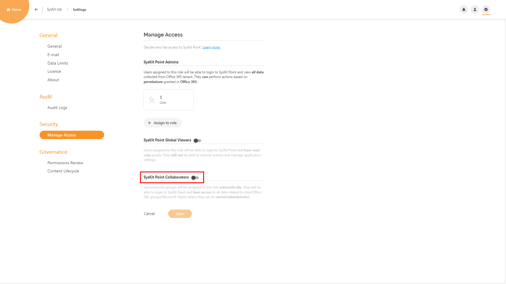

# Enable Automated Permissions Review

To use the advantages of Automated Permissions Review, first, you need to enable it and configure the settings in SysKit Point.


**Please note!**   
Only users assigned to the **SysKit Point Admin** role can access and configure Settings in SysKit Point.


Go to **Settings** &gt; **Governance** &gt; **Permissions Review** screen. The permission review depends on two additional components that you need to set up: 
* **E-mail**, and
* **SysKit Point Collaborators** role 

Initially, you may find the Permissions Review settings screen displaying the following warnings: 

Clicking the tiles in the **Additional Actions Required** section redirects to the appropriate settings screen.

## **Set Up E-Mail**

As a part of the automated permissions review process, e-mails are sent to SysKit Point Admin and SysKit Point Collaborator users. For SysKit Point to be able to send e-mails, you need to configure the sending method. **Exchange Online** and **SMTP** \(Simple Mail Transfer Protocol\) options are available.


**Please Note!** E-mail address set up in this section will appear in the **Sent from** field of all e-mails sent from SysKit Point.


### Exchange Online Settings


**Please Note!** Exchange Online has the sending limit of 10000 e-mails per day.


The Exchange Online method enables you to use an existing Exchange account in your Office 365 tenant to send e-mails from SysKit Point. To do so, enter a valid e-mail address in the **Sent from (1)** field. By default, the **Save to sent items folder (2)** option is turned on, meaning that all e-mails sent from SysKit Point will be stored in the **Sent** mailbox folder of the entered Exchange account.

Click the **Send test e-mail** button to check if the entered e-mail address is working properly. The **Sent test e-mail (3)** dialog opens. Here, enter the e-mail address to which you want to send the test e-mail. After a moment, you should receive an e-mail like the one pictured below.

Click the **Save** button to store your e-mail settings.

### SMTP Settings

Select the **SMTP method** if you are using an **SMTP** server in your environment. Here, you can enter the SMTP properties - **Outgoing Server**, **Port**, **Sent from** e-mail - and choose whether to **Use Encrypted Connection \(SSL\)** and **Require Authentication**. If the later is turned on, you will have to provide a **Username** and **Password**.

You can check if the entered data is correct by **sending a test e-mail**.

Click the **Save** button once you confirm that the test email was received.

## **Enable SysKit Point Collaborators**

Navigate to the **Settings** &gt; **Security** &gt; **Manage Access** settings screen to **enable the SysKit Point Collaborators role**.
When the role is enabled, site owners can access SysKit Point, where they can manage their sites and review permissions. 

For more information about role-based access in SysKit Point, go to the [following article](enable-role-based-access.md).

## **Enable Automated Permissions Review**

After you have successfully set up e-mail and enabled the SysKit Point Collaborators role, you can enable the Automated Permissions Review by marking the checkbox on the **Governance** &gt; **Permissions Review** screen.
Click **Save** to be able to proceed with further customization.

### **Customize Permissions Review**

First, **define the start date** for the first **Automated Permissions Review**. Click the **calendar icon (1)** and choose the desired date. You can also enter the date manually in the provided field. Next, define the **reocurrence period (2)** for the permissions review. Save your changes to recalculate and view the **start date for the next permissions review (3)**. Each permissions review has a defined duration of **10 workdays (4)**.


**Please Note!** 
All dates in the permissions review, including start and due date, are calculated to fall on a workday. That way, SysKit Point ensures that no emails are sent during non-working hours.


The last option in this section is turned on by default, and it regards the **e-mail reminder (5)** sent to all site owners included in the permissions review three workdays before the due date. It is possible to turn off this option at any time during the permissions review.


**Hint!** SysKit Point Admins can manually send an e-mail reminder to site owners once a day, any time during the permissions review by choosing the **Remind Owners** action on the **Governance** &gt; **Permissions Review details** screen.


If you want to become familiar with the look of the permissions review e-mail that will be sent to site owners, click the **Preview e-mail button (6)**. A dialog opens showing the e-mail. Since each site owner will have different number of sites and site types to review, the **e-mail preview shows placeholders** marked with parenthesis **\{ \}**.

### **Permissions Review Targeting**

In the **Target Selection** section, you can **define which sites to include in the permissions review**. By default, the **All active Microsoft Teams, Office 365 Groups and sites (1)** option is selected. Click the resource filter **(2)** in case you want to **include OneDrive**, or remove any of the initially selected resources. Additionally, you can choose to **only include resources where external sharing is enabled (3)**. To enable the **Preview tile (4)**, save your changes.

To learn more about **active and inactive content**, visit [this article](../common-tasks/inactive-content.md).

Once your changes are saved, you can click the **Preview tile**, which opens the **Permissions Review - Preview** report showing detailed information about resources that will be included in the permissions review. **Top tiles (1)** show the number of sites included in the permission review, grouped by type. Click a tile to show only a certain type of sites.Permissions review due date, number of email recipients, and the number of orphaned sites - sites that have no owners, or owners that are blocked or deleted - is visible on the top of the report **(2)**. Use the **Orphaned Sites view (3)** to see all such sites. For each Microsoft Team, Office 365 Group, site, and OneDrive included in the Permissions Review, all site owners that will get an permissions review email, are listed. If you **select a row (4)**, the **Change owners action (5)** shows in the side panel. 

Choose the **Specific items (1)** option if you want to manually select specific sites to be included in the permissions review. 

Save the changes to proceed with the selection. Click the **Select Now (2)** link. The **Specific Permissions Review** screen opens. 

When done with the selection, save your changes. The **Preview tile** becomes available and, once clicked, shows the **Permissions Review - Preview** report described above.

Now that everything is defined, the permissions review will start automatically. To learn all about the automated permissions review in SysKit Point, visit the [following article](../common-tasks/permissions-review.md).

