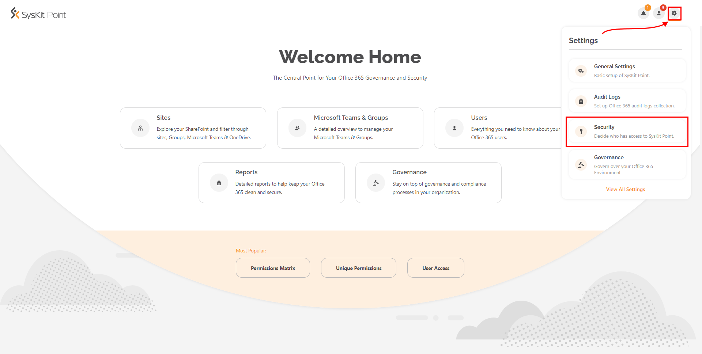
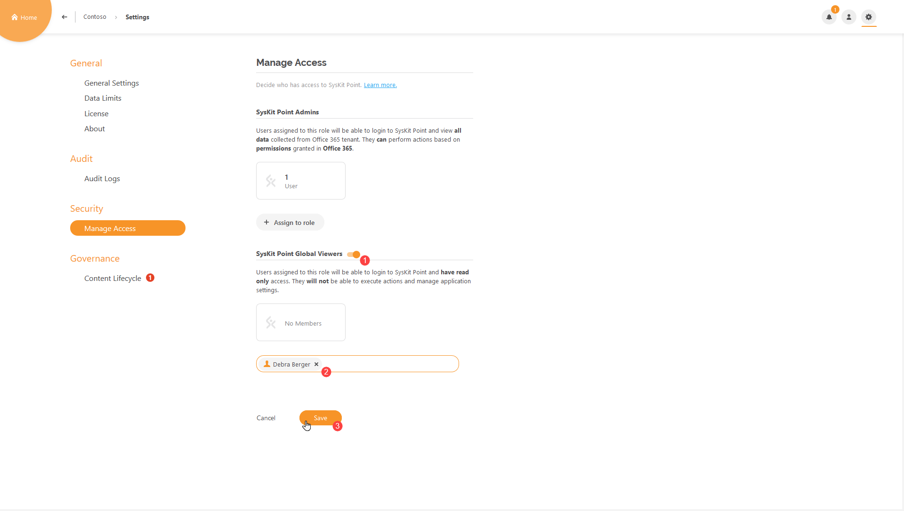
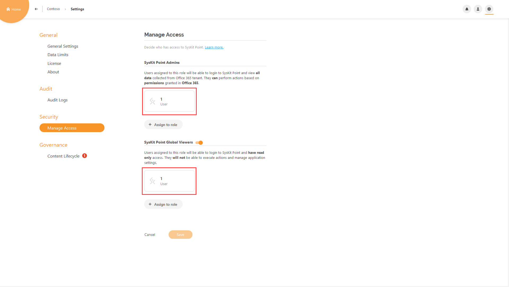
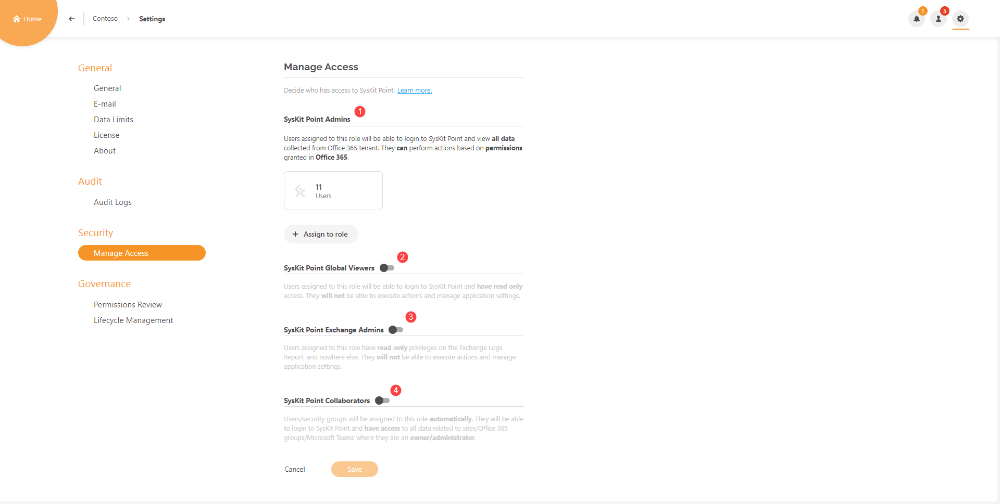
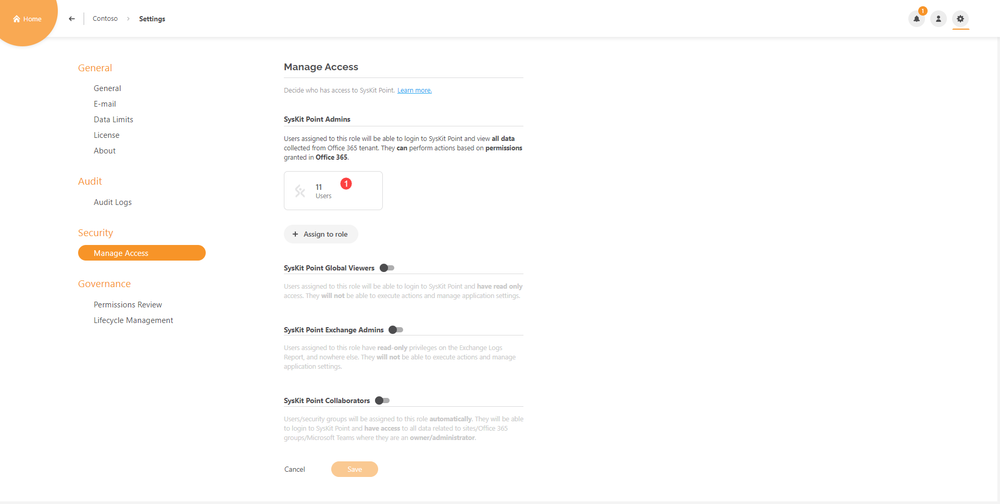
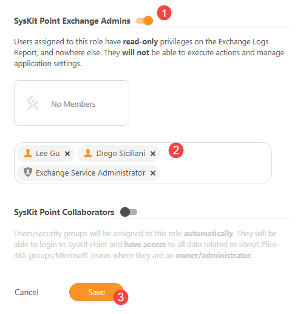
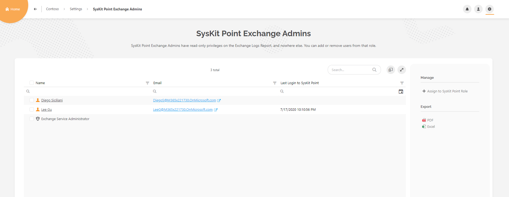
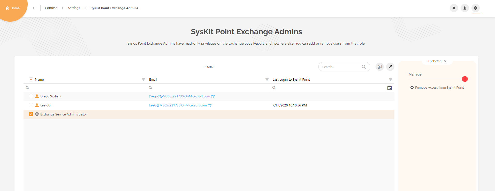
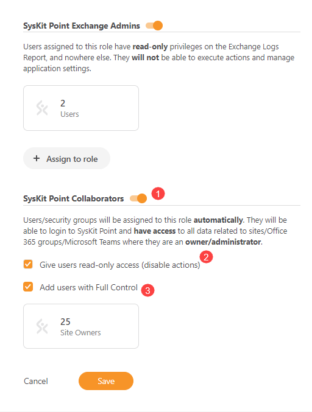
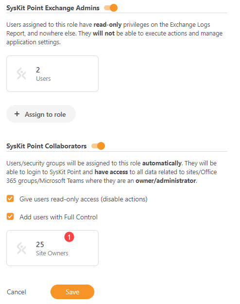

# Enable Role-Based Access

After the installation and configuration of **SysKit Point**, depending on the selected subscription plan, you can have multiple users using **SysKit Point** simultaneously. This option is found under the **Settings** page named **Manage Access.**


**Please note!**   
Simultaneous usage of **SysKit Point** is only available in the **Team** and **Enterprise** subscription plan.


## Setting up Role-Based Access

### Team License

Let's say you activated the **SysKit Point Team** license. With it, you can simultaneously use **SysKit Point** between **five** users, be it like a **SysKit Point Admin** or **SysKit Point Global Viewer**. Here's how you can manage who gets to use it.


**Please note!**   
The account that has activated your license **will automatically occupy one out of five eligible** **Admin user** places.


When located on the **Home Screen**, click on the **Settings** **option \(1\)** in the upper right corner. A drop-down appears. Click on the **Security** **option \(2\)**.

You will be redirected to the **Settings** &gt; **Security** &gt; **Manage Access** page, where you can define who has access to **SysKit Point**.


**Hint!**  
Shortcut to Manage Access is also available from the License tab in Settings.


When you are on the **Manage Access** screen, you will see two roles available for the **Team** license plan; **SysKit Point Admin** and **SysKit Point Global Viewer** \(which is disabled by default\)**.**

When the user is assigned to the **SysKit Point Admin** role, they will be able to login to SysKit Point and view **All data** collected from the **Office 365** tenant. Still, they will only be able to **execute** actions for which they have **permissions** in **Office 365**.

To assign a user to the **SysKit Point Admin** role, click the **Assign to role** button which will open up a **textbox** where you can type in the name of the **user** you want to **assign** to the **SysKit Point Admin role**. After you've selected the user, click **Save** to confirm your action.

If you have a situation in your environment where you have Users that should be able to generate reports and see tenant permissions but don't want them to have the ability to execute actions, **SysKit Point Global Viewer** is a perfect role for that situation.

When User is assigned to **SysKit Point Global Viewer** role, they are able to login to **SysKit Point** and view all data collected from **Office 365** but are **unable** to **execute** **actions** or **manage application settings**.

To assign a User to a **SysKit Point Global Viewer** role, **enable** the **toggle** \(1\) **next to it.** Click on the **Assign to role** button, type in the name of the desired user and select it \(2\) and then click Save \(3\).

Each role on **Manage Access** has its user number label. It shows us how many users are currently occupying SysKit Point roles.

Clicking on each of those labels will redirect us to the **report** of the corresponding role. The report will show us **exact** users **occupying** that role. On the role reports, you can also **assign** new users to that role, **export** the report into **PDF** and **XLSX** and also **remove** users from said roles.

To **remove** a user click on **checkbox** next to desired user name \(1\), then click on the **Remove Access from SysKit Point** \(2\).

A **dialog** will pop out, asking you to **confirm** your desired action.

When the action is **completed**, the selected user will **no longer have access** to **SysKit Point**.


**Please note!** Removing user access from **SysKit Point** will not remove user from your **Office 365** environment.


### Enterprise License

If you are using the **Enterprise** plan, you are not limited to several **Admin** users using SysKit Point simultaneously. However, if you want to enable login for users who don't have **Global Administrator** or **SharePoint admin** rights on your tenant, you have to allow it in **Settings**.

When located on the **Home Screen**, click on the **Settings** option in the upper right corner. A drop-down appears. Click on the **Security** option.

You will be redirected to **SysKit Point Settings screen - Manage access**.

With **Enterprise** plan you have four available options for accessing SysKit Point. **SysKit Point Admins** \(1\), **SysKit Point Global Viewers** \(2\), **SysKit Point Exchange Admins** \(3\) and **SysKit Point Collaborators** \(4\) of which the latter ones are disabled by default.

If you have activated **SysKit Point** with **Enterprise** license it will automatically add two **Office 365** administration roles \(**Company Administrator** and **SharePoint Service Administrator**\) as **SysKit Point Admins**. So any user on your **Office 365 environment** that has that role will **automatically** have **full access** to **SysKit Point**.

To see all users associated with those roles, click on the **number** on Users label under **SysKit Point Admins** option \(1\).

You are then redirected to **SysKit Point Admins** report where You can see who has **access** to **SysKit Point**.

While **Team** license plan gives you the ability to add **distinct users** only as **SysKit Point admins** \(also limited to number five\). **Enterprise** license enables you to add even **Office 365 Administration roles**, **security groups** and **Office 365 groups**.


**Please note!** it is not possible to remove or add a distinct user from **Office 365 administration role** in **SysKit Point**.


#### Who Are SysKit Point Exchange Admins

**SysKit Point Exchange Admins** role is the special role made for **SysKit Point** in which you can delegate a person or security group in charge of monitoring Exchange Log reports for your environment, giving that person Read-Only access on Exchange Log report, without giving them the ability to execute actions and manage application settings.

To enable **SysKit Point Exchange Admins** when you're located on **Settings screen** - **Manage Access**, enable the **toggle** next to **SysKit Point Exchange Admins** \(1\) and click on the button **Assign to role** \(2\), a textbox will open and you can enter the names of **users**, **Office 365 Administrator roles**, **security groups** and **Office 365 groups**. When you're finished, click on the **Save** button \(3\).

After your settings have been saved, you can click on Users tile under SysKit Point Exchange Admins to see more details by checking out who is currently occupying said role, you can assign more users to that role, Export the report in PDF and Excel

 You can also select current user or role and remove their access\(1\) from SysKit Point.

#### What is SysKit Point Collaborators role

**SysKit Point Collaborators** role is the specific role made for **SysKit Point** Enterprise license users in which they can enable their **Site admins/Teams owners** access to the **SysKit Point** to easily manage their **sites/teams** while not showing them information they should not see. When it's enabled, **SysKit Point** will **automatically** assign that type of users to **SysKit Point Collaborators** role.

To enable **SysKit Point Collaborators**, when you're located on **Settings screen** - **Manage Access**, enable the **toggle** next to **SysKit Point Collaborators** \(1\) and, you will see that number appears automatically on **Site Owners label**. If you also wish to enable user who has **Full Control** permissions check '**Add users with Full Control**' \(3\) that will also **automatically** add that type of users to the **SysKit Point Collaborators** role. Also if you want to enable those users to login to **SysKit Point** but **do not want** them to be able to **execute actions** check '**Give users read-only access \(disable actions\)**' \(2\). When you're finished, click **Save**.

If you want to see which users are in **SysKit Point Collaborators** role simply Click on the **Site Owners** \(1\) label.

You will be redirected to **SysKit Point Collaborators report** on which you can see who are your **Site Owners**, where exactly do they have **permissions** in your **Office 365 environment** and through what means are they given those permissions.

### SysKit Point manage access Roles

To sum up, SysKit Point gives you a wide range of managing access which you can tailor by your own needs and preferences. Here are all of SysKit Point Roles in short:

#### SysKit Point Admins

Users and security groups assigned to this role are able to see all data collected from your **Office 365** tenant, they **manage** all the **settings** of **SysKit Point** and can perform **actions** based on **permissions** granted in **Office 365**

#### SysKit Point Global Viewers

Users and security groups assigned to this role can see all data collected from your Office 365 tenant but have **Read Only** access, they **cannot execute actions** and manage application settings.

#### SysKit Point Exchange Admins

Users and security groups assigned to this role have **Read Only** access **exclusively** on **Exchange Logs** report and **nowhere else** in the application. They **cannot execute actions** and manage application settings

#### SysKit Point Collaborators

The only role in SysKit Point where users and security groups are **assigned automatically** based on their **ownership permissions** on your **Office 365 tenant**, when logged in to SysKit Point, they have access to all data related to Office 365 resources where they are owners/administrators, you can also choose to add Users with **Full Control** permissions on your tenant into this role and can **disable actions** for them by giving them Read Only Access 

### Why Should You Enable Role-Based Access

When working in large environments, it's easier to keep things tidy if more people are working together.

As you know, the **SysKit Point Admin** can see all the content that is available on the Office 365 Tenant.

**Role-Based Access** empowers all **Site Owners** \(and users with **Full Control** permissions\) to keep their **Sites** and **Teams** clean. It gives them access to all reports and information relevant to them, without showing the content they are not allowed to see.

**For example,** the **SysKit Point Admin** has generated the **User Access** report and instead of sharing the URL of the generated report to the other **SysKit Point Admin**, it was sent to the **SysKit Point Collaborator** that doesn't have access to all the users on the said environment. This is where **Role-Based Access** kicks in.

When said **SysKit Point Collaborator** opens the URL, the report will be generated but only containing **Users** who are members on his **Site Collections** and **Office 365** **Groups**.

Also, when the **SysKit Point Collaborator** tries to **drill** to the **User Details** page of a user he is not a manager of, he/she will be redirected to an **Unauthorized Access** page.

