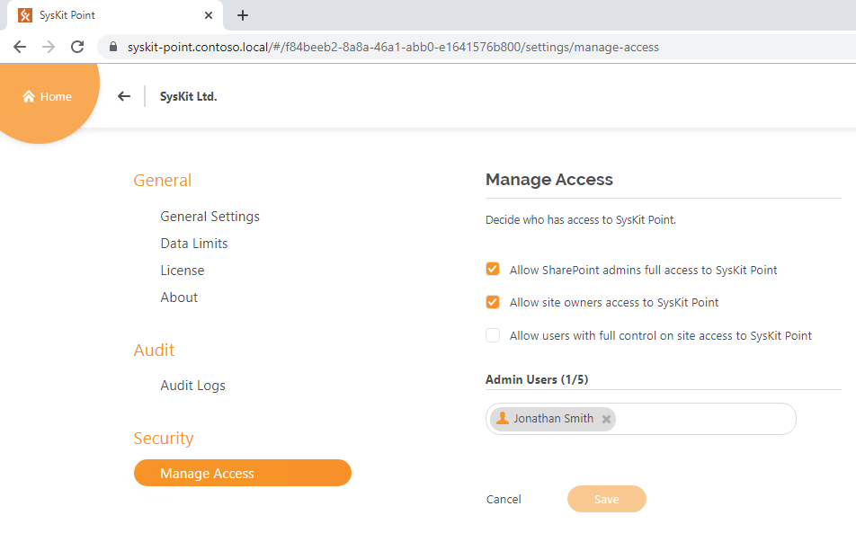
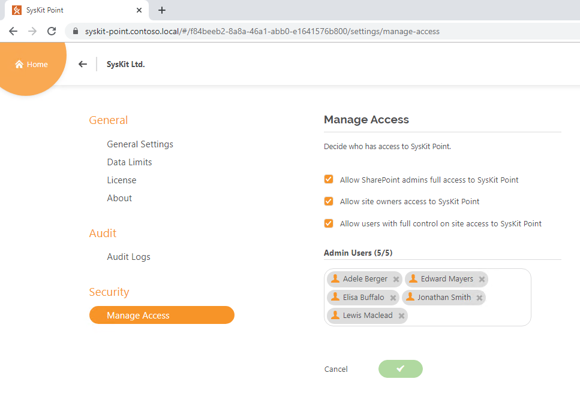
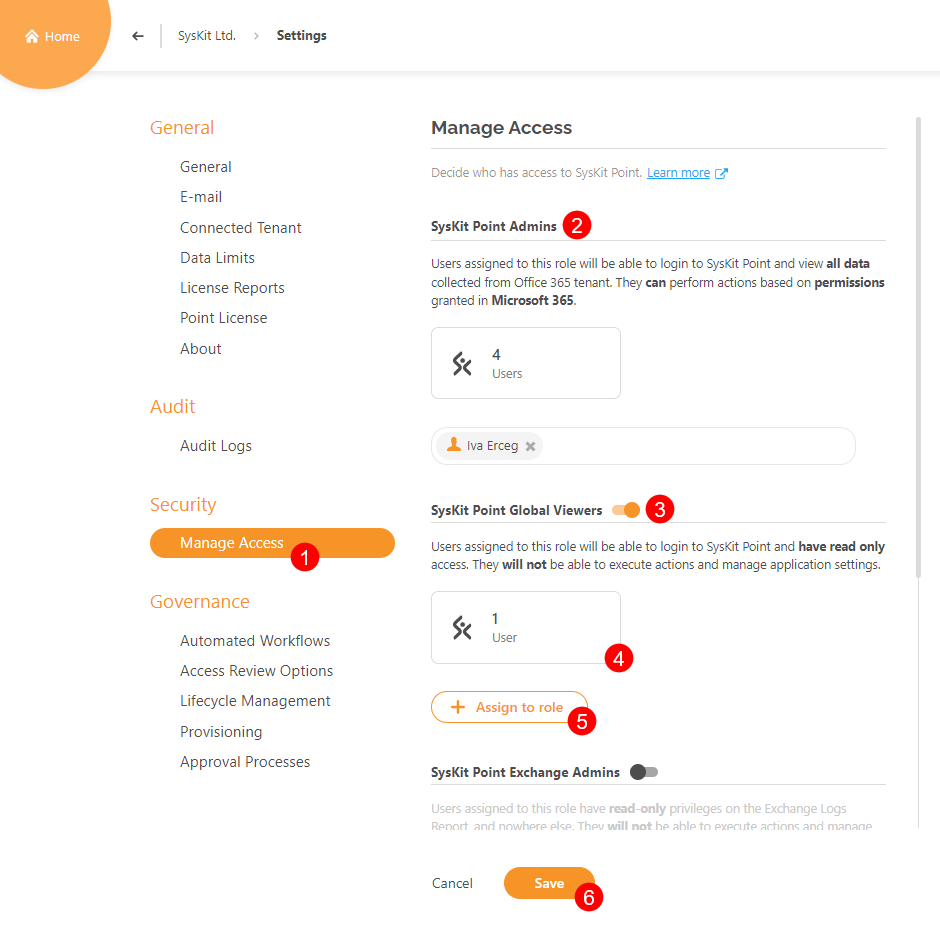
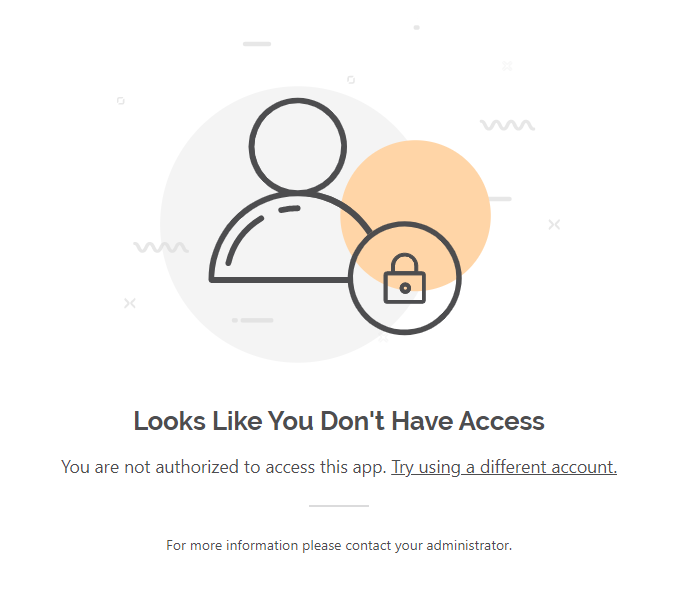

# Enable Role-Based Access

After the installation and configuration of **SysKit Point**, depending on the subscription plan you selected, you can have multiple users using **SysKit Point** simultaneously. This option is found under **Settings** page named **Manage Access.**


**Please note!**                                                                                                                                       Simultaneous usage of **SysKit Point** is only available in the **Team** and **Enterprise** subscription plan. 


## Setting up Role-Based Access

### Team License

Let's say you activated the **SysKit Point Team** license. With it, you get an option to simultaneously use **SysKit Point** between **five** users. Here's how you can manage who gets to use it.


**Please note!**                                                                                                                                                                 The account that has activated your license **will automatically occupy one out of five eligible** **Admin user** places.


When located on the **Home Screen**, click on the **Settings** option \(1\) in the upper right corner. A drop-down appears. Click on the **Security** option \(2\).

You will be redirected to the **Settings** &gt; **Security** &gt; **Manage Access** page, where you can define who has access to **SysKit Point**.


**Hint!**  
Shortcut to Manage Access is also available from the License tab in Settings.



**Please note!**  
By default, **SharePoint Admin** **users have the same privileges in SysKit Point as Global Administrators.** Uncheck the **Allow SharePoint admins full access to SysKit Point** option in Settings to disable SharePoint Admin's access to SysKit Point.


If the user that you want to add as **Admin** **Users** doesn't have **Global Administrator** or **SharePoint admin** role in your environment, you have to **enable** the **Allow site owners access to SysKit Point** option.

After that, you can enable the **Allow users with full control on site access to SysKit Point** option, in case the user that you want to add as Admin is not a **Site Owner** but has **Full Control** permissions on some Site Collections or Office 365 Groups in your environment.

Now that you've enabled all those options, click on the **People Picker** box and add users to Admin users by typing their name.

Once you've added all desired users, click on the **Save** button. All of them are now able to log in to SysKit Point.


**Hint!**  
You can change selected Admin Users at any time by clicking on cross mark next to their name and typing in the new one.


### Enterprise License

If you are using the **Enterprise** plan, you are not limited to several **Admin** users using SysKit Point simultaneously. However, if you want to enable login for users who don't have **Global Administrator** or **SharePoint admin** rights on your tenant, you have to allow it in **Settings**.


**Please note!**  
By default, **SharePoint Admin** **users have the same privileges in SysKit Point as Global Administrators.** To disable such behavior, uncheck the **Allow SharePoint admins full access to SysKit Point** option.


When located on the **Home Screen**, click on the **Settings** option in the upper right corner. A drop-down appears. Click on the **Security** option.

If you wish to enable login to **SysKit Point** for users that are **Site Owners** activate that option. You also have the option to enable login for users that have **Full Control** permissions on sites or groups in your environment.

Click the **Save** button.

After you have saved your changes, all **Site Owners** and users with **Full Control** permissions can log in to **SysKit Point**.

### Why Should You Enable Role-Based Access

When working in big environments it's easier to keep things tidy if more people are working together.

As you know, the **Global Administrator** account can see all the content that is available on the Office 365 Tenant.

**Role-Based Access** empowers all **Site Owners** \(and users with **Full Control** permissions\) to keep their **Sites** and **Teams** clean. It gives them access to all reports and information relevant to them, without showing the content they are not allowed to see. 

**For example,** the Global Administrator has generated the **User Access** report and instead of sharing the URL of the generated report to the other **Global Administrator**, it was sent to the **Site Owner** that doesn't have access to all the users on the said environment. This is where **Role-Based Access** kicks in.

When said **Site Owner** opens the URL, the report will be generated but only containing **Users** who are members on his **Site Collections** and **Office 365** **Groups**. 

Also, when the **Site Owner** tries to **drill** to the **User Details** page of a user he is not a manager of, he/she will be redirected to an **Unauthorized Access** page.

