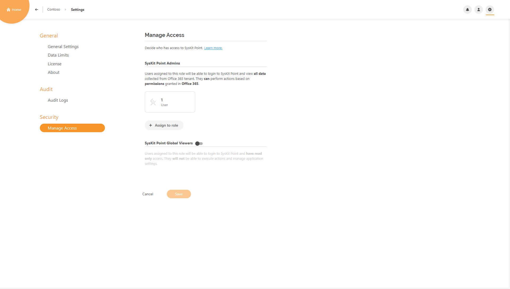
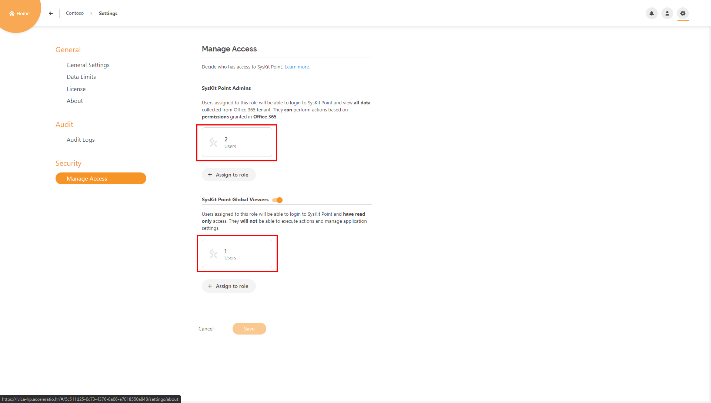
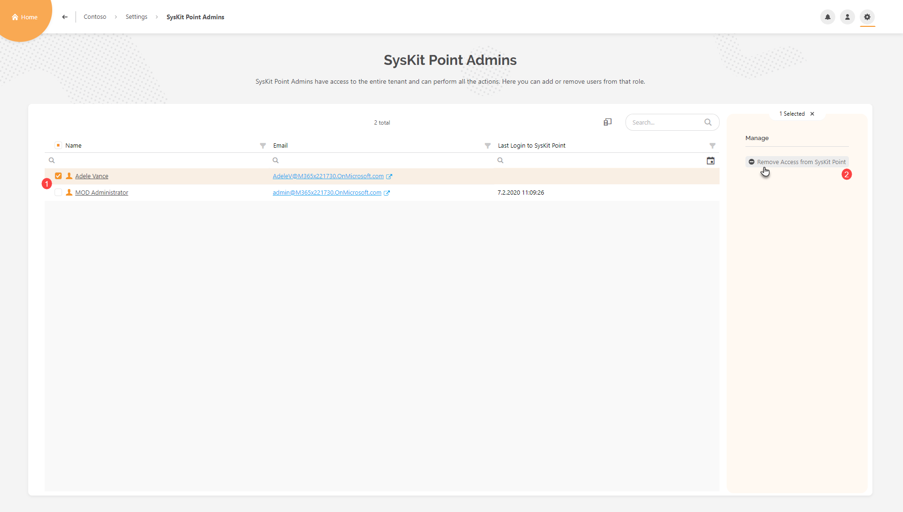
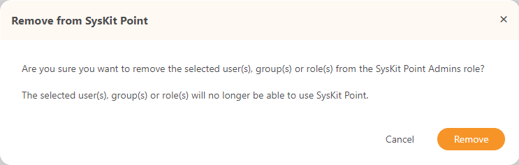
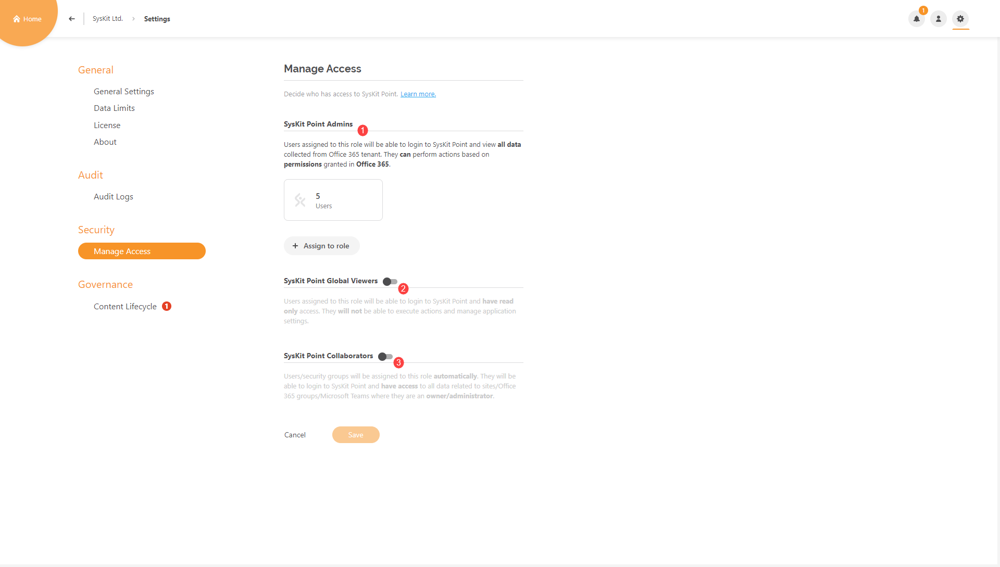
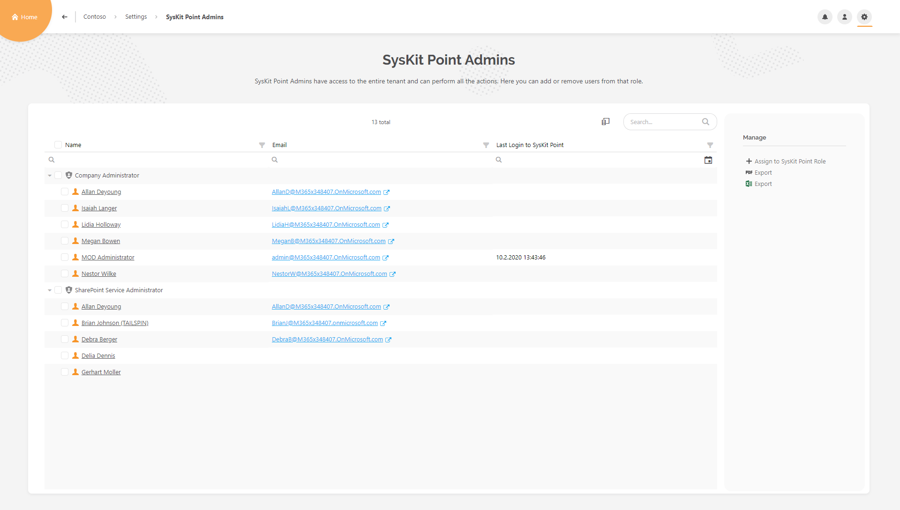
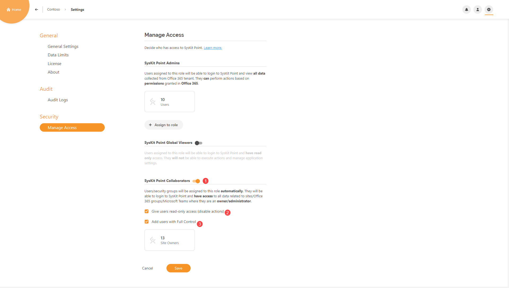
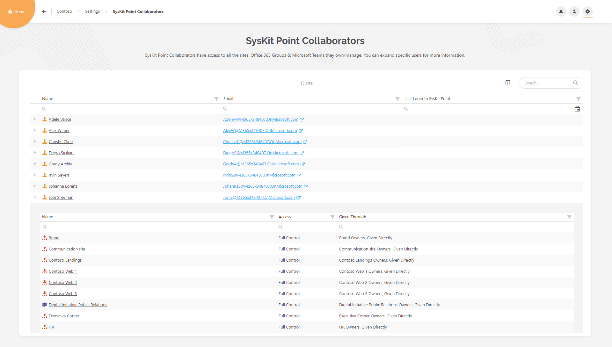

# Enable Role-Based Access

After the installation and configuration, depending on the subscription plan you selected, you can have **multiple users using SysKit Point simultaneously**. This option is located under the **Settings** page named **Manage Access.**


**Please note!**   
Simultaneous usage of **SysKit Point** by multiple users is only **available in the Team and Enterprise subscription plan**.


## Setting up Role-Based Access

### Team License

Let's say you activated the **SysKit Point Team** license. With it, you get an option to **simultaneously use SysKit Point between five users** be it like a **SysKit Point Admin** or **SysKit Point Global Viewer**. Here's how you can manage who gets to use it.


**Please note!**   
The account that has activated your license **will automatically occupy one out of five eligible** **Admin user** places.


When located on the **Home Screen**, click the **Settings** option \(1\) in the upper right corner. A drop-down appears. Click the **Security** option \(2\).

You will be redirected to the **Settings** &gt; **Security** &gt; **Manage Access** page, where you can define who has access to **SysKit Point**.


**Hint!**  
Shortcut to Manage Access is also available from the License tab in Settings.


When you are on the **Manage Access** screen, you will see two roles that are available for the Team license plan; **SysKit Point Admin** and **SysKit Point Global Viewer** \(which is disabled by default\).

When the user is assigned to the **SysKit Point Admin** role, they will be able to login to SysKit Point and view All data collected from the Office 365 tenant, but **they will only be able to execute actions for which they have permissions in Office 365**.

To assign a user to the **SysKit Point Admin** role, simply click on the **Assign to role** button, which will open up a textbox where you can type in the name of the user you want to assign to the **SysKit Point Admin** role. After you've selected the user, click **Save** to confirm your action. 

If you have a situation in your environment where you have Users that should be able to generate reports and see tenant permissions but don't want them to have the ability to execute actions, **SysKit Point Global Viewer** is a perfect role for that situation. 

When User is assigned to **SysKit Point Global Viewer** role, **they can log in to** **SysKit Point** and **view all data collected from Office 365** but are **not able to execute actions or manage application settings**.

To assign a user to the **SysKit Point Global Viewer** role, **enable the** **toggle** \(1\) ****next to it. **Click on the** **Assign to role** button, **type in the name** of the desired user and **select it** \(2\), and then click **Save** \(3\).

Each role on the **Manage Access** page has the number of users visible in the **Users tile**. It shows how many users are currently occupying SysKit Point roles.

Clicking on each of those tiles redirects to the **report for the corresponding role**. The report shows the **list of users occupying the selected role**. From the report, you can **assign new users** to the role, **export the report** to PDF or XLSX, ****and **remove users** from the said role.

**To remove a user**, **click the checkbox** next to the desired user name \(1\), then click the **Remove Access from SysKit Point** action \(2\).

A dialog shows, asking you to confirm the action.

Once the action is completed, the **removed user will no longer have access to SysKit Point**.


**Please note!**   
Removing a user from the SysKit Point role **will not remove** them from your Office 365 environment.


### Enterprise License

If you are using the Enterprise plan, you are not limited to several Admin users using SysKit Point simultaneously. However, if you want to enable login for users who don't have **Global Administrator** or **SharePoint Admin** rights on your tenant, you have to allow it in Settings.

When located on the **Home Screen**, click the **Settings** option \(1\) in the upper right corner. A drop-down appears. Click the **Security** option \(2\).

You will be redirected to the **SysKit Point Settings** screen **- Manage access** page. 

With the **Enterprise plan**, you have three available options when configuring access to SysKit Point. **SysKit Point Admins** \(1\), **SysKit Point Global Viewers** \(2\), and **SysKit Point Collaborators** \(3\), from which only the first option is enabled by default.

If you have activated **SysKit Point** with **Enterprise license**, it will automatically add two **Office 365** administrator roles - **Company Administrator** and **SharePoint Service Administrator** - as **SysKit Point Admins**. Any user in your **Office 365 environment** assigned to one of these roles will **automatically** have **admin access** to **SysKit Point**.

To see all users associated with the Office 365 administrator roles, **click the** **Users tile** under the **SysKit Point Admins** option.

You are then redirected to the **SysKit Point Admins** report, where You can see who has **access** to **SysKit Point**.

While the **Team license plan** gives you the ability to add **distinct users** as **SysKit Point admins** \(limited to five users\), the **Enterprise license** enables you to add **Office 365 Administrator roles**, **security groups**, ****and **Office 365 groups**.


**Please note!**   
Adding/removing a specific user to/from a SysKit Point role **does not add/remove them to/from an Office 365 administration role.**


#### SysKit Point Collaborators

**SysKit Point Collaborators** role is the specific role made for **SysKit Point** Enterprise license users in which they can enable their **Site admins/Teams owners** access to the **SysKit Point** to easily manage their **sites/teams** while not showing them information they should not see. When it's enabled, **SysKit Point** will **automatically** assign that type of users to **SysKit Point Collaborators** role.

To enable **SysKit Point Collaborators**, when you're located on **Settings screen** - **Manage Access**, Enable the **toggle** next to **SysKit Point Collaborators**\(1\) and, you will see that Number appears automatically on **Site Owners label**. If you also wish to enable user who have **Full Control** permissions check '**Add users with Full Control**'\(3\) that will also **automatically** add that type of users to the **SysKit Point Collaborators** role. Also if you want to enable those users to login to **SysKit Point** but **do not want** them to be able to **execute actions** check '**Give users read-only access \(disable actions\)**'\(2\). When you're finished, click **Save**.

If you want to see which users are in **SysKit Point Collaborators** role simply Click on the **Site Owners** label.

You will be redirected to **SysKit Point Collaborators report** on which you can see who are your **Site Owners**, where exactly do they have **permissions** in your **Office 365 environment** and through what means are they given those permissions.

### Why Should You Enable Role-Based Access

When working in big environments, it's easier to keep things tidy if more people are working together.

As you know, the **SysKit Point Admin** can see all the content that is available in the Office 365 Tenant.

**Role-Based Access** empowers all **Site Owners** \(and users with **Full Control** permissions\) to keep their **Sites** and **Teams** clean. It gives them access to all reports and information relevant to them, without showing the content they are not allowed to see.

**For example,** the **SysKit Point Admin** has generated the **User Access** report, and instead of sharing the URL of the generated report to the other **SysKit Point Admin**, it was sent to the **SysKit Point Collaborator** that doesn't have access to all the users in the said environment. This is where **Role-Based Access** kicks in.

When said **SysKit Point Collaborator** opens the URL, the report will be generated but only containing **Users** who are members on his **Site Collections** and **Office 365** **Groups**.

Also, when the **SysKit Point Collaborator** tries to **drill** to the **User Details** page of a user he is not a manager of, he/she will be redirected to an **Unauthorized Access** page.

