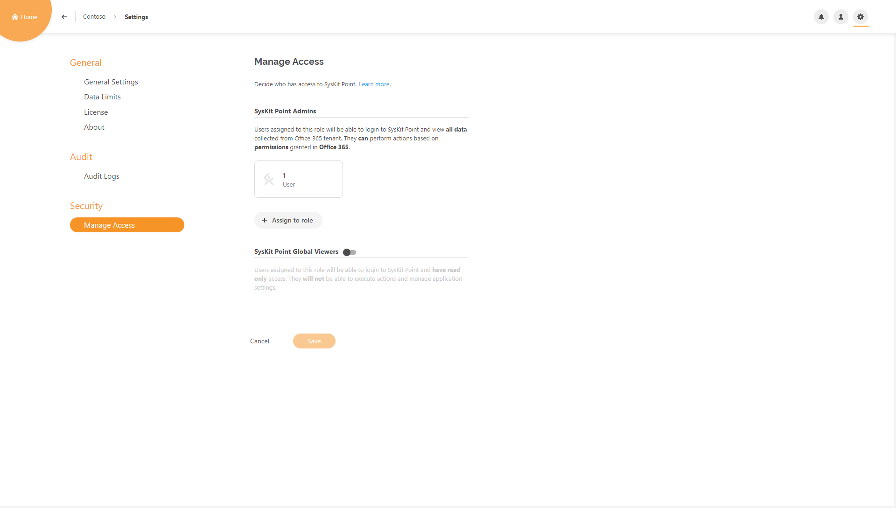
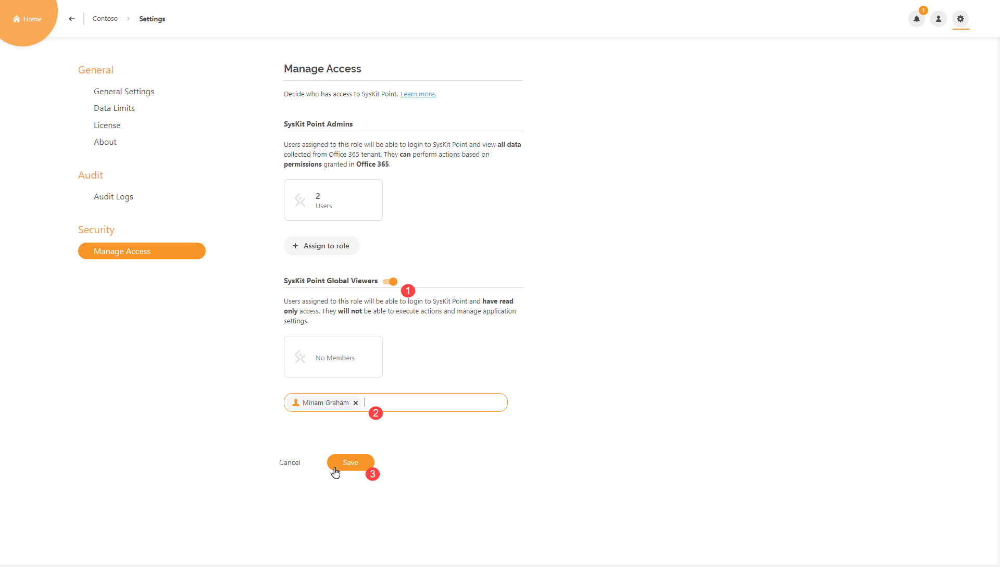
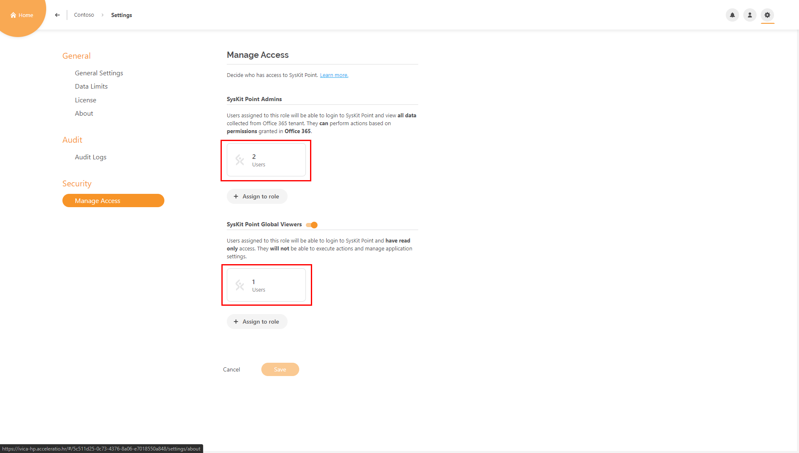
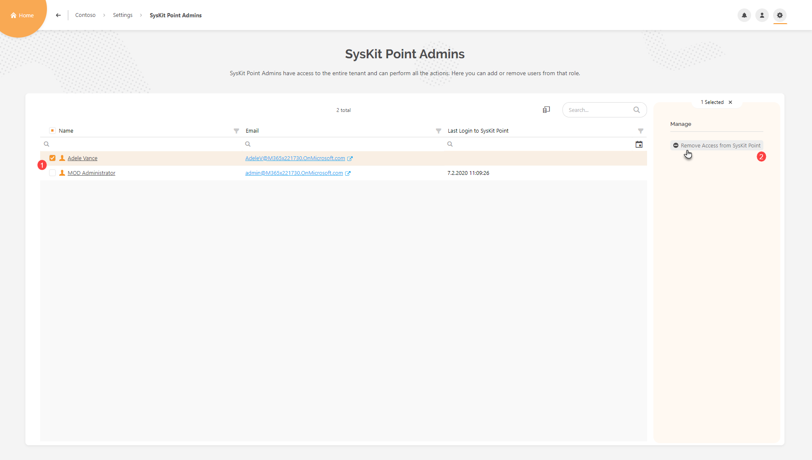
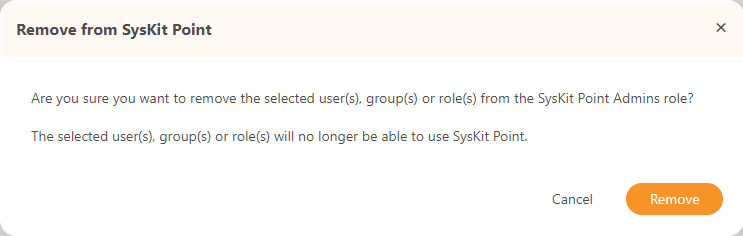
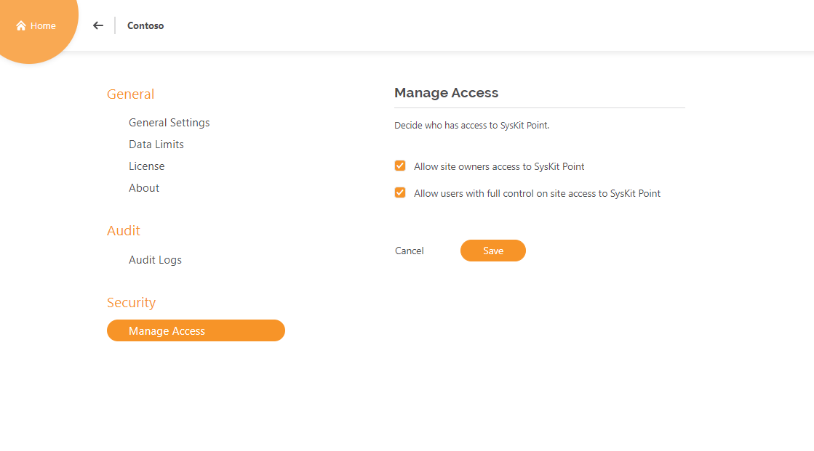
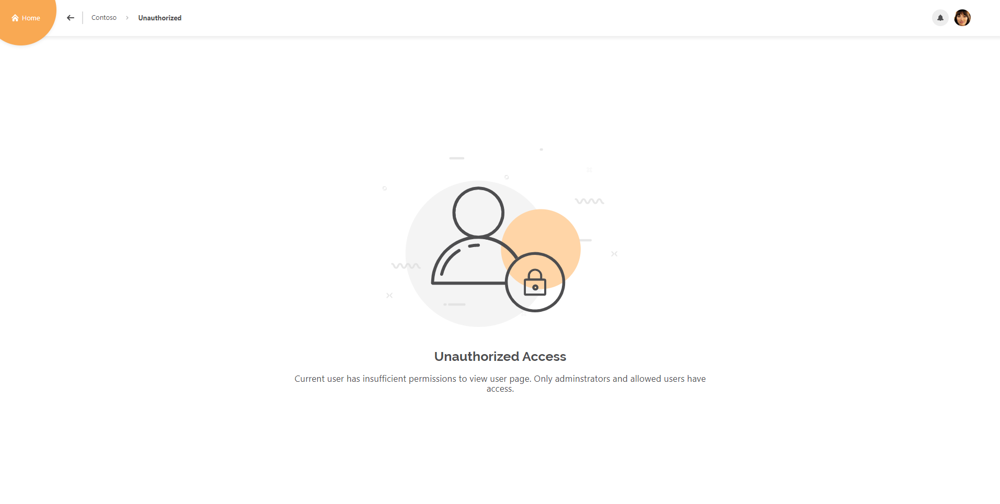

# Enable Role-Based Access

After the installation and configuration of **SysKit Point**, depending on the subscription plan you selected, you can have multiple users using **SysKit Point** simultaneously. This option is found under the **Settings** tab called **Manage Access.**


**Please note!** Simultaneous usage of **SysKit Point** is only available in the **Team** and **Enterprise** license plan.


## Setting up Role-Based Access

### Team License

Let's say you activated the **SysKit Point Team** license. With it, you get an option to simultaneously use **SysKit Point** between **five** users be it like a **SysKit Point Admin** or **SysKit Point Global Viewer**. Here's how you can manage who gets to use it.


**Please note!** The account that has activated your license **will automatically occupy one out of five eligible** places.


When located on the **Home Screen**, click on the **Settings**\(1\) option in the upper right corner and click on **Security**\(2\) option in the Settings dropdown.

You will be redirected to the **Manage Access** tab on the **Settings** page.


**Hint!** Shortcut to Manage Access is also available from the License tab in Settings.


When you are on the **Manage Access** screen, you will see two roles that are available for the **Team** license plan; **SysKit Point Admin** and **SysKit Point Global Viewer** \(which is disabled by default\)**.**

When the user is assigned to the **SysKit Point Admin** role, they will be able to login to SysKit Point and view **All data** collected from the **Office 365** tenant, but they will only be able to **execute** actions for which they have **permissions** in **Office 365**.

To assign a user to the **SysKit Point Admin** role, simply click on the **Assign to role** button which will open up a **textbox** where you can type in the name of the **User** you want to **assign** to the **SysKit Point Admin role**. After you've selected the User, click **Save** to confirm your action. 

If you have a situation in your environment where you have Users that should be able to generate reports and see tenant permissions but don't want them to have the ability to execute actions, **SysKit Point Global Viewer** is a perfect role for that situation. 

When User is assigned to **SysKit Point Global Viewer** role, they are able to login to **SysKit Point** and view all data collected from **Office 365** but are **unable** to **execute** **actions** or **manage application settings**.

To assign a User to a **SysKit Point Global Viewer** role, **enable** the **toggle**\(1\) ****next to it. Click on the '**Assign to role**' button, type in the name of the desired user and select it\(2\) and then click save\(3\).

Each role on **Manage Access** has its user number label. It shows us how many users are currently occupying SysKit Point roles.

Clicking on each of those labels will redirect us to the **report** of the corresponding role. The report will show us **exact** users **occupying** that role. On the role reports, you can also **assign** new users to that role, **export** the report into **PDF** and **XLSX** and also **remove** users from said roles.

To **remove** a user click on **checkbox** next to desired user name\(1\), then click on the '**Remove Access from SysKit Point**'\(2\). 

A **dialog** will pop out asking you to **confirm** your desired action. 

When the action is completed, the selected user will no longer have access to SysKit Point.


**Please note!** Removing user access from **SysKit Point** will not remove user from your **Office 365** environment.


### Enterprise License

If you are using the **Enterprise** plan for your **SysKit Point** you are not limited to several **Admin** users using it simultaneously. However, if you want to enable login for users who don't have **Global Administrator** rights on your tenant, you have to allow it in **Settings**.

Click on **Settings** and then select the **Manage Access tab**.

If you wish to enable login to **SysKit Point** for users that are **Site Owners** activate that option. You also have the option to enable login for users that have **Full Control** permissions on sites or groups in your environment.

Click on the **Save** button.

After you have saved your changes, all **Site Owners** and users with **Full Control** permissions can log in to **SysKit Point**.

### Why Should You Enable Role-Based Access

When working in big environments it's easier to keep things tidy if more people are working together.

As you know, the **Global Administrator** account can see all the content that is available on the Office 365 Tenant.

**Role-Based Access** empowers all **Site Owners** \(and users with **Full Control** permissions\) to keep their **Sites** and **Teams** clean. It gives them access to all reports and information relevant to them, without showing the content they are not allowed to see.

**For example,** the Global Administrator has generated the **User Access** report and instead of sharing the URL of the generated report to the other **Global Administrator**, it was sent to the **Site Owner** that doesn't have access to all the users on the said environment. This is where **Role-Based Access** kicks in.

When said **Site Owner** opens the URL, the report will be generated but only containing **Users** who are members on his **Site Collections** and **Office 365** **Groups**.

Also, when the **Site Owner** tries to **drill** to the **User Details** page of a user he is not a manager of, he/she will be redirected to an **Unauthorized Access** page.

\*\*\*\*

\*\*\*\*

