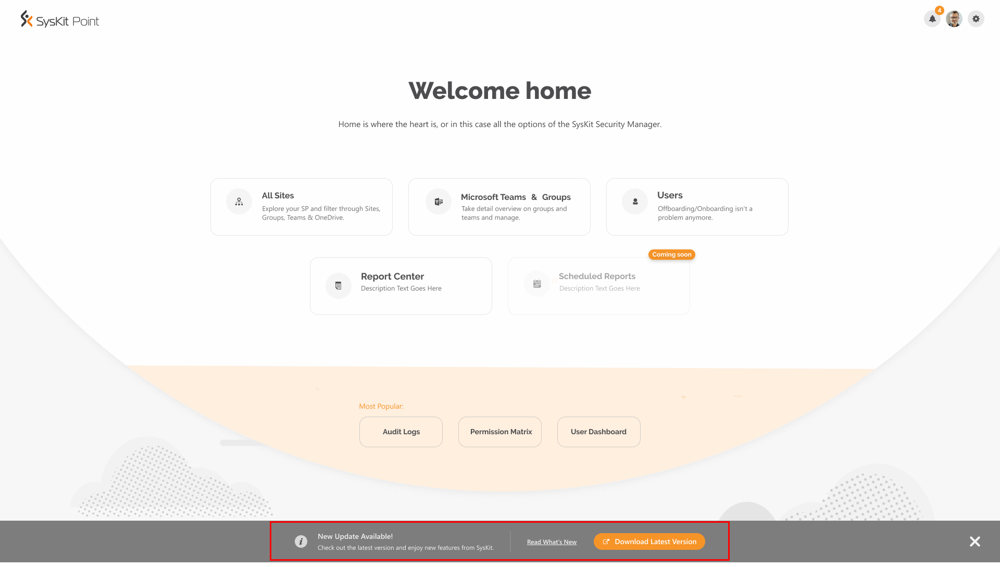
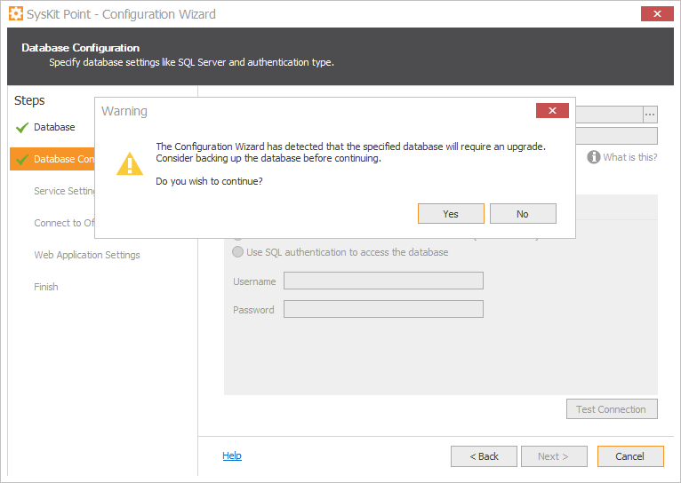

# Upgrade SysKit Point

Since **SysKit Point** is frequently getting new features, we highly recommend having the latest available version installed, to use its maximum potential. 

## 
Checking for Updates

**SysKit Point automatically checks for updates** every day, outside of working hours. **In case a new update is available, every SysKit Point user** **receives a popup message** at the bottom of the Home screen when they open the web application. 


The **Read What's New** link opens a new tab in your browser at the [Product Updates](../product-updates/) section in SysKit Point documentation, where you can find out about new features, improvements, and bug fixes by each product version.

**If you activated SysKit Point**, clicking the **Download Latest Version** link will redirect you to the [Customers Portal](https://my.syskit.com/) page. From there, download the latest SysKit Point version available. In case you are using a **trial version** of SysKit Point, the same link will redirect you to the **SysKit Point web download page**.

**To hide the Update message**, **click the x icon** visible on the right side. The message will stay hidden until the next time you log in to SysKit Point.

## 
Upgrading to the Latest Version


After you downloaded the newest version of the application, follow these steps for a successful upgrade:

*  Unpack and run the setup file - **SysKitPointSetup.exe** on the same server where previous version was installed.
* The wizard will require to uninstall the previous version of SysKit Point. 

* Follow the wizard through the installation steps. For more information click [here](install-syskit-point.md).
* After completing the installation, the **Configuration Wizard** will open by default.
*  In the **Database** step, select **Use existing database** option to preserve all your previous data. Click **Next** to proceed.
* In the **Database Configuration** step, click **Next**. A **warning message** will appear about the necessary upgrade for the database. For data protection, **consider backing up the database**. Click **Yes** and continue to the next step.

* Enter your **service account** and validate it. Click **Next**.
* In **Connect to Office 365** step, you can see that your **tenant is already connected** with the application. Proceed to the next step.
* In **Web Application Settings** step, click on the **Next** button. 
* In the **Finish** step, wait until all the checks are done and click on the **Finish** button to open the application automatically in your browser.


You can always Visit [**What's New**](https://www.syskit.com/products/point/whats-new/) page at our official site to get more in-depth information about how we improved the application.

