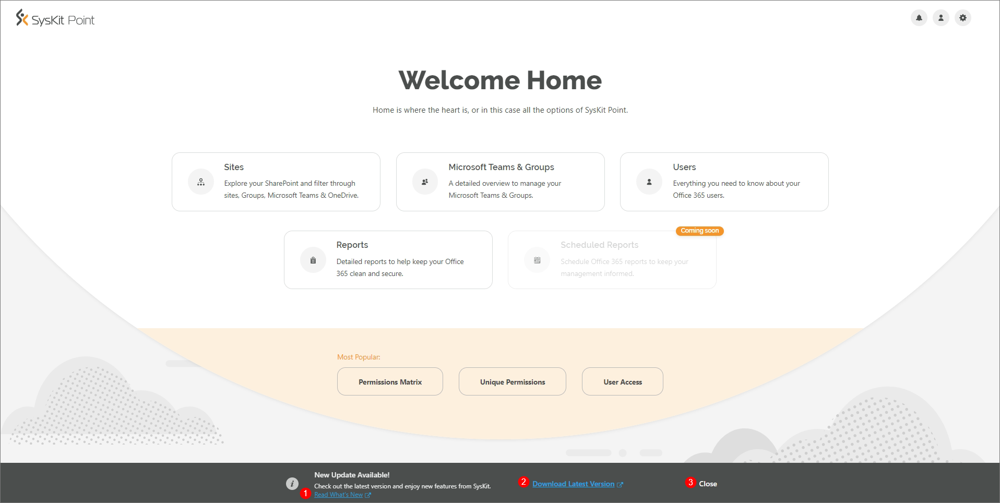
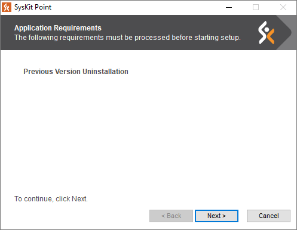
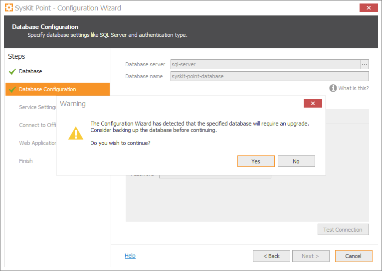

# Upgrade SysKit Point

Since **SysKit Point** is frequently getting new features, we highly recommend having the latest available version installed, to use its maximum potential.

Checking for Updates

**SysKit Point automatically checks for updates** every day, outside of working hours. **In case a new update is available, every SysKit Point user** **receives a popup message** at the bottom of the Home screen when they open the web application.

The **Read What's New** **link \(1\)** opens a new tab in your browser at the [Product Updates](../product-updates/) section in SysKit Point documentation, where you can find out about new features, improvements, and bug fixes by each product version.

**If you activated SysKit Point**, clicking the **Download Latest Version \(2\)** link will redirect you to the [Customers Portal](https://my.syskit.com/) page. From there, download the latest SysKit Point version available. In case you are using a **trial version** of SysKit Point, the same link will redirect you to the **SysKit Point web download page**.

**To hide the Update message**, **click the Close link \(3\)** visible on the right side. The message will stay hidden until the next time you log in to SysKit Point.

Upgrading to the Latest Version

After you download the newest version of the application, follow these steps to upgrade SysKit Point:

* **Unpack the previously downloaded .zip file and run the SysKitPointSetup.exe setup** file on the server where SysKit Point is installed. 
* The installation wizard will require to uninstall the previous version of SysKit Point. Click **Next** to continue. 

* Follow the wizard through the installation steps. All installation steps are described [here](install-syskit-point.md).
* After the installation is completed, the **Configuration Wizard** opens automatically.
* On the **Database** step, select the **Use existing database** option to preserve all data collected by SysKit Point. Click **Next** to proceed.
* On the **Database Configuration** step, click **Next**. A **warning message** is displayed. Before you continue, **consider backing up the database** to ensure no data is lost in an unlikely event of an upgrade failure. Click **Yes** to continue.

* On the **Service Settings** step, enter your **service account** and validate it. Click **Next**.
* On the **Connect to Office 365** step, you can see that your **tenant is already connected** with the application. Proceed to the next step.
* On the **Web Application Settings** step, click the **Next** button. 
* On the **Finish** step, wait until all the checks are done and click the **Finish** button to open the SysKit Point web application in your browser.


**Hint!**  
Use the [What's new](https://www.syskit.com/products/point/whats-new/) page as an additional source of information on new features available in the latest version of SysKit Point.


