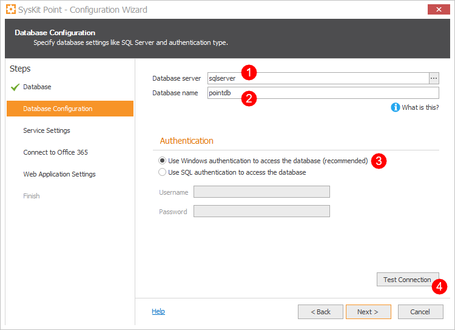

# Install SysKit Point On-Premises

Before you can install and configure **SysKit Point** on your Virtual Machine make sure you prepared the following information described in the [**installation guide**](overview.md):

* [**SQL Server database information**](syskit-point-database.md#output): **SQL server**, and **optionally** depending on your setup **SQL database name** and **SQL account** with db owner permissions 
* [**URL for Point web application and a valid SSL certificate**](ssl-certificate.md#output)
* [**Service account**](additional-vm-configuration.md#service-account): windows account to run the SysKit Point windows service
* **Global Administrator** is ready to provide [**application consent**](../../requirements/permission-requirements.md#global-administrator)

## Install SysKit Point

1. **Connect to the Virtual Machine** using RDP connection
2. [Download the SysKit Point setup file](https://my.syskit.com/).
3. **Unpack and run the setup file** - **SysKitPointSetup.exe**. The wizard will guide you through the installation steps.
4. Read and accept the license agreement - [EULA](https://www.syskit.com/eula/) - click **Next &gt;** to proceed.
5. By default, the installation folder is set to **C:\Program Files\SysKit\Point**. You can modify it by clicking the **Change** button. Once selected, click **Next &gt;** to proceed. 
6. By default, the **Run Configuration Wizard now** option is selected. **SysKit Point Configuration Wizard** will, therefore, automatically start when you click the **Finish** button. Alternatively, you can always start the Configuration Wizard manually by running it from the installation folder. The default location is: **C:\ProgramFiles\SysKit\Point\Host\Configuration.exe**.

## Configure SysKit Point

By default, after SysKit Point is installed the **SysKit Point Configuration Wizard** starts automatically. Alternatively, you can start it manually at any time by running it from the installation folder. The default location is: **C:\ProgramFiles\SysKit\Point\Host\Configuration.exe**.

Below, each step of the Configuration Wizard is described in greater detail.

### Database Step

Here, you can choose between two options:

* **Create new database \(1\)** – use this when configuring SysKit Point for the first time, and if the account running the Configuration Wizard has proper privileges on the MS SQL server to create new SQL Server databases. 
* **Use existing database \(2\)** – if you have your SQL Server database pre-created by your SQL administrator, or if you already configured SysKit Point and are just upgrading to a newer version of SysKit Point, or modifying settings. 

In case you **pre-created an empty SQL database** for SysKit Point, choose the **Use existing database \(2\)** option.

Click **Next \(3\)** to proceed.

### Database Configuration Step

On the Database Configuration step you will be required to enter the:

* **Database server \(1\)**
* **Database name \(2\)**


**How to enter the MS SQL Server name?**

* if you are using the default instance type “servername”, or “FQDN” 
* if you are using a named instance type “servername\instancename”, or “FQDN\instancenameˇ  
* if your MS SQL Server is on a non-standard port \(different from 1433\), type “servername,port” or “servername\instance,port”. \(FQDN formats are also supported\) 


Choose the type of authentication to this MS SQL Server and SQL Server database:

* **Windows Authentication** \(recommended\)  
* **SQL Authentication** 

Click **Test Connection**\(4\) to see if **SysKit Point** can connect to the entered SQL Server.

If the connection is successful, click **Next** to proceed.

### Service Settings Step

Here you must provide a [Service account](additional-vm-configuration.md#service-account) that will be used for running the SysKit Point windows service.

Supported service account formats are as follows:

* `machine_name\username`
* `.\username`
* `domain\username`

After you've entered the credentials click the **Validate Account** button. If the account has all [proper privileges](additional-vm-configuration.md#service-account), a Success window appears with the message:

`This account can be used to run SysKit Point!`

Click **OK** to close the Success window, and **Next &gt;** to continue to the next step.

### Connect to Microsoft 365

Click the **Connect to your tenant** link to connect SysKit Point to your Microsoft 365 tenant. **You need to provide the Microsoft 365 global admin account.** This account will be **used only for the initial setup** and Point **does not store any passwords** you present here.

When you first connect to your tenant, SysKit Point will request permissions needed to collect data from your Microsoft 365 environment.

To continue, check the **Consent on behalf of your organization** **option \(1\)**, and click the **Accept** **button \(2\)**. A new window opens where you can choose which information would you like to collect when it comes to your Microsoft 365 environment:

* **Automatic Discovery** – by default, SysKit Point continuously monitors your Microsoft 365 environment and shows you the latest data. SharePoint Online sites and Microsoft 365 Groups data will always be monitored. This setting cannot be modified.
* **Autodiscover OneDrive \(1\)** - by default, SysKit Point will collect information and report on user OneDrive activity, content, and sharing. To stop collecting OneDrive data, uncheck this option.
* **Protect OneDrive privacy \(2\)** - When enabled, SysKit Point will only show general information about the user's OneDrive, such as used storage. SysKit Point Admins won't be able to access OneDrive content and personal data. By default, this option is disabled.
* **Store audit logs \(3\)** - SysKit Point will also collect all audit logs to monitor internal and external user activities and changes and Store them on the hard drive. To stop storing audit logs, uncheck this option.
* **Protect user privacy \(4\)** - When enabled, user activity data will be hidden from SysKit Point and protected from Administrator supervision. By default, this option is disabled.


You can change these options anytime by running **SysKit Point Configuration**.



**Please note!**  
For SysKit Point to collect, process, and save audit logs, the auditing has to be enabled in your tenant. [Navigate here to find out how to turn on auditing.](../../faq/turn-on-auditing.md)



**Why do I need to provide a global admin account?**  
You can find answers in the [following article](../../requirements/permission-requirements.md#office-365).


### Web Application Settings Step

The default URL for the web interface of SysKit Point is set to `https://fully-qualified-domain-name` of your server and port to `443`. You can customize these values as you wish at any point in time, but make sure to also configure your DNS for the customized URL to correctly resolve the target address.

Use this URL to log in to the SysKit Point web interface by using the [supported browsers](../../requirements/system-requirements.md#supported-browsers).

In the Web Application Settings, the following is defined:

* **URL of SysKit Point Web App \(1\)**
* **Port used \(2\)**
* **Certificate**; here, you can choose between two options:
  * **Import SSL certificate \(3\)** - here, you can **import the certificate from a file \(5\)**, or from the **Personal Store \(6\)**
  * **Use self-signed certificate \(4\)**


All certificate file types are supported - `cer`, `pfx`, `p12`, `crt`, and others. In case importing a specific certificate file should fail, import the certificate manually with the help of the Certificate Manager, and then select it in SysKit Point Configuration Wizard by using the **Import from Personal Store** option.


### Finish Step

When the configuration is completed, if everything was configured correctly the screen will look like this.

## Get to Know SysKit Point

After the installation, move on to the [following article](../../get-to-know-syskit-point/navigate-through-syskit-point.md) and learn how to use **SysKit Point**.

## Related Topics

* [Overview - Install SysKit Point On-Premises](overview.md) 
* [Hardware and Software Requirements](hardware-software-requirements.md)
* [Virtual Machine Configuration](additional-vm-configuration.md)
* [SysKit Point Database](syskit-point-database.md)

If you have additional questions or concerns, please [contact us](https://www.syskit.com/contact-us/).

