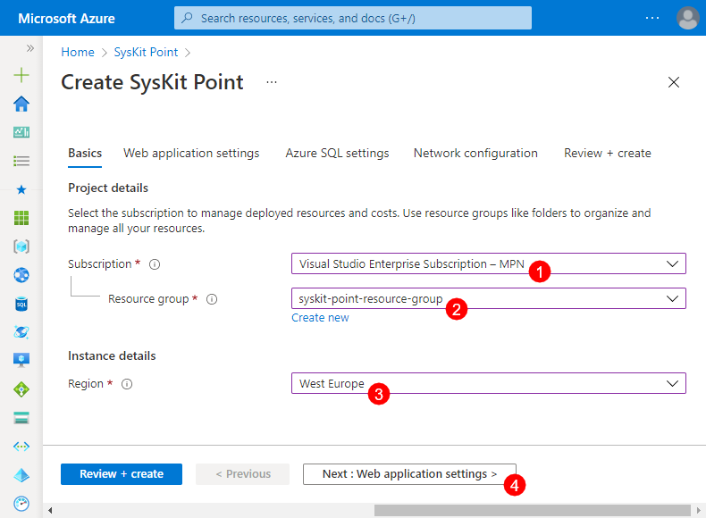
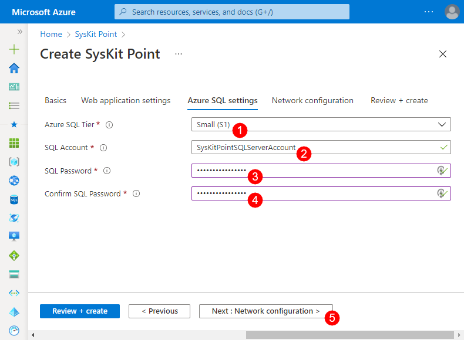

# Deploy SysKit Point


**Please note!**  
Before you continue, make sure to read the [resource requirements article.](resource-requirements.md)


Prepare the following for SysKit Point deployment:
* __precreated Azure resource group__ and __user credentials of a resource group owner__, or
* __user credentials of a user able to create a new Azure resource group__

## Azure Marketplace

* start by opening the [SysKit Point product page](https://azuremarketplace.microsoft.com/en-us/marketplace/apps/syskitltd.syskit_point) on Azure Marketplace
* click the __Get It Now button (1)__; a confirmation dialog opens
* click the __Continue (2) button__; you will be redirected to Azure Portal
* click __Create (3)__ to continue with the deployment configuration; __Create SysKit Point__ screen opens with the __Basics__ tab selected

## Azure Resources Deployment

Before deploying Azure resources needed to run SysKit Point, you will be prompted to configure several options grouped into three tabs:
* __Basics__
* __Web application settings__
* __Azure SQL settings__
The last available tab - __Review + create__ - shows an overview of all configured options to check before the deployment is started.

The __Basics__ tab enables you to:
* __select the Azure subscription (1)__
* __select an existing__ or __create a new resource group (2)__ within which the SysKit Point resources will be created
* __choose the Azure region (3)__ where SysKit Point resources will be created
* __click Next (4)__ to proceed to the __Web application settings__ tab

On the __Web application settings__ tab, you will need to define the following:
* __Website Name (1)__
* __Web Application Time Zone (2)__
* __Web Service Tier (3)__
* __Backgorund Services Tier (4)__
* __click Next (5)__ to continue with the __Azure SQL settings__ configuration

Define the following on the __Azure SQL settings__ tab:
* __Azure SQL Tier (1)__
* __SQL Account (2)__
* __SQL Password (3)__; enter the same password in the __Confirm SQL Password (4)__ field
* __click Next (5)__ to move to the __Review + create__ tab

The __Review + create__ tab shows the following information:
* __Validation status (1)__ showing whether all resources are correctly configured
* __Configuration summary (2)__ showing all options selected in previous steps
* __Create button (3)__; once clicked, the deployment of Azure resources starts

At the start of the deployment, you will be redirected to a page showing the deployment progress. Once the deployment is complete, the __Go to resource group (1)__ button appears, as shown in the image below. Click the button to open the __Resource group's Overview page__, showing all created Azure resources.


With the described deployment, __all Azure resources needed to run SysKit Point are created__, and no additional installation is needed.
You can now __access SysKit Point by opening the SysKit Point web app URL in a browser__.


## SysKit Point Web App URL

To view the SysKit Point web app URL, do the following:
* __navigate to the Overview screen__ of the created resource group
* __find and click the app service resource (1)__
* __click the URL link (2)__ available in the Essentials section on the app service's Overview screen

![SysKit Point Web App URL]](../.gitbook/assets/deploy-syskit-point_url.png)

SysKit Point web page opens, guiding you through the process of [connecting to a tenant for the first time](connect-to-tenant.md). 

