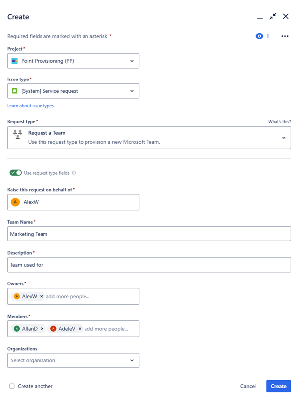
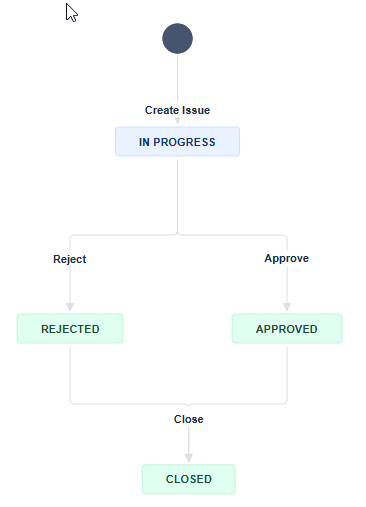
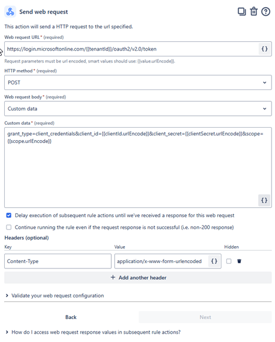
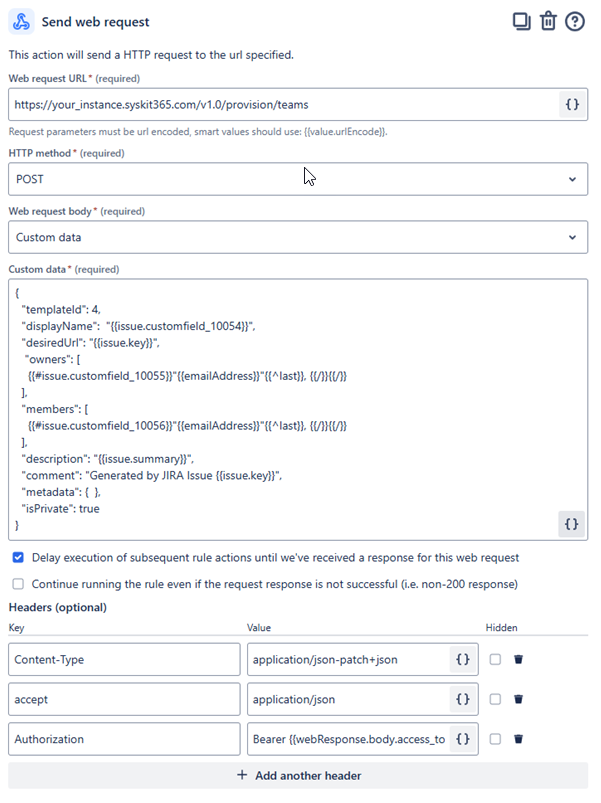
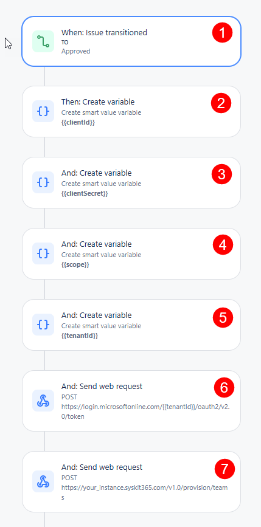

# Jira

This article will show you how to set up Jira Cloud integration with Syskit Point. This integration lets you automate Microsoft 365 workspace provisioning directly from Jira using Syskit Point provisioning API.

All the prerequisites needed for this to work are explained in the [3rd Party Integrations Using Webhooks article](webhooks-example.md).

Before you start, make sure you have done the following:

* **Syskit Point Provisioning Template**
  * Configured with automated approvals in Syskit Point
* **Entra ID App for API Authentication**
  * This will be used to retrieve an OAuth token for Syskit Point API authentication
* **Syskit Point API Credentials**
  * Syskit Point URL
  * Directory (Tenant) ID
  * Syskit Point API Application (Client) ID
  * Client ID
  * Client Secret
  * Template ID &#x20;

### Configuring Jira: Fields and Request Type

Jira is very flexible when adding custom fields, forms, and request types. You can achieve the required customization in many different ways, and the approach will depend on how your Jira is set up.

In essence, you will need the following custom fields:

* Site Name / Team Name (Text, Mandatory)
* Description (Text, Mandatory)
* Owners (User Picker (multiple users), Mandatory)
* Members (User Picker (multiple users), Mandatory)

Then, create a custom request type and use the fields you created, as shown in the image below.

### Workflows

To follow your business process for approving workspaces, you will have to use one of the available Workflows in Jira or create a custom one.

Below, you can see an example of a very simple workflow in Jira.

### Automation

The final step of setting up Jira to work with Syskit Point is configuring the automation to call the Syskit Point Provisioning API and initiate provisioning.

Jira allows for a fully no-code solution to be implemented, and the solution is very simple, but make sure you follow all the steps outlined in this article for the solution to work properly.

Create a new automation in your project.

* The **automation triggers** when issues transition to the **Approved state (1)**
* Configure variables that will be used in the following steps:
  * Add them as automation variables and hardcode the values you obtained in the Prerequisite steps of this article.
    * **clientId (2)**
    * **clientSecret (3)**
    * **scope (4)**
    * **tenantId (5)**

Now, we need to call Point API web services. The first call is to authenticate against service:

* To your automation **add the action “Send web request” (6)** to authenticate, use the following setup
  * Web request URL:\
    [https://login.microsoftonline.com/\{{tenantId\}}/oauth2/v2.0/token](https://login.microsoftonline.com/%7B%7BtenantId%7D%7D/oauth2/v2.0/token)
    * Note that we are using a variable `{{tenantId}}` labeled as number **(5)** here.
  * HTTP method:\
    <mark style="color:green;">`POST`</mark>
  * Web request body: Custom Data
  * Custom Data:
    * Please note you should use the variables listed under number **(2-5)** in this request.
    * `grant_type=client_credentials&client_id={{clientId.urlEncode}}&client_secret={{clientSecret.urlEncode}}&scope={{scope.urlEncode}}`
  * Headers: Key: Content-Type, Value: application/x-www-form-urlencoded
  * Make sure you check this option: “Delay execution of subsequent rule actions until we’ve received a response for this web request”

With the token we acquired when completing the “Send web request” action, we can now **POST the request to the Provisioning API (7)**.

* Add another “Send web request” to your automation and fill in the fields:
  * Web request URL:\
    `https://your_instance.syskit365.com/v1.0/provision/teams`\
    Change `your_instance.syskit365.com` with the actual URL of your instance.
  * HTTP method: \
    <mark style="color:green;">`POST`</mark>
  * Web request body: Custom data
  * Custom Data, use the following sample

<pre class="language-json"><code class="lang-json"><strong>{
</strong><strong>   "templateId": TemplateId,
</strong>   "displayName":  "{{issue.customfield_number1}}",
   "desiredUrl": "{{issue.key}}",
   "owners": 
    [
     {{#issue.customfield_number1}}"{{emailAddress}}"{{^last}}, {{/}}{{/}}
    ],
   "members": 
    [
     {{#issue.customfield_number1}}"{{emailAddress}}"{{^last}}, {{/}}{{/}}
    ],
   "description": "{{issue.summary}}",
   "comment": "Generated by JIRA Issue {{issue.key}}",
   "metadata": {  },
   "isPrivate": true
}
</code></pre>

There are a couple of changes you need to make before pasting this text:

* Add the actual TemplateId from prerequisites (it is an integer value)
* Use the smart values helper to detect the names of the fields for the “Site Name”, “Owners”, and “Members” fields you created. The names of these fields usually look like something like customfield\_10054.
  * &#x20;**Replace the values** in the text above.
* isPrivate is set to be true, i.e., the created workspace will be private. You can change this or even tie this to a field and allow users to change it.
* Headers
  * Key: Content-Type, Value: application/json-patch+json
  * Key: accept, Value: application/json
  * Authorization, Value: Bearer \{{webResponse.body.access\_token\}}

This reads the response from the previous call. The name of this step might be different in your automation.

* **Make sure you check this option: “Delay execution of subsequent rule actions until we’ve received a response for this web request”**

* The image above shows what a full request should look like. The fully assembled automation is shown in the following image:

* The image above shows the full automation to call Syskit Provisioning API, marked with numbers (1-7) reflecting the above-labeled steps.

This setup enables automated provisioning of Microsoft 365 workspaces directly from Jira.

While this article covers a basic setup, **Jira automation and Syskit Points API offer significant flexibility** to adapt this workflow to your specific business needs.
