# Control Your Microsoft 365 Environment

The **Dashboard** screen provides you with the information needed to see the whole picture of your **Microsoft 365 environment**.

You can use Dashboard to:

* **see what was happening in your Microsoft 365 environment** in the last 30 days at a glance  
* **find summary data** on your resources, internal and external users, sharing links, and used storage - all numbers are drillable, taking you to the related reports, which will show more details 
* **detect potential issues**, for example, if your environment has inactive or orphaned resources

You can access the **Dashboard** screen from:

* the **Welcome Home** screen
* the **Home dropdown menu** on any other screen within the application 

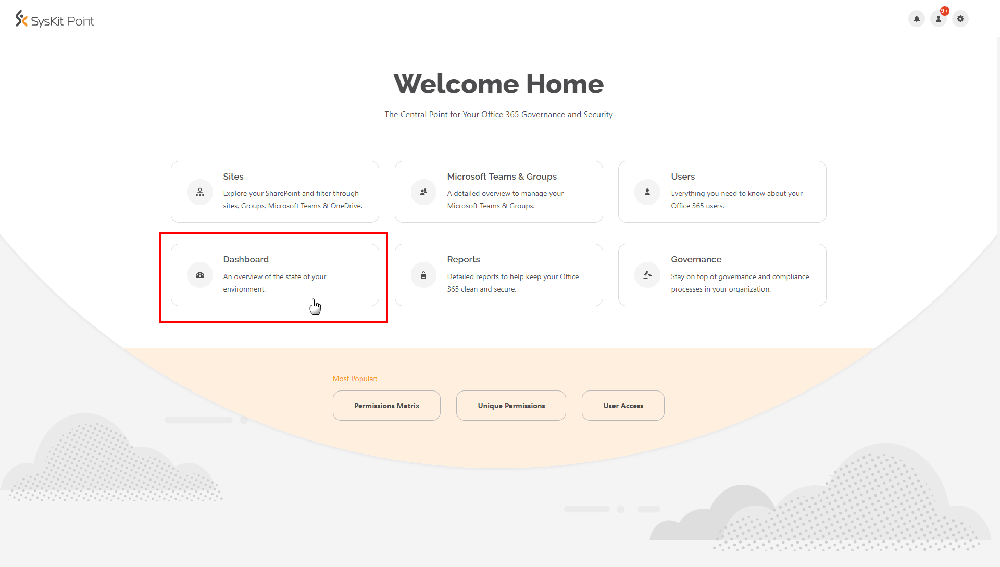

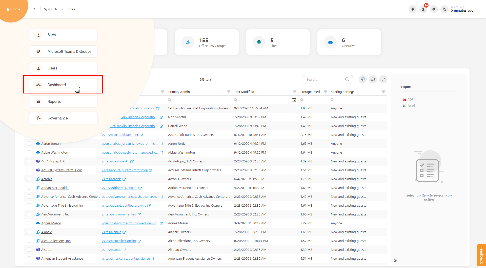

The Dashboard screen shows six tiles:

* **Inventory**
* **Users**
* **External Collaboration**
* **Storage**
* **Access Review**
* **Lifecycle Management**

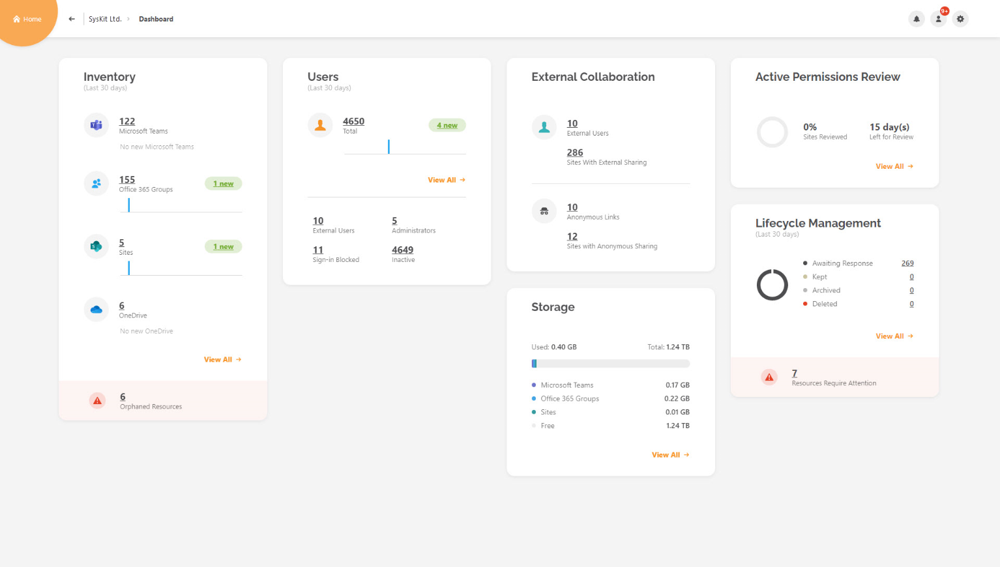

Below, each tile is described in more detail.

## Inventory

In Inventory, you can find the information about the total number of:

* **Microsoft Teams** 
* **Microsoft 365 Groups** 
* **SharePoint sites** 
* **OneDrive**
* **Orphaned resources**
* **Inactive resources**

Each of these numbers is drillable, and, once clicked, opens the Sites Overview screen filtered to show appropriate data.

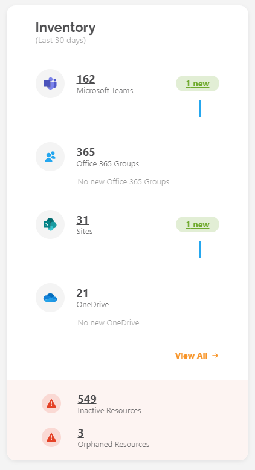

For the **period of the last 30 days**, you can find the number of new items for each resource type.

If you **hover over a bar**, which represents a newly added resource, a **tooltip will appear** with the exact date.

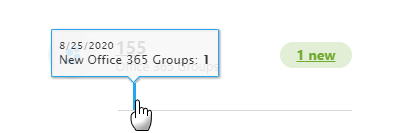

To see more details about all resources, click the **View All** link, which opens the **Sites Overview** screen.

On the bottom, colored in red, you will find the number of **inactive** and **orphaned resources** if they are present in your environment.

By **clicking the number** of the inactive resource, the **Inactive Content** report opens.

For more information about the Inactive Content report, click [here](../governance-and-automation/lifecycle-management/inactive-content.md#inactive-content-report).


**Please note!**  
The number of inactive resources **will be visible 10 days after the first installation of Syskit Point.**


Similarly, **clicking the number** of orphaned resources will open the **Orphaned Resources** report in the **Report Center**.

## Users

This tile contains the following information:

* **the total number of users** in your environment
* **the number of newly added users** in the past 30 days
* **the number of external users**, **administrators**, **inactive users**, and **users with blocked sign-in**
* **the View All** link

To access detailed information about all users, click the total number of users or the **View All** link, which opens the **Users Overview** screen.

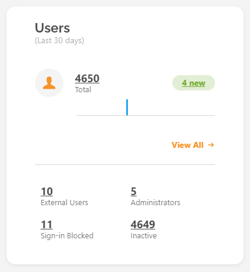

Each of the numbers drills to the appropriate view in the **Users Overview** screen, where you can perform further actions on each user by selecting them and choosing an action from the side panel.

## External Collaboration

You can supervise external sharing within your environment with this tile.

Here you can find the total number of:

* **External users** 
* **Sites with External Sharing**
* **Anonymous Links**
* **Sites with Anonymous Sharing**  

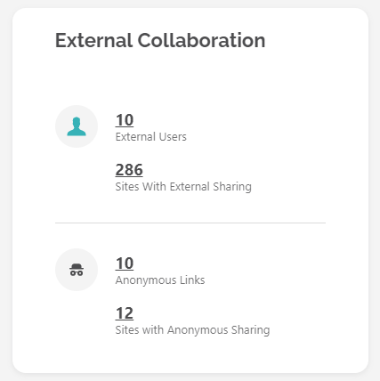

Clicking the External users opens the **Users Overview** screen with filtered external/ad-hoc users.

Drill on the **Sites With External Sharing** number opens the **External Sharing** view on the **Sites Overview** screen. Here you can find Microsoft Teams, Microsoft 365 Groups, sites, and OneDrive with **external sharing setting set to any other value than 'Only people in your organization'**.

Clicking the **Anonymous Links** number opens the **Sharing Links** report in Report Center. Here, only links shared to anyone are displayed. You can remove specific links with the help of actions available in the side panel.

The last information on this tile is the number of **Sites With Anonymous Sharing**. The drill opens the **Anonymous Sharing view** on the Sites Overview screen. Here, only resources with the external sharing settings set to **'Anyone'** are displayed.

## Access and Lifecycle Management

The **Access** and **Lifecycle Management** tiles show the progress of current automated tasks.

If the Access Review and Lifecycle Management automation is not configured, the tiles will help you navigate to the settings screen by clicking the **Configure Now** button.


**Learn more!**  
Use the following articles to learn how to enable and configure automation in Syskit Point:

* [Enable Automated Access Review](../governance-and-automation/permissions-review/enable-permissions-review.md)
* [Enable Lifecycle Management Automation](../governance-and-automation/lifecycle-management/enable-lifecycle-management.md)


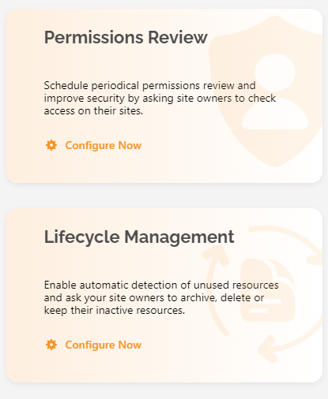

When the Access Review is configured, the tile shows information about the upcoming Review, previous Review, or the current active Review, depending on the Access Review's current state.

Below, you can see the information for the active Access Review. The **View All** link guides you to the **Governance screen**, where additional information is provided about the active Access Review.

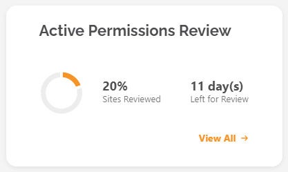

When the **Lifecycle Management feature** is configured, the tile gives information whether it is in an active state, or just turned on but inactive.

If inactive, the numbers in the tile will be zero.

In the picture below, you can see the tile when Lifecycle Management is in the active state.

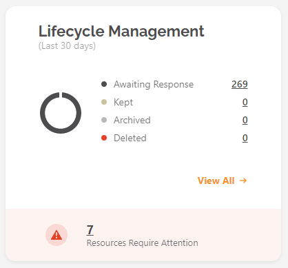

**View All** link opens the **Governance screen for Lifecycle Management Overview** with additional information.

The **chart shows information about performed actions in the last 30 days**.

Every number is drillable and opens the dedicated screen in the Governance section.

**Resources that require attention are highlighted with red color** and displayed on the bottom of the tile. Clicking the link opens the **Awaiting Response** screen, where you can decide how to resolve tasks for these resources.

## Storage

This tile provides the following storage metrics:

* **total storage**
* **used storage**
* **free storage**

Information about used storage is also given for each resource type separately.

**View All** link will open the **Largest Sites view** on the **Sites Overview** screen.

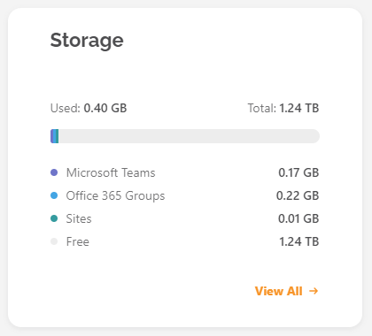


**Learn more!**  
The used storage number is calculated for all the files, including those in the recycle bin, as well as archived files. OneDrive storage is not included in the metrics.



**Please note!**  
Storage data displayed on the Dashboard can differ from the data provided by the **SharePoint admin center** since it doesn't include changes made within the last 24-48 hours, as described [here](https://docs.microsoft.com/en-us/sharepoint/manage-site-collection-storage-limits).


