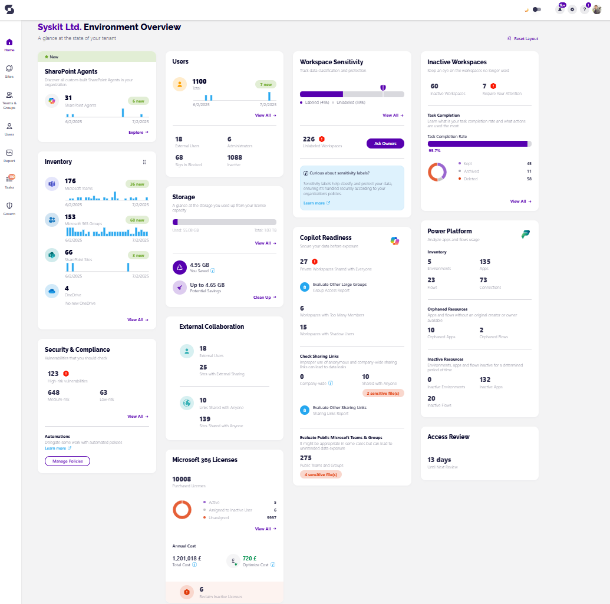
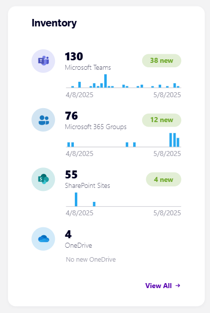
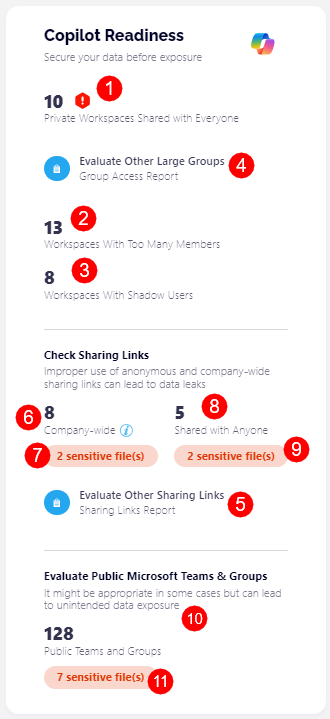
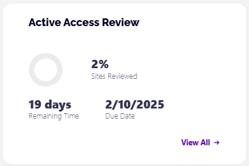
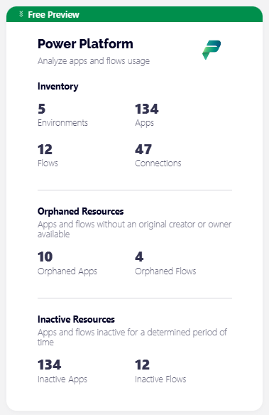

# Control Your Microsoft 365 Environment

The **Dashboard** screen provides you with the information needed to see the whole picture of your **Microsoft 365 environment**.

You can use Dashboard to:

* **See what was happening in your Microsoft 365 environment** at a glance.
* **Find summary data** on your workspaces, internal and external users, sharing links, and used storage - all numbers are drillable, taking you to the related reports, which will show more details.
* **Detect potential issues**, for example, if your environment has inactive or orphaned workspaces.

The Dashboard is the home page of Syskit Point and shows as soon as you log in. 

The **Syskit Point** Dashboard shows Syskit Point administrators the following information in the tiles:
 * Inventory
 * Users
 * Storage
 * Security & Compliance
 * Copilot Readiness
 * External Collaboration
 * Active Access Review
 * Lifecycle Management
 * Microsoft 365 Licenses
 * Power Platform

The **Syskit Point** Dashboard shows Syskit Point collaborators the following information in the tiles:
 * Inventory
 * Users
 * External Collaboration

Below, each tile is described in more detail.

## Inventory

In Inventory, you can find the information about the total number of:

* **Microsoft Teams** 
* **Microsoft 365 Groups** 
* **SharePoint Sites** 
* **OneDrive**
* **Inactive workspaces**

Each of these numbers is drillable and, once clicked, opens the Sites Overview screen filtered to show appropriate data.

For the **period of the last 30 days**, you can find the number of new items for each workspace type.

If you **hover over a bar**, which represents a newly added workspace, a **tooltip will appear** with the exact date.

To see more details about all workspaces, click the **View All** link, which opens the **Sites Overview** screen.

On the bottom, colored in red, you will find the number of **inactive** and **orphaned workspaces** if they are present in your environment.

By **clicking the number** of the inactive workspaces, the **Inactive Workspaces** report opens.

For more information about the Inactive Workspaces report, click [here](../governance-and-automation/lifecycle-management/inactive-content.md#inactive-workspaces-report).


**Please note!**  
The number of inactive workspaces **will be visible 10 days after the first installation of Syskit Point.**


Similarly, **clicking the number** of orphaned workspaces will open the **Orphaned Workspaces** report in the **Report Center**.

You can find more details on your workspaces by taking a look at the:

* [Microsoft Teams & Groups article](../microsoft365-inventory/microsoft-teams-and-groups.md)
* [Sites article](../microsoft365-inventory/sites.md)

## Users

This tile contains the following information:

* **the total number of users** in your environment
* **the number of newly added users** in the past 30 days
* **the number of external users**, **administrators**, **inactive users**, and **users with blocked sign-in**
* **the View All** link

To access detailed information about all users, click the total number of users or the **View All** link, which opens the **Users Overview** screen.

Each of the numbers drills to the appropriate view in the **Users Overview** screen, where you can perform further actions on each user by selecting them and choosing an action from the side panel.

[You can find more details about the users overview screen in the Users article.](../microsoft365-inventory/users.md)

## Storage

This tile provides the following storage metrics:

* **total storage**
* **used storage**
* **free storage**

The **View All** link opens the **Storage Metrics report** showing tenant-wide storage usage, usage trend through time, and the largest sites in your tenant.

You can also find information on:
* How much storage you saved
* How much storage you could save

The **Clean Up** link opens the **Storage Metrics report** where you can select the workspaces you want to perform a storage clean up on.


**Hint!**  
The used storage number is calculated for all the files, including those in the recycle bin, as well as archived files. OneDrive storage is not included in the metrics.



**Please note!**  
Storage data displayed on the Dashboard can differ from the data provided by the **SharePoint admin center** since it doesn't include changes made within the last 24-48 hours, as described [here](https://docs.microsoft.com/en-us/sharepoint/manage-site-collection-storage-limits).


[For more details on Storage Management for SharePoint Online, take a look at the Storage Management Overview article.](../storage-management/storage-management-overview.md)

## Security & Compliance

The Security and Compliance Checks tile shows the most important vulnerabilities and misalignments in your environment. These checks keep you up-to-date in order to react quickly and efficiently to keep your environment secure and under control.

The tile on the Dashboard shows:
 * The number of high-risk vulnerabilities
 * The number of medium-risk vulnerabilities
 * The number of low-risk vulnerabilities

Clicking on **View All** redirects you to the Security and Compliance checks screen. 

The following information is tracked and available there:

 * **Orphaned Workspaces**
 * **Inactive Guest Users**
 * **Tenant Storage Limit**
 * **Blocked Users with Assigned Licenses**
 * **Workspaces with Not Enough Owners**
 * **Orphaned Users**
 * **Workspaces with Too Many Owners**

Syskit Point performs regular security and compliance checks for you and presents the results directly on your home screen.

[For more details on Security and Compliance checks, take a look at this article.](../governance-and-automation/security-compliance-checks/security-compliance-checks.md)

## Copilot Readiness

The Copilot Readiness tile on the Syskit Point dashboard **helps businesses as they prepare to integrate Copilot into their workflow** or those that want to stay on top of policy vulnerabilities or overshared workspaces that could pose a security risk. By providing a **clear and comprehensive Copilot Readiness score**, you are able to quickly **identify vulnerabilities**.

The tile on the Dashboard shows:
* Number of vulnerabilities detected for the Workspaces **Shared with Everyone policies (1)**, the Workspaces with **Too Many Members (2)**, Workspaces with **Shadow Users (3)**
* The **Group Access (4) and Sharing Links reports (5)**
* The number of **company-wide sharing links (6)** as well as **company-wide sharing links that contain sensitive files (7)**
* The number of **links shared with anyone (8) and links shared with anyone that contain sensitive files (9)**
* The number of **public workspaces (10)** and the **public workspaces with sensitive files (11)**

[For more details on how to navigate the Copilot Readiness tile, take a look at this article.](../microsoft365-inventory/copilot-readiness.md)

## External Collaboration

You can supervise external sharing within your environment with this tile.

Here you can find the total number of:

* **External users** 
* **Sites with External Sharing**
* **Links Shared with Anyone**
* **Sites Shared with Anyone**  

Clicking the External users opens the **Users Overview** screen with filtered external/ad-hoc users.

Drill on the **Sites With External Sharing** number opens the **External Sharing** view on the **Sites Overview** screen. Here, you can find Microsoft Teams, Microsoft 365 Groups, sites, and OneDrive with **external sharing setting set to any other value than 'Only people in your organization'**.

Clicking the **Anonymous Links** number opens the **Sharing Links** report in the Report Center. Here, only links shared with anyone are displayed. You can remove specific links with the help of actions available in the side panel.

The last information on this tile is the number of **Sites With Anonymous Sharing**. The drill opens the **Anonymous Sharing view** on the Sites Overview screen. Here, only workspaces with the external sharing settings set to **'Anyone'** are displayed.

## Access Review & Lifecycle Management

The **Access** and **Lifecycle Management** tiles show the progress of current automated tasks.

If the Access Review and Lifecycle Management automation is not configured, the tiles will help you navigate to the settings screen by clicking the **Configure Now** button.


**Learn more!**  
Use the following articles to learn how to enable and configure automation in Syskit Point:

* [Enable Automated Access Review](../governance-and-automation/permissions-review/enable-permissions-review.md)
* [Enable Lifecycle Management Automation](../governance-and-automation/lifecycle-management/enable-lifecycle-management.md)


When the Access Review is configured, the tile shows information about the upcoming Review, previous Review, or the current active Review, depending on the Access Review's current state.

Below, you can see the information for the active Access Review. The **View All** link guides you to the **Governance screen**, where additional information is provided about the active Access Review.

When the **Lifecycle Management feature** is configured, the tile gives information on whether it is in an active state or just turned on but inactive.

If inactive, the numbers in the tile will be zero.

In the picture below, you can see the tile when Lifecycle Management is in the active state.

**View All** link opens the **Governance screen for Lifecycle Management Overview** with additional information.

The **chart shows information about performed actions in the last 30 days**.

Every number is drillable and opens the dedicated screen in the Governance section.

**Workspaces that require attention are highlighted with red color** and displayed on the bottom of the tile. Clicking the link opens the **Awaiting Response** screen, where you can decide how to resolve tasks for these workspaces.

## Microsoft 365 Licenses

The Microsoft 365 Licenses tile shows an overview of the paid licenses used for your Syskit Point subscription. 

You can find the following information on the tile screen:
 
 * Number of active licenses
 * Number of licenses assigned to inactive users
 * Number of unassigned licenses
 * The total annual cost for your licenses
 * The amount you can save annually by removing inactive licenses 

You can also click the View All button, which takes you to the Licenses Overview report screen.

For more information on the license reports available, take a look at the [Licenses Reports article](../reporting/licenses-reports.md).

## Power Platform 

The Power Platform tile on the Syskit Point dashboard **provides an overview of all of your Power Platform apps and flow usage**.

The tile on the Dashboard shows:
* **Inventory** - which provides a quick overview of your Power Platform inventory and shows the numbers of
  * Environments
  * Apps
  * Flows
  * Connections

* **Orphaned Resources** - shows the number of apps and flows without an original creator or owner available
  * Clicking the **Orphaned Apps** number, opens the Power Apps Inventory report with the Orphaned Apps filter applied
  * Clicking the **Orphaned Flows** number, opens the Power Automate Inventory report with the Orphaned Flows filter applied
* **Manage Inactivity** - provides an overview of inactive apps and flows to help you determine which are no longer necessary 
  * Clicking the **Inactive Apps** number, opens the Power Apps Inventory report with the Inactive Apps filter applied
  * Clicking the **Inactive Flows** number, opens the Power Automate Inventory report with the Inactive Flows filter applied

* For more details [on the Power Platform reports, take a look at thos article.](../reporting/power-platform-reports.md)

