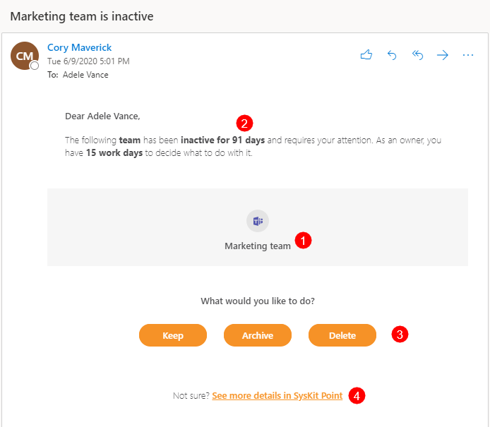
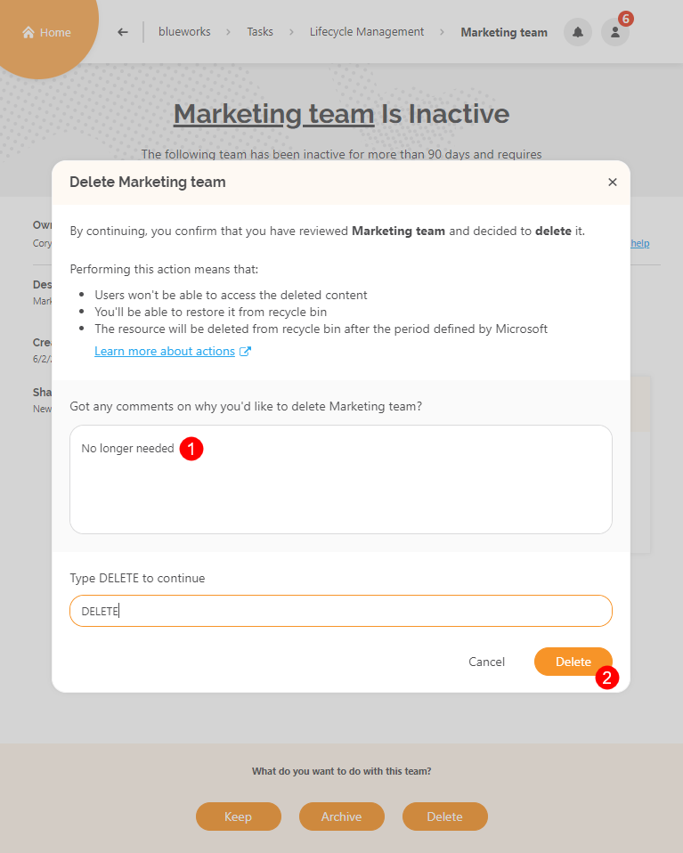
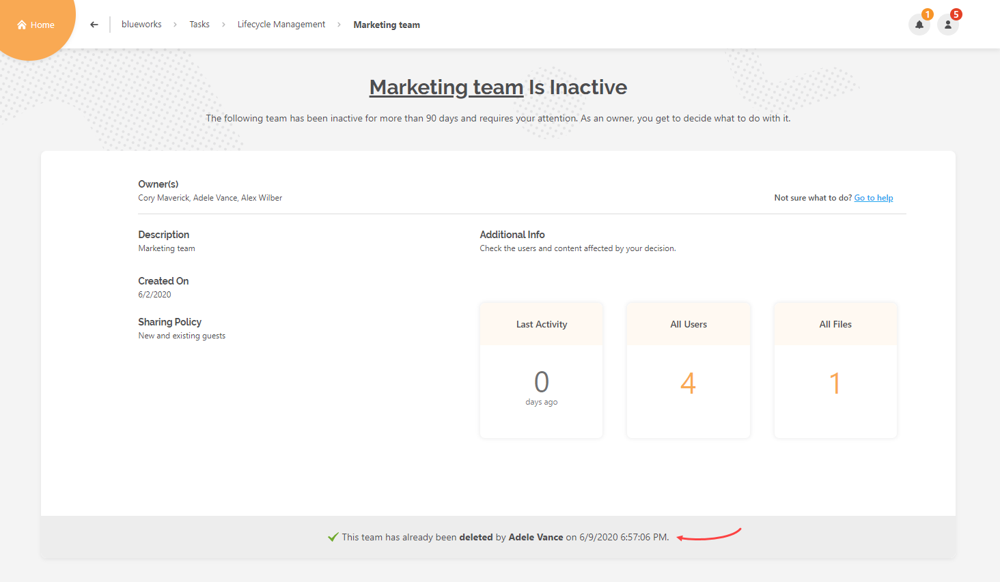
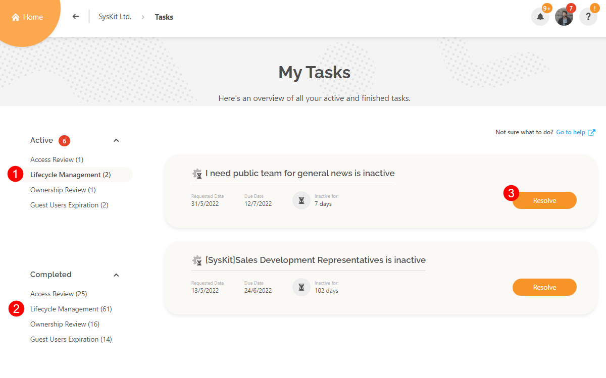

---

description: This article gives site owners a complete overview of the Lifecycle Management Automation process in SysKit Point.
---

# Resolve Lifecycle Management Tasks in SysKit Point

* **Watch this short video for a quick start on Lifecycle Management tasks in SysKit Point**.
<iframe title="vimeo-player" src="https://player.vimeo.com/video/714449776?h=441fb200e5" width="640" height="360" frameborder="0" webkitallowfullscreen mozallowfullscreen allowfullscreen></iframe> 
 
<a href="https://player.vimeo.com/video/714449776?h=441fb200e5" target="_blank">Click here to watch this video in full-screen mode</a>
 
 

* **Continue with the article to find detailed information** on how to complete Lifecycle Management tasks in SysKit Point.
 
 

## Workspace Lifecycle 

Workspaces in Microsoft 365 usually display the following lifecycle stages:

* **Beginning**; for example, when an admin creates a new workspace - Microsoft Team.
* **Middle**; users collaborate and use said workspace, chat, create files, and take advantage of all means available to collaborate and achieve their goals successfully.
* **End**; after a team is dismissed or a product is retired, the previously used workspace becomes stale and is no longer needed. 

**When a workspace has reached the third stage**, a team owner for that workspace needs to decide:

* Whether to **keep** the workspace available, 
* **Archive** the produced content, or
* **Delete** the workspace and all of its content.

To help with this process, **SysKit Point provides the Lifecycle Management Automation feature** and reduces the management to the previously described decision-making.

After a SysKit Point Admin [enables and configures Lifecycle Management Automation](../governance-and-automation/lifecycle-management/enable-lifecycle-management.md), **site owners and admins will be notified via email** when some of their workspaces are inactive for a period longer than the one [defined in SysKit Point settings](../governance-and-automation/lifecycle-management/inactive-content.md#define-what-is-inactive).

## Inactive Workspace Email

Once SysKit Point recognizes that a workspace – Microsoft Team, Microsoft 365 Group, or a site – is inactive, an email is sent to the owner or admin of said workspace.

The email provides the following:

* **Workspace name and type \(1\)**
* **Inactivity period \(2\)**
* **Keep, Archive and Delete actions \(3\)**
* **Link to the Lifecycle Management task in SysKit Point \(4\)**

Clicking any of the **action buttons \(3\)** redirects to the **Lifecycle Management task** of the workspace in SysKit Point. 

The Lifecycle Management task screen provides the option to **include additional information on the workspace and execute the selected action**. 

Once clicked, the **task details screen opens** with the appropriate action dialog visible.
  *  For example, if the **Delete action button** is clicked, the screen shown on the image below opens.

  The following can be:

* **Comment \(1\)** on why you’re performing the action
* **Run the action \(2\)** 

After the action is executed, **the information is displayed in the bottom ribbon of the Lifecycle management** task for the viewed workspace.
  * An example of this is shown in the image below. 


**Please note!**  
You can find more detailed information on all Lifecycle Management actions available in SysKit Point [here](../governance-and-automation/lifecycle-management/lifecycle-management-actions.md).


All Lifecycle Management tasks assigned to you can be found on the **My Tasks screen**.

## Lifecycle Management Tasks

To view the Lifecycle Management Tasks, click the **My Tasks tile** on the Home screen or the **My Tasks section** in the user profile menu. The red **notification bubble** that can be seen in the top right corner shows the number of tasks assigned to you.

My Tasks screen shows:

* **Active Lifecycle Management tasks (1)**
* **Completed Lifecycle Management tasks (2)**
* **Resolve button (3)** to open the task details screen

## Lifecycle Management Task Details

On the task details screen, the following information is available:

* **Owner\(s\) list \(1\)**
* **General workspace information \(2\)**
  * Description
  * Creation date 
  * Workspace sharing policy
* **Last Activity**, **All Users**, and **All Files tile \(3\)**; 
  * The All Users and All Files tile redirects to the relevant reports where more information can be found on the users and content in that workspace.
* **Actions \(4\)**; this section provides options on what to do with the inactive workspace

**After successfully running a Lifecycle Management action, SysKit Point automatically completes the Lifecycle Management task for the reviewed workspace.**

## Reminder Emails

By default, site owners will receive two additional emails reminding them to complete their Lifecycle Management task. 

SysKit Point automatically sends these emails:

* **three days before they're due**
* **on the due date**

The emails display an appropriate message depending on the time left to complete the task and provide all the available Lifecycle Management actions. 
  * Choosing one of the Lifecycle Management actions is necessary for task completion.

## Expired Tasks

If the opportunity to decide what to do with the inactive workspace is missed, SysKit Point automatically changes the status of all incomplete Lifecycle Management tasks to **Expired**.

They can be found on the **My Tasks screen** under the Completed Lifecycle Management view.


**Please note!**  
Expired tasks are now **assigned to SysKit Point Admins** and can no longer be completed by site owners or admins.


When a site owner or admin opens an expired task, the task details screen shows a message stating, 'This task has expired.' We have transferred it back to the SysKit Point Admin'.

## Related Topics

* [Learn more about lifecycle management](https://docs.microsoft.com/en-us/microsoftteams/plan-teams-lifecycle)
* [Learn how to Resolve Access Review Tasks](access-review.md)

