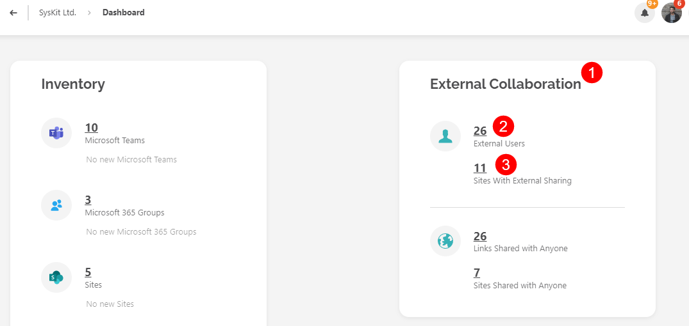
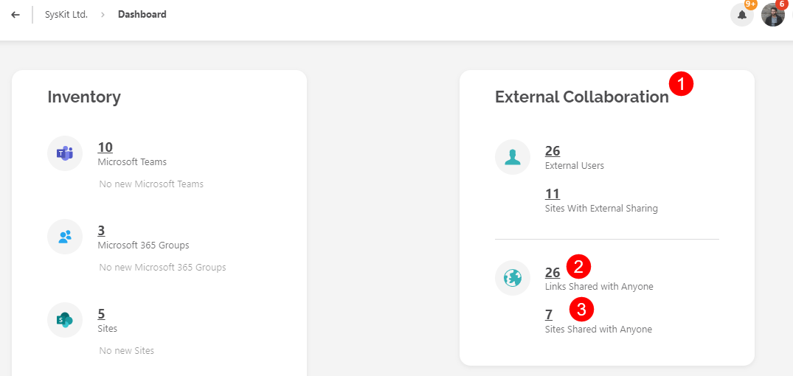

# Manage External Sharing 

External Sharing is the **ability to share documents, folders, and sites** with someone who is not part of your Teams or Sites usually or might not even be within your organization.

This can be done through **sharing links or by adding external users** to Microsoft Teams & Groups or sites.

**Sharing links** allow you to **send a link to a specific document or folder** to someone **outside of your organization**. This gives them access to view or edit the file. 

**External users** are people who are not part of your organization but who **are granted access to specific workspaces**, such as a site or a Microsoft Team.

**Managing external sharing** is important for collaborators and owners of workspaces because it **helps to ensure that confidential or sensitive information is not shared with unauthorized individuals**. 

Syskit Point helps you manage external sharing, which means you can easily **control who has access to your organization's data** and **limit the risk of data breaches** or other security issues.



You are only able to **manage external sharing for workspaces where you are the owner**.



In this article, you will learn how to:

* [**Manage External Users**](#manage-external-users)
* [**Manage Sites with External Sharing**](#manage-sites-with-external-sharing)
* [**Manage Sharing Links**](#manage-sharing-links)
* [**Manage Sites Shared with Anyone**](#manage-sites-shared-with-anyone)

## Manage External Users

You can manage external users by taking the following steps:

  * On the Syskit Point home page, **click the Dashboard button**
  * Navigate to the section titled **External Collaboration (1)**

Under the External Collaboration section, you will have two options to manage external users:
  * **External Users (2)**
  * **Sites With External Sharing (3)**

To manage external users:
 * Click the **External Users button**, and you will be redirected to the Users site with the **filter showing External Users**
 * Here you will be able to access the **User Activity and User Access reports** and can complete the **following actions**:
    * Add to Groups
    * Configure Alerts
 * Additionally, clicking on the user and opening the user details screen provides the option to:
    * **Promote to Owner**
    * **Remove from Group**
    * **Remove Access** from a workspace

Once you've identified all your external users, you might see a name or two that are outdated and should not have access to particular content. You can then choose whether to remove them from the Group or completely remove workspace access. The User Activity and User Access reports can help with that as well. 

 User Activity reports help you track progress, resolve conflicts, and assess performance, while User Access reports let you monitor access to sensitive information and identify potential security breaches.

For example, let's say you're working with a team on a project. User Activity reports allow you to see who accessed shared documents when they did so, and the changes they made.

[For instructions on how to complete these actions, take a look at this article.](manage-users.md) 

## Manage Sites with External Sharing

Let's say that as a team owner, you want to see every file under your ownership that is exposed to someone outside of your organization. This will not only make for phenomenal housekeeping but will also **prevent potential data breaches from happening within your own teams**. 

By reviewing your externally shared content, in a couple of clicks, you can **make sure that no sensitive data is unnecessarily exposed**.

You can manage sites with external sharing by going back to the **External Collaboration section of the Dashboard**. 

To start, complete the next steps: 

 * Click the Sites with External Sharing button, and you will be redirected to the Sites page with the **filter showing Externally Shared Sites (1)**
 * Selecting an externally shared site provides the following options, located on the right side of the screen:
   * Add Admins
   * Remove Admins
   * Change Admins
   * Configure Alerts
   * Change Metadata

Clicking on a site will open the details screen for that site and provide several more actions you can take.

On the right side of the screen, under Manage, you will have the option to:

  * **Grant Access** - where you can add users to the site and assign the level of access you want to provide
  * **Change Admins** - allows you to change the admins in charge of the side
  * **Configure Alerts** - lets you set up specific alerts for your site

Scrolling to the Lifecycle Management section on the left side, you can choose to: 
  * **Keep** the site
  * **Archive** the site
  * **Delete** the site

In the middle part, under the content section, you will find a list of all content included in this site. Depending on the item selected, you will have additional options to:
  * **Stop Inheriting Permissions**
  * **Delete Unique Permissions**

Clicking either action provides a pop-up that will ask you to confirm your choice. 

The permissions section provides a list of users and the level of access they were given to the site. Selecting a user provides the options to:
  * **Remove Access**
  * **Edit Permissions**

## Manage Sharing Links

It's time to put an end to accidental data leaks and security breaches caused by improper sharing practices. 

Syskit Point provides a straightforward and effective method to identify and resolve misconfigured or outdated sharing links, ensuring the security and accessibility of your valuable data.

You can manage sharing links by taking the following steps:

  * On the Syskit Point home page, **click the Dashboard button**
  * Navigate to the section titled **External Collaboration (1)**

Under the External Collaboration section, you will have two options to manage externally shared links:
  * **Links Shared with Anyone (2)**
  * **Sites Shared with Anyone (3)**

To manage links shared with anyone, complete the following:
 * Click the **Links Shared with Anyone** button, and you will be redirected to the **Sharing Links report (1)**
 * Here, you can **select the workspace** with externally shared links, and on the right side of the screen, you will have the option to **Remove All Sharing Links**
    * Clicking Remove All Sharing Links will remove all the sharing links from all of the items included in the workspace
    * You can also complete this as a **bulk action by selecting all of the workspaces** before clicking Remove All Sharing Links
 * Alternatively, you can remove a sharing link from a specific item in the workspace, for example, a folder
   * To do this, **select the folder** you want to change and **click the Remove Sharing Link button** on the right side of the screen

## Manage Sites Shared with Anyone

While talking about proper governance and Microsoft 365 security, one of the first things you will want to expose and address is all the content under your ownership that is shared with anyone. 

This segment potentially exposes you and your organization to data leakage and should be one of your priorities. Through Syskit Point – you can achieve this in a couple of clicks.

To manage sites that have been shared with anyone, go back to the **External Collaboration section of the Dashboard**. 

To start, complete the next steps: 

 * Click the Sites Shared with Anyone button, and you will be redirected to the Sites page with the **filter showing Anonymously Shared Sites (1)**
 * Selecting an externally shared site provides the following options, located on the right side of the screen:
   * Add Admins
   * Remove Admins
   * Change Admins
   * Configure Alerts
   * Change Metadata

Clicking on a site will open the details screen for that site and provide several more actions you can take.

On the right side of the screen, under Manage, you will have the option to:

  * **Grant Access** - where you can add users to the site and assign the level of access you want to provide
  * **Change Admins** - allows you to change the admins in charge of the side
  * **Configure Alerts** - lets you set up specific alerts for your site

Scrolling to the Lifecycle Management section on the left side, you can choose to: 
  * **Keep** the site
  * **Archive** the site
  * **Delete** the site

In the middle part, under the content section, you will find a list of all content that is included in this site. Depending on the item selected, you will have additional options to:
  * **Stop Inheriting Permissions**
  * **Delete Unique Permissions**

Clicking either action provides a pop-up that will ask you to confirm your choice. 

The permissions section provides a list of users and the level of access they were given to the site. Selecting a user provides the options to:
  * **Remove Access**
  * **Edit Permissions**