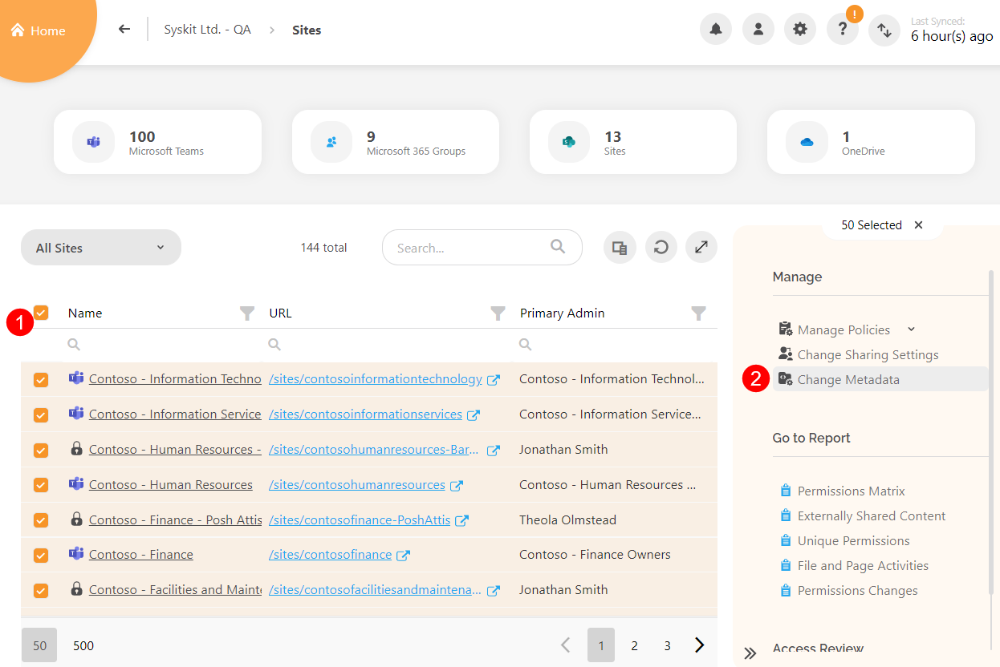
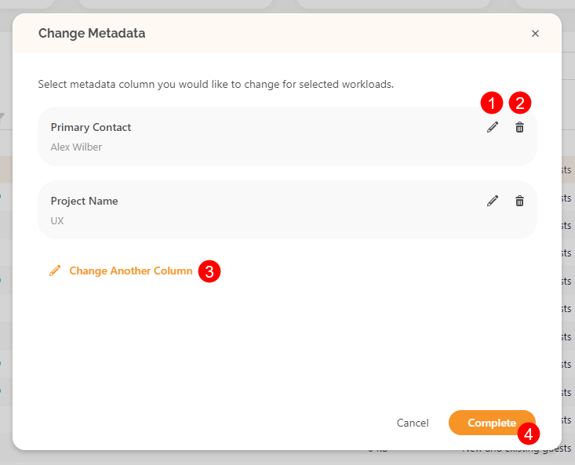
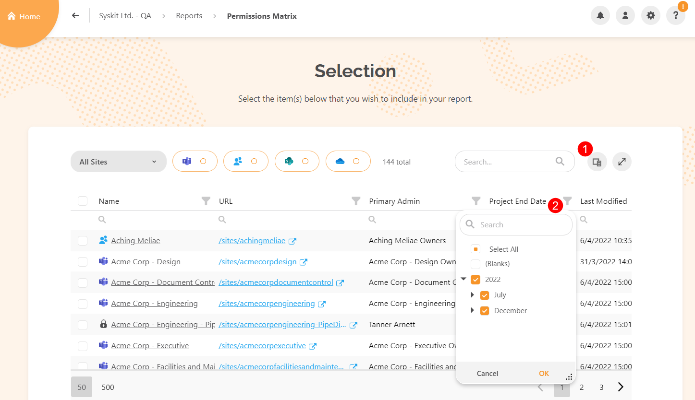
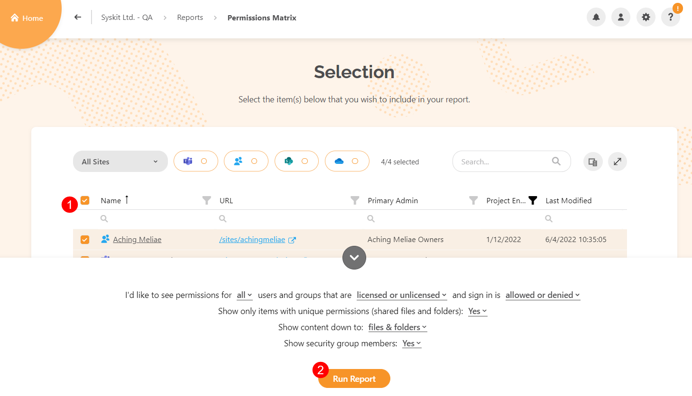

# Custom Metadata

In the context of Microsoft 365, the custom metadata provides additional information on **Microsoft Teams, Microsoft 365 Groups, Sites, and OneDrive**. It allows you to create and define specific properties or attributes that are relevant to your needs.

Custom metadata in SysKit Point allows you to **organize, find, and automate processes** that involve your workspaces based on your unique requirements, in order to enhance your productivity and efficiency.

**Essential metadata** is natively available in  Microsoft 365 and collected by SysKit Point during the sync process. 

Here are some examples of such metadata:

 * **The Microsoft Teams Owner**
 * **The date of creation for a site**
 * **The storage used by a site**
 * **And other useful information**

With SysKit Point custom metadata feature, you can:

* **Leverage custom metadata** to expand on the existing information and better describe Microsoft Teams, Microsoft 365 Groups, Sites, and OneDrive in relation to your business processes and policies.

* **Organize and find workspaces**, and **generate reports** based on custom metadata.

* **Provision new workspaces** from templates that define the custom metadata to be specified. 



Only SysKit Point **administrators can create new custom metadata**.


## Change Custom Metadata

After custom metadata has been created by your SysKit Point admin, you are able to manage and change how it applies to the **workspaces where you are the owner**.

To change the custom metadata that has been set up to your workspaces, **select Sites or Microsoft Teams & Groups from the Home page**.

* On the **Sites (1)** overview screen, select one or multiple workspaces to edit their metadata.
* Select **Change Metadata (2)**; this option is available on the right side of the screen.

On the Change Metadata dialog, you can:
* **Edit (1)** or **delete (2)** the existing metadata entry
* **Specify additional metadata (3)** by clicking the Change Another Column action
* Click **Complete (3)** when satisfied with your changes.
  * This will start the process of changing the custom metadata, and once completed, the information input will be displayed under the selected workspaces.

## Filter Workspaces by Metadata

When generating a report, it can now include and be filtered by the specific custom metadata that was set up.

To generate a report with custom metadata, take the following steps:

* Go to Reports and select the type of report to generate.
* Use the **Column Chooser (1)** to select the metadata.
* Once the custom metadata column was added, use the **filter dropdown menu (2)** to select the details for the report. 

This will filter the report to show the items that the chosen metadata applies to.
* **Select (1)** one or more files to include in the report.
  * Set the values for the report on the pop-up that appears.
* Click **Run Report (2)** to generate the report. 

This can be applied to any reports from the Report section that include **Sites, Microsoft Teams & Groups, and OneDrive**.

